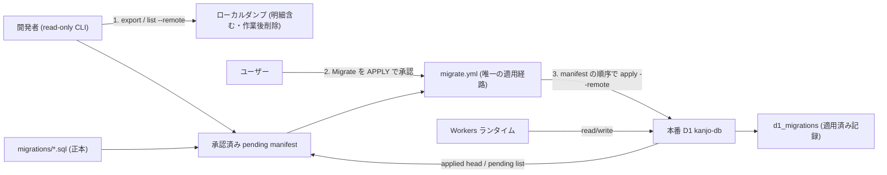

# Architecture overview

本番 D1 (`kanjo-db`) のスキーマ版数を、リポジトリ直下 `migrations/*.sql` を正本として `d1_migrations` テーブルへ収束させるライフサイクルを定義する。事故観測時は `d1_migrations` の記録が `0005_sub_vendors.sql` までで、`0006`〜`0014` が未適用のまま Worker だけが先行していた。現在の repository head は 0015 を含むため、事故時の番号を復旧上限として再利用しない。

## Context and drivers

- ビジネス/技術文脈: 収支統合管理アプリの本番 (`console.daishimanju.workers.dev`) で、データ取込 (`POST /api/imports`) と取込履歴 (`GET /api/imports`) が同時に 500 を返す。原因はコードが前提とするテーブル (`import_runs` / `import_writer_claims` / `import_active_targets` / `cash_entries` / `attachments` / `restored_monthly_agg` / `password_login_rate_limits`) が本番に存在しないこと。
- 品質属性の優先順: データ保全 > 復旧の確実性 > 所要時間 > 実装量。記帳データは税務上の記録に直結するため、喪失ゼロ (G4) を他のすべてに優先する。
- 制約: 本番への適用権限はユーザーが保持する (AI は手順提示と検証のみ)。既存データが存在するため、破壊的な作り直しは選べない。

## Goals and non-goals

- Goals: (G1) 作業開始時の remote list と repository head から確定した承認済み pending manifest を本番へ適用し、コードとスキーマの前提を一致させる。(G4) 適用前後で既存行が 1 行も失われないことを事後検証できる形で担保する。
- Non-goals: マイグレーションファイル自体の設計見直し、スキーマの再設計、D1 以外のデータストアへの移行。

## System context and boundaries

- 利用者/外部システム: 記帳担当 (単一利用者)、Cloudflare D1 (`kanjo-db`)、Cloudflare Workers ランタイム、開発者のローカル環境 (wrangler CLI)。
- 信頼/配備/データ境界: 本番 D1 は Cloudflare ネットワーク上にあり、適用操作は wrangler の `--remote` を通じてのみ行う。エクスポートしたダンプは明細と金額を含むため開発者のローカルに閉じ、外部サービスへ送らない。
- 文脈図:

## Container and component view

| Container/Component | Responsibility | Interface | Data owner | Deployment unit |
|---|---|---|---|---|
| `migrations/*.sql` | スキーマ変更の連番正本 | ファイル (連番昇順) | リポジトリ | git |
| `packages/api/wrangler.jsonc` | `migrations_dir: ../../migrations` の宣言 | Wrangler 設定 | リポジトリ | git |
| `d1_migrations` テーブル | 適用済みマイグレーション名の記録 | SQL | 本番 D1 | Cloudflare |
| 承認済み pending manifest | remote list と repository head を同一時点で固定し、人間承認の対象を一意にする | JSON evidence | incident | Migrate |
| wrangler `d1 migrations list` | 未適用分の列挙 | CLI | — | 開発者ローカル / CI |
| `migrate.yml` | 人間承認後に manifest の対象を適用する唯一の書込経路 | GitHub Actions | — | CI |
| wrangler `d1 export --remote` | 適用直前の全件ダンプ取得 | CLI | — | 開発者ローカル |

## Cross-cutting contracts

- Identity/access: 本番 D1 への書込は `migrate.yml` の `confirm == 'APPLY'` を人間が承認した場合に限る。AI は手順を提示し、read-only の差分確認と適用後検証までを担う。
- Errors/resilience: `wrangler d1 migrations apply` はマイグレーション単位で実行され、あるファイルが失敗した時点で以降は適用されない。失敗時は `d1_migrations` の最終記録から再開点が機械判定できる。
- Observability/audit: 適用前後の行数を主要テーブルごとに記録し、差分ゼロを事後検証の証跡とする。ログ・レポートに明細内容と金額そのものは載せず、件数のみ扱う。
- Configuration/secrets: `migrations_dir` はリポジトリ相対で固定。データベース名 (`kanjo-db`) で指定し、binding 名では指定しない (binding は変わり得るが名前は不変)。
- Compatibility/versioning: 番号上限ではなく、同じ ordered migrations digest に対する pending migration names の集合差が空であることを互換条件とする。repository head、ordered migrations digest、remote list のいずれかが承認後に変わった manifest は失効する。

## Subtype architecture

- Frontend: N/A — 本ノードはスキーマ適用の運用境界のみを扱う (利用者向け表示は `arch-schema-guard-error-contract` が扱う)。
- Backend: N/A — 実行時判定は `arch-schema-guard-error-contract` が扱う。
- Infrastructure: 本章の「Delivery, migration and rollback」で wrangler 経由の適用系統を定義する。
- Data: 本章の「Container and component view」と行数検証で `d1_migrations` を版数の正本として定義する。
- Security: N/A — ダンプの取り扱い規律のみ本章に含め、認証/認可の設計は扱わない。

## Architecture decisions

| ADR | Decision | Alternatives | Trade-on rationale | Consequences |
|---|---|---|---|---|
| D1-migration-gate | 本番への適用はユーザーが実行し、AI は手順提示と検証に限る | AI が直接適用 / CI で自動適用 | 不可逆かつ既存データを持つ操作の権限を人間に残す | 復旧の所要時間は人間の可用性に依存する |
| D2-pre-apply-backup | 適用直前に `wrangler d1 export --remote` で全件ダンプを取得する | Time Travel のブックマークのみ / 両方 | 適用前の中身を事前確認でき、行数比較の基準値をダンプから直接得られる | 明細を含むファイルがローカルに残るため、作業後の削除まで手順に含める |
| D3-approved-pending-manifest | 作業開始時と適用直前の remote list と repository head から ordered pending list を作り、人間がその manifest を承認する | 事故時の固定番号範囲 / repository head だけを見る | 現在の repository head (0015 を含み得る) と将来の追加に追随し、承認対象を一意にする | repository head / ordered migrations digest / remote pending のいずれかが変われば承認を取り直す |
| D4-document-ownership | `docs/ci-cd-operations.md` を恒久 policy・通常手順の SSOT とし、incident runbook は baseline・manifest・行数突合・証跡へのリンクだけを持つ | runbook に通常手順を複製 | 平常運用とincident固有値の更新理由を分離し、二重保守をなくす | runbook 単体ではなく SSOT と組で読む |

既存の夜間 cron バックアップは `cash_entries` / `attachments` / `restored_monthly_agg` を参照する SQL を持ち、これらが本番に存在しないため毎晩失敗し続けている。したがって復旧前のバックアップ手段として当てにできず、D2 の明示エクスポートを基本線に据える。

## Delivery, migration and rollback

- ビルド/デプロイ配置: Worker のデプロイ (`deploy.yml`) は自動だが、配信前に未適用/判定不能を fail-closed で止める。マイグレーション適用 (`migrate.yml`) は手動 (`workflow_dispatch` + `confirm == 'APPLY'`) の唯一の書込経路とする。
- 移行手順:
  1. 利用者がアプリを操作しない時間帯を選ぶ。
  2. `wrangler d1 export kanjo-db --remote --output <local>` で全件ダンプを取得する。
  3. `wrangler d1 migrations list kanjo-db --remote` と repository の `migrations/` を突合し、repository head / ordered migrations digest / remote applied head / ordered pending files / captured_at を manifest に固定する。
  4. 適用直前に同じ二つの一覧を再取得する。差分があれば manifest を失効させ、手順 3 へ戻る。
  5. ユーザーが manifest の対象を確認し、`Migrate` を `APPLY` で実行する。
  6. 同じ repository head / ordered migrations digest に対する未適用が 0 件であること、主要テーブルの行数が減っていないことを確認する。
  7. ダンプを削除する。
- 文書: 恒久 policy と通常手順は `docs/ci-cd-operations.md` だけに記述する。`docs/runbooks/prod-d1-schema-recovery.md` は当該 incident の baseline・承認済み manifest・行数突合・証跡へのリンクを並べる薄い checklist とする。
- ロールバック契機/手順: 適用中の失敗、または行数減少を検知した場合。`d1_migrations` の最終記録で再開点を特定し、復元が必要なときは取得済みダンプから戻す。

## Risks and verification

- リスク/前提: エクスポート中に書込が発生するとダンプと適用直前の状態がわずかにずれる (作業時間帯の限定で回避)。外部キー制約に抵触する変更では `PRAGMA defer_foreign_keys = true` が必要になる。
- アーキテクチャ適合テスト: `wrangler d1 migrations list --remote` の未適用件数が 0 であること。
- 負荷/障害/セキュリティ検証: 適用後に `POST /api/imports` と `GET /api/imports` が 200 を返すこと、夜間 cron バックアップが成功へ転じること、ダンプが作業後に残っていないこと。

## 出典

- Cloudflare D1 migrations — https://developers.cloudflare.com/d1/reference/migrations/ (last_updated 2026-06-08 / 確認 2026-08-27T03:38:13Z)
- Wrangler configuration — https://developers.cloudflare.com/workers/wrangler/configuration/ (last_updated 2026-08-13 / 確認 2026-08-27T03:38:13Z)
