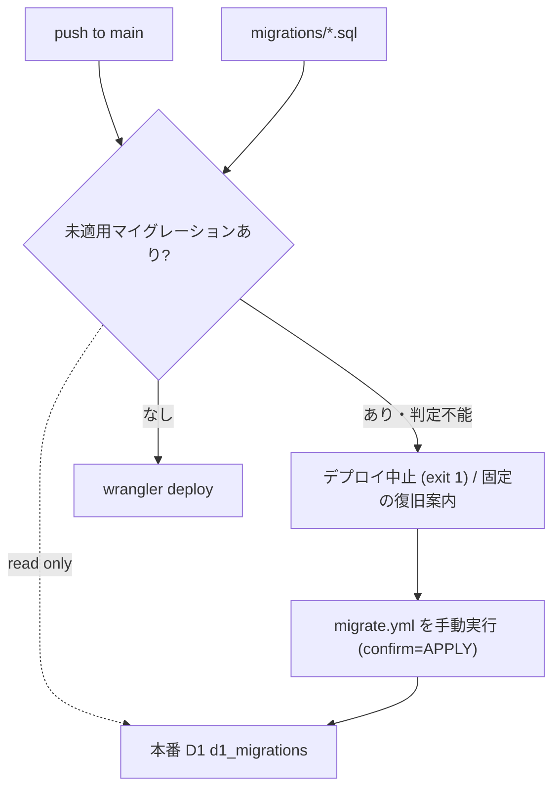

# Architecture overview

Worker のデプロイが本番 D1 のスキーマ版数を追い越さないよう、`deploy.yml` の内部に fail-closed の検査ゲートを設ける。ゲートは「リポジトリの `migrations/` に、本番 `d1_migrations` へ未記録のファイルが存在するか」を判定し、存在すればデプロイを中止する。

## Context and drivers

- ビジネス/技術文脈: 現行は `deploy.yml` が push で自動実行される一方、`migrate.yml` は `workflow_dispatch` かつ `confirm == 'APPLY'` の手動専用である。この非対称により「コードだけが進む」状態が無検知で成立し、本障害を生んだ。
- 品質属性の優先順: 再発防止の確実性 > デプロイの速度 > CI 実行時間。
- 制約: 適用そのものを自動化する権限は与えられていない (ADR D1-migration-gate)。ゲートは「止める」ことだけを担い、「適用する」ことはしない。

## Goals and non-goals

- Goals: (G2) スキーマとコードの乖離を、本番へ到達する前に自動で検知して停止する。停止時のログは秘密値を含まない固定案内に限定し、Migrate workflow を `APPLY` で手動実行してから Deploy を再実行する一意な復旧行動を示す。
- Non-goals: マイグレーションの自動適用、ロールバックの自動化、デプロイ承認フローの導入。

## System context and boundaries

- 利用者/外部システム: GitHub Actions ランナー、Cloudflare D1 (`kanjo-db`)、リポジトリの `migrations/`。
- 信頼/配備/データ境界: ゲートは D1 に対して読み取りのみを行う。書込権限を持つ手順 (`migrate.yml`) とは分離したままにする。
- 文脈図:

## Container and component view

| Container/Component | Responsibility | Interface | Data owner | Deployment unit |
|---|---|---|---|---|
| `deploy.yml` の検査 step | 未適用件数の判定と fail-closed 停止 | GitHub Actions step | リポジトリ | git |
| `wrangler d1 migrations list --remote` | 未適用一覧の取得 | CLI | — | CI ランナー |
| `migrate.yml` | 手動適用の唯一の経路 | workflow_dispatch | リポジトリ | git |

## Cross-cutting contracts

- Identity/access: ゲートは既存の Cloudflare API トークンを読み取り用途で使う。新たな権限を要求しない。
- Errors/resilience: 判定自体が失敗した場合 (認証エラー・ネットワーク断など) も**デプロイを止める**。判定不能を「問題なし」に倒さない。これが fail-closed の意味である。
- Observability/audit: Wrangler の stdout/stderr は認証・環境由来の診断を含み得るため、そのままログへ再出力しない。停止時は「Migrate workflow を APPLY で手動実行後、Deploy を再実行」という固定案内だけを出す。未適用名の確認と承認は Migrate 側の incident baseline / pending manifest が担う。
- Configuration/secrets: 追加のシークレットを導入しない。
- Compatibility/versioning: 判定基準は `arch-d1-schema-lifecycle` と同一 (未適用件数 = 0)。
- Documentation: 恒久 policy と通常の適用順序は `docs/ci-cd-operations.md` を SSOT とする。本 architecture と incident runbook はその policy を複製せず参照する。

## Subtype architecture

- Frontend: N/A — CI 内部の判定であり利用者に露出しない。
- Backend: N/A — ランタイム経路を持たない。
- Infrastructure: 本章の「Delivery, migration and rollback」でワークフロー配線を定義する。
- Data: N/A — D1 へは読み取りのみで、データモデルを持たない。
- Security: N/A — 既存トークンの読み取り利用にとどまる。

## Architecture decisions

| ADR | Decision | Alternatives | Trade-on rationale | Consequences |
|---|---|---|---|---|
| G2-gate-placement | `deploy.yml` 内のデプロイ直前 step として検査する | 別ワークフローで並行検査 / 適用を自動化 | デプロイと同一ジョブに置くことで、検査を通らずデプロイへ到達する経路が原理的に存在しなくなる | デプロイのたびに D1 への読み取りが 1 回増える |
| G2-fail-closed | 判定不能もデプロイ中止として扱う | 判定不能は警告のみで続行 | 判定不能を続行に倒すと、認証エラーが常態化したときゲートが静かに無効化する | 一時的な障害でデプロイが止まり得る (再実行で回復する) |

## Delivery, migration and rollback

- ビルド/デプロイ配置: push → 既存のビルド/テスト → **検査ゲート** → `wrangler deploy`。
- 移行手順: ゲート追加は既存ワークフローへの step 追加のみ。導入直後は現に未適用が残っているため、`arch-d1-schema-lifecycle` の復旧 (F1) を先に完了させないと全デプロイが停止する。この順序依存が本ノードを F1 の後段に置く理由である。
- ロールバック契機/手順: ゲートが誤検知でデプロイを恒常的に阻害する場合、step を無効化して原因を切り分ける。無効化は一時措置として記録を残す。

## Risks and verification

- リスク/前提: 復旧前に導入するとデプロイが全面停止する。CI から本番 D1 へ到達できることが前提。
- アーキテクチャ適合テスト: 未適用が存在する状態でゲートが exit≠0 になること、未適用ゼロで通過すること、認証を意図的に落とした場合も停止すること。
- 負荷/障害/セキュリティ検証: 追加の読み取りが 1 デプロイあたり 1 回に収まること、ログに明細・金額が現れないこと。

## 出典

- Cloudflare D1 migrations — https://developers.cloudflare.com/d1/reference/migrations/ (last_updated 2026-06-08 / 確認 2026-08-27T03:38:13Z)
- Wrangler configuration — https://developers.cloudflare.com/workers/wrangler/configuration/ (last_updated 2026-08-13 / 確認 2026-08-27T03:38:13Z)
