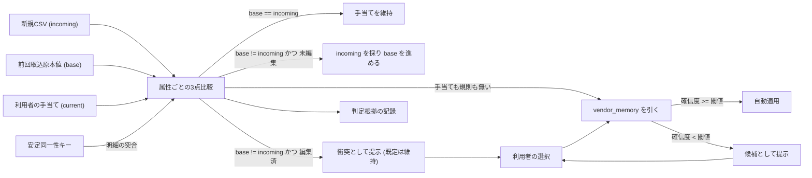

# Architecture overview

同じ対象を取り込み直すとき、いま画面にある値と新しい CSV の値が食い違う。このとき「利用者が直したのか、取込元が変わったのか」は、現在値と新規値の2点だけでは**原理的に区別できない**。本ノードは、前回取込時の原本値 (base) を第3の基準として持つことで判定を確定させる境界と、そこから導かれる手当ての再適用・学習の契約を定める。規範の正本は `system-spec/archive/2026-08-31-import-deletion-override-reapply/spec-state.json` (G2/G3/G6/G7、O8/O9/O10/O11、決定 D2-overwrite-default-policy / D3-auto-classification-method) にあり、本書はそれを再掲せず境界だけを書く。

## Context and drivers

- ビジネス/技術文脈: 同じ取引先からの入出金は毎月繰り返し発生するため、取込のたびに同じ手当てを入力し直すことが最大の手間になっている。現状の受け皿は `rules` / `overrides` / `account_norm_map` の3つで、いずれも前回取込原本値を持たない。
- 品質属性の優先順: 手当てが消えないこと > 判定が説明できること > 提示件数の少なさ > 実装量。無言で手当てが消える事象は、利用者が気づく手段を持たないため最も重い。
- 制約: 判定・学習はすべて D1 内のデータだけで行い、明細を外部サービスや推論モデルへ送らない。学習結果をブラックボックスにせず、一覧で確認し個別に取り消せる。既存の `rules` / `overrides` / `account_norm_map` と矛盾させず優先順位を明示する。

## Goals and non-goals

- Goals: 変更の出どころを属性単位で確定させ、片方しか動いていない箇所を自動で決める。確定した手当てを取引先単位で蓄積し、明細 ID が振り直されても追随させる。
- Non-goals: 確率的推論への置き換え、外部 API による分類、全件を目視確認させる取込フロー、手当ての自動生成による既存 `rules` の上書き。

## System context and boundaries

- 利用者/外部システム: 記帳担当 (単一利用者)、取込元 CSV/ZIP (freee / マネーフォワード ME)、Cloudflare D1 (`kanjo-db`)。外部推論サービスは境界の外にあり、接続点を持たない。
- 信頼/データ境界: 明細は D1 の内側に留まる。判定根拠・確信度・決め事はすべて利用者スコープの D1 行として保持し、外部送信経路を作らない。
- 判定の境界: 3点比較は属性単位 (公私区分・大項目・中項目・名義) で行い、明細単位でまとめない。ある属性が衝突しても、他の属性は自動で決まる。
- 文脈図:

## Container and component view

| Container/Component | Responsibility | Interface | Data owner | Deployment unit |
|---|---|---|---|---|
| base 値 | 属性ごとの前回取込原本値を保持し、比較の基準を与える | 手当てテーブルの列 | D1 | migrations |
| 安定同一性キー | 日付・金額・保有金融機関・正規化内容から明細の同一性を与え、取込元 ID の振り直しに耐える | 明細行の列 (指紋版数つき) | D1 | migrations |
| 3点比較 | 属性ごとに base / current / incoming を突き合わせ、自動確定と衝突を分ける | 取込処理の内部 | backend | Worker |
| vendor_memory | 取引先単位の決め事と確信度を蓄積する | SQL (UPSERT) | D1 | migrations |
| 判定根拠の記録 | 自動判定か衝突か、どの経路で決まったかを残す | 監査記録 | D1 | migrations |
| 取込プレビュー | 自動確定分を要約で、衝突と低確信度の候補だけを行で出す | 画面 | frontend | web |
| 決め事の管理画面 | 一覧・取消・常時適用・内容修正を提供する | 画面 | frontend | web |

## Cross-cutting contracts

- Identity/access: 判定・学習はすべて `user_id` スコープに閉じる。決め事は利用者を跨いで共有しない。
- 優先順位: 明示的な手当て > 利用者が定義した規則 > 学習した決め事 > 取込原本値。学習が利用者の明示登録を上書きしない、が不変条件である。
- Errors/resilience: 既定は常に「手当ての維持」。無操作で確定しても手当てが消えない。判定不能を「取込元を採る」へ倒さない。
- Observability/audit: 判定ごとに自動確定か衝突かの別と採用根拠を残し、自動適用された明細には決め事由来の印を付けて決め事へ辿れるようにする。説明できない自動適用を作らない。
- Configuration/secrets: 追加なし。確信度の閾値はコードで持ち、秘密値を伴わない。
- Compatibility/versioning: 安定同一性キーは既存 `packages/core/src/fingerprint.ts` の正規化方針に揃え、**指紋版数を持たせて算出規則の変更に追従できる**形にする。版数なしのキーを作らない。

## Subtype architecture

- Backend: 3点比較の分岐、確信度の更新、UPSERT による書き戻しと分割実行をここで定義する。
- Data: base 列・安定同一性キー・`vendor_memory` の永続境界と、既存明細への base 埋め移行をここで定義する。
- Frontend: 自動確定分と要判断分の出し分け、および決め事の可視化・取消の要求をここで定義する (表現の具体化は下流の feature)。
- Infrastructure/Security: N/A — 実行基盤は既存のまま。外部送信経路を増やさないことのみ制約として持つ。

## Architecture decisions

| ADR | Decision | Alternatives | Trade-off rationale | Consequences |
|---|---|---|---|---|
| MRG-001 | 前回取込原本値 (base) を属性ごとに保持し、3点比較で変更元を確定させる (決定 D3-auto-classification-method) | 現在値と新規値の2点比較 / キーワード規則の拡充だけ | 2点では「誰が動かしたか」が判定できず、一律の優先順位に倒すしかない。base があれば片方しか動いていない箇所は確定的に決まる | 既存明細には base が無いため、初回取込時に現在の取込値を base として埋める移行が要る |
| MRG-002 | 一律の優先ではなく「機械で決まる分は黙って通し、衝突だけ提示する」(決定 D2-overwrite-default-policy) | 取込元を常に優先 / 手当てを常に優先 | 前者は G3 (手当ての保護) を、後者は G2 (取込元への収束) を捨てる。両立させる方法は場合分けしかない | 差分算出と提示の実装が必要になり、判定規則の変更時に既存 base との整合確認が要る |
| MRG-003 | 提示するのは真の衝突と低確信度の候補の2種類だけに絞る | 差分を全件提示する | 全件提示は確認が苦役になり、読まれない確認は無いのと同じになる。自動確定分は件数の要約と事後追跡で足りる | 「提示されなかったが変わった」を後から辿れる記録が必須になる |
| MRG-004 | 明細の同一性を取込元 ID だけに頼らず、安定同一性キーでも辿れるようにする | 取込元 ID のみを同一性とする | マネーフォワード側で ID が振り直されると手当てが黙って孤立する。無言の孤立は利用者が気づけない | 正規化が緩いと別明細を誤って同一視して手当てが混線するため、指紋版数と正規化方針の共有が前提になる |
| MRG-005 | 決め事は確信度つきで蓄積し、閾値以上のみ自動適用、pin は確信度によらず常に適用 | 一致すれば常に自動適用 / 学習しない | 学習の誤りは取り消すまで広がるため、自動適用の範囲を確信度で絞る。閾値は候補提示から始め、取消率を見ながら段階的に緩める | 確信度の算出規則と閾値そのものが検証対象になる |
| MRG-006 | 判定と書き戻しは取込単位でまとめ読みし、UPSERT で1文にまとめる | 明細ごとに個別クエリを発行する | Worker 1回の呼び出しあたりのクエリ本数は D1 Free で 50 本であり、明細比例のクエリは即座に上限へ当たる | 件数に応じた分割実行が必要で、`arch-import-deletion-undo-boundary` と同じ分割設計を共有する |

## Delivery, migration and rollback

- ビルド/デプロイ配置: スキーマ追加は `migrations/` へ連番 append-only で足し、expand としてコード配信より先に適用する。
- 移行順序: base 列と安定同一性キーの追加 → 既存明細への base 埋め移行 → 3点比較の判定 → `vendor_memory` と確信度更新 → 提示の出し分け → 決め事の管理画面。
- 移行の不変条件: base 埋め移行の前後で、既存の手当ての扱いが変わらないこと。移行が「利用者が直した」と「取込元がそうだった」を取り違えないこと。
- ロールバック契機/手順: 誤学習が広がった場合は決め事の取消を即時反映し、過去に自動適用された明細を再判定で戻す。判定規則そのものに誤りがあった場合は、指紋版数と決め事の `source` を手掛かりに影響範囲を特定する。

## Risks and verification

- リスク/前提: 安定同一性キーの正規化が緩いと手当てが混線する。誤学習した決め事は取り消すまで誤分類を広げる。閾値を最初から緩めると誤りの発見が遅れる。
- アーキテクチャ適合テスト: 判定経路が明細件数に比例したクエリを発行しないこと (`D1_FREE_QUERY_LIMIT` 未満)。明細を外部へ送る依存・通信が存在しないこと。学習した決め事が利用者の明示登録を上書きする経路が存在しないこと。
- 検証: 利用者が触っていない属性で新規値が採られること、触った属性で手当てが維持されること、両方が動いた箇所だけが提示されること、明細 ID が振り直されても手当てが追随すること、決め事を取り消せば以後適用されないこと、同種の取引について問われる件数が回を追って減ること。

## 出典

- git-merge (3-way merge の判定モデル) — https://git-scm.com/docs/git-merge (確認 2026-08-30)
- SQLite UPSERT — https://www.sqlite.org/lang_upsert.html (確認 2026-08-30)
- Cloudflare D1 limits — https://developers.cloudflare.com/d1/platform/limits/ (確認 2026-08-30)
