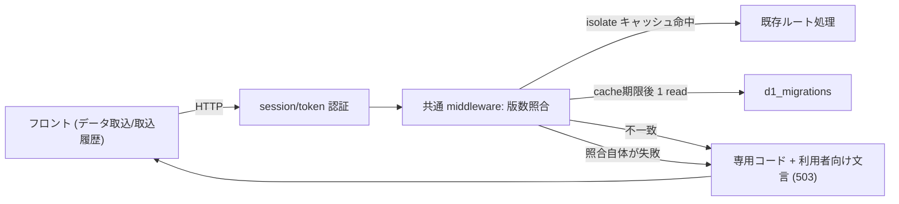

# Architecture overview

デプロイ済みコードが前提とするスキーマ版と、本番 D1 に実際に適用済みの版が食い違ったとき、session 認証後、または D1-backed token 認証後かつ payload/report 取得前に検知し、専用エラーコードと利用者に行動可能な文言を返す契約を定義する。ゲート (`arch-deploy-migration-gate`) をすり抜けた乖離や、ゲート導入前から存在する乖離に対する最後の防波堤である。

## Context and drivers

- ビジネス/技術文脈: 今回の障害で利用者が見たのは「取込を実行できませんでした: サーバーエラーが発生しました」だけだった。この文言からは、自分のファイルが悪いのか、操作を誤ったのか、待てば直るのかが判断できない。取込と取込履歴の両方で同時に発生しており、特定エンドポイントに閉じた検知では取りこぼす実例が既に出ている。
- 品質属性の優先順: 検知漏れゼロ > 説明可能性 > 実装量 > リクエスト当たりのオーバーヘッド。
- 制約: 既存方針「ログ・レスポンスに明細内容や金額は含めない (件数・月・理由のみ)」を崩さない。テーブル名やスキーマ版数も応答へ出さない。

## Goals and non-goals

- Goals: (G3) スキーマ乖離を認証済みの全 D1 利用エンドポイントで検知し、利用者へは「復旧作業中であり、時間をおいて再試行すればよい」ことが伝わる応答を返す。開発者へは専用コードで原因を即座に特定させる。
- Non-goals: 乖離の自動修復、マイグレーションの実行時適用、利用者への技術的詳細の開示。

## System context and boundaries

- 利用者/外部システム: 記帳担当 (ブラウザ)、Workers ランタイム (Hono)、本番 D1 の `d1_migrations` テーブル。
- 信頼/配備/データ境界: 判定は Worker 内で完結する。応答に載せるのは「不一致という事実」と専用コードのみで、内部構造は境界を越えない。
- 文脈図:

## Container and component view

| Container/Component | Responsibility | Interface | Data owner | Deployment unit |
|---|---|---|---|---|
| 版数照合 middleware | 期待版と適用済み最新版の突合、結果の isolate キャッシュ | Hono middleware | — | `packages/api` |
| 期待版定数 | コードが要求する最大マイグレーション番号 | ビルド時に確定する値 | リポジトリ | `packages/api` |
| 専用エラーコード | 乖離を汎用 500 と区別する識別子 | JSON レスポンス | — | `packages/api` |
| フロントのエラー分岐 | 専用コードを受けて待機を促す文言を表示 | React コンポーネント | — | `packages/web` |

## Cross-cutting contracts

- Identity/access: schema 照合は必ず認証の後段に置く。session/public auth では認証前schema照合を行わない。token経路はBearer tokenを `ai_tasks` で認証するため、その認証専用D1 readだけがguardより前に必要であり、payload/report等の業務D1 readはguardより後に置く。
- Errors/resilience: **照合そのものが失敗した場合も専用 503 で停止する。** 判定不能なまま業務クエリへ進むと、古いスキーマに対する書込みや汎用 500 を再発させるため、乖離と判定不能を同じ利用者向け契約へ畳み、内部ログの reason だけで区別する。
- Observability/audit: 乖離検知時は専用コードをログとレスポンスの双方へ載せる。ログにテーブル名・明細・金額を含めない。「しばらく待てば直る」と利用者へ示す以上、開発者へ届く経路 (ログ) を必ず併設する。
- Configuration/secrets: 追加のシークレットや設定項目を導入しない。
- Compatibility/versioning: 判定条件は `arch-d1-schema-lifecycle` と共通で、「期待版 ≤ 適用済み最新版」を満たさないときに乖離と判定する。

## Subtype architecture

- Frontend: 専用コードに対する表示分岐を 1 件追加する (`packages/web`)。文言はテーブル名・版数・スタックを含まない。
- Backend: session 認証の直後と、token の `ai_tasks` 認証直後に共通 middleware として照合を実装し、public auth を対象外にする。isolate 内には期限付きの scalar 判定結果だけをキャッシュする (`packages/api`)。
- Infrastructure: N/A — 追加のインフラ資源を要さない。
- Data: N/A — `d1_migrations` の読み取りのみで、新規テーブルを持たない。
- Security: 応答・ログへの内部構造の非露出を本章の Cross-cutting contracts で規定する。

## Architecture decisions

| ADR | Decision | Alternatives | Trade-on rationale | Consequences |
|---|---|---|---|---|
| D3-runtime-schema-guard | session認証後、およびtokenの`ai_tasks`認証後の共通 middleware で照合する | 重いエンドポイントの直前だけ / 夜間 cron で照合 | schema照合を認証より前へ出さず、業務 D1 経路の検知漏れを防げる。今回の取込履歴側の取りこぼしも防げる | token認証専用の`ai_tasks` readはguardより前に必要。認証済みリクエストが判定を通るため、キャッシュ設計を誤ると D1 への問い合わせが増える |
| D4-schema-mismatch-user-message | 復旧作業中である旨と、時間をおいた再試行を促す文言を表示する | 未適用マイグレーションと参照コードを併記 / 表示は変えずログのみ区別 | 利用者に必要なのは内部事情ではなく「自分の操作の誤りではない」「待てば直る」の 2 点である | 開発者は画面だけでは原因を特定できず、専用コードかログを見る必要がある |

## Delivery, migration and rollback

- ビルド/デプロイ配置: 既存の Worker デプロイに同梱する。期待版はビルド時に確定させ、実行時に外部から与えない。
- 移行手順: middleware を追加 → フロントの分岐を追加 → 乖離状態を再現した環境で 503 と文言を確認 → 本番へデプロイ。
- ロールバック契機/手順: 照合が誤検知で正常リクエストを阻害する場合は、期待版の導出または照合 query を修正して再配信する。guard の無効化は判定不能な schema へのアクセスを再許可するため、通常の復旧手段にはしない。

## Risks and verification

- リスク/前提: 「しばらく待てば直る」と示す以上、実際に復旧されない状態が続くと文言が嘘になる。検知と復旧手順が対で運用されることが前提であり、`arch-d1-schema-lifecycle` の復旧手順と併せて成立する。
- アーキテクチャ適合テスト: 乖離状態と照合失敗時の双方で、認証済みの全 D1 利用エンドポイントが専用コードを返すこと。public auth は guard 対象外であること。キャッシュ有効期間内の `d1_migrations` 読み取りが 1 回に収まること。
- 負荷/障害/セキュリティ検証: 応答本文とログに、テーブル名・スキーマ版数・スタックトレース・明細・金額が現れないことを検査する。

## 出典

- Cloudflare D1 migrations — https://developers.cloudflare.com/d1/reference/migrations/ (last_updated 2026-06-08 / 確認 2026-08-27T03:38:13Z)
