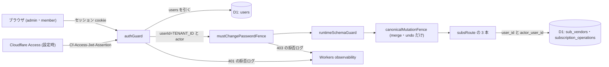

# Architecture overview

サブスク統合の新しい API を、既存のセッション認証と共有テナントのキーの配下に置く。本書は認証・認可の制約を持つ。エンドポイントごとの認証・認可の正本は `specs/spec-subscriptions-merge.md` (以下 spec) の API 契約と「認証・認可」の節で、`system-spec/auth.md` は承認時の入力である。行番号は 2026-09-30 に現物で確かめた値。

前サイクルの `architecture/subscriptions-auth.md` は、新設の経路を既存の route に足し、authGuard と mustChangePasswordFence の内側で userId と組にして引く形を定めた。本書はこの形と「存在を明かさない 404」を引き継ぎ、認証の方式は変えない。新しく決めるのは次の 4 点。

1. 統合・取り消し・操作履歴の 3 本を、既存の subsRoute に足して同じ guard の配下に置く。
2. テナントのキー (`c.get('userId')`) と操作者 (`c.get('actor').id`) を分けて使う。
3. 統合と取り消しを canonical mutation の表へ明示的に登録する。
4. 認証・認可が拒否した要求をログに残す。

## Context and drivers

以下の既存実装の観測は開発着手前 (2026-09-30) の記録。現在の構造・契約は各設計節と spec を参照する。

- Business/technical context〔観測 qa-subsmerge-auth-web-evidence-001・qa-subsmerge-auth-web-evidence-002、現物 2026-09-30〕:
  - セッション cookie は `packages/api/src/auth.ts:128-135` で httpOnly・secure・SameSite=Strict・path=/ として発行し、:137-138 の clearSession で消す。
  - `packages/api/src/index.ts` のミドルウェアは次の順に掛かる: :111 authGuard → :113 mustChangePasswordFence → :114 runtimeSchemaGuard → :115 canonicalMutationFence。subsRoute は :136 で載る。認証の要らない authRoute・aiAgentRoute・improvementAgentRoute は :102-107 で、guard より前に載る。
  - authGuard (auth.ts:245) の経路は 2 つある。
    - Cloudflare Access の経路 (:248-266): `Cf-Access-Jwt-Assertion` を検証したうえで users を引き、status が active のときだけ通す。
    - セッションの経路 (:274-279)。
    - どちらも userId に `TENANT_ID = 'default'` (:36) を、actor に SessionActor (:38-43 の id・email・role・mustChangePassword) を入れる。userId は全利用者で同じ値で、利用者を特定しない。
  - verifySession は、users.status が active でない利用者 (:172) と、session_generation が合わない cookie (:173) を通さない。停止した利用者の cookie は次の要求から 401 になる。
  - 拒否は、401 unauthorized (:266・:275)、403 password_change_required (:292-302)、403 forbidden (adminGuard、:309-312) のいずれもログを出さずに返す。
- Quality attribute priorities:
  - G4 を最優先にする。ログインした利用者だけが共有テナントのデータを変え、誰が何をしたかを後から辿れるようにする。
  - 上流の指針は OWASP ASVS 5.0.0 (出典 owasp-asvs)。保護資源の全てで認証を強制し、オブジェクト単位で認可し、失敗した認証・認可を記録する (V16.3.2)。
- Constraints:
  - 外部 IdP を足さず、資格情報の処理 (ハッシュ・ロックアウト・パスワード変更) に触れない。
  - secrets は `packages/api/.dev.vars` と Cloudflare の secret にだけ置く。wrangler.jsonc の `secrets.required` は SESSION_SECRET の 1 本だけ。public リポジトリなので、値をコミットしない。
  - 対象は web だけ〔決定 qa-subsmerge-target-platforms-002〕。

## Goals and non-goals

- Goals:
  - G4: 新しい 3 本を authGuard・mustChangePasswordFence の配下に置く。統合と取り消しは canonicalMutationFence の表にも登録する〔-003 由来: qa-subsmerge-auth-web-003〕。
  - G4: テナントは `c.get('userId')` からだけ、操作者は `c.get('actor').id` からだけ取り、操作の記録の `actor_user_id` に書く。本文・クエリ・ヘッダ (Idempotency-Key を含む) からは受けない〔決定 qa-subsmerge-actor-record-001、spec 認証・認可〕。
  - G4: 取り消しと操作履歴は、role と操作者で絞らず、テナントの全利用者を対象にする〔決定 qa-subsmerge-undo-scope-001〕。
  - G4: テナントに無い vendor id と操作 id には、存在しない id と同じ 404 not_found を返す〔-003 由来: qa-subsmerge-auth-web-003、spec AC-012〕。
  - G4: 認証・認可が拒否した要求を、path・理由・actor の id でログに残す〔-003 由来: qa-subsmerge-security-web-003、spec 可観測性〕。
- Non-goals:
  - 認証方式・cookie の属性と期限・パスワード変更の流れを変えること。
  - admin と member で操作を分ける権限の設計。
  - Idempotency-Key を認証や認可の材料に使うこと。
  - 利用者を削除する API を作ること。停止は既存の `status='suspended'` で行う (`routes/admin-users.ts:110`)〔観測 qa-subsmerge-maintenance-ops-web-evidence-002〕。

## System context and boundaries

- Users/external systems:
  - ログインした利用者 (admin・member)。
  - Cloudflare Access (ACCESS_AUD と ACCESS_TEAM_DOMAIN を設定したときだけ使う)。Access が示す email は users の行と照らし、users を認可の正本にする (auth.ts:253-254 のコメント)。
- Trust/deployment/data boundaries:
  - 信頼の境界は `/api/*` の入口の guard にある。身元は cookie か Access の JWT から引いた users の行からだけ決まる。
  - 本文・クエリ・ヘッダの値は、身元を決める材料にしない。
  - D1 は Worker の後ろにあり、ブラウザから直接は届かない。
- Context diagram:

## Container and component view

| Container/Component | Responsibility | Interface | Data owner | Deployment unit |
|---|---|---|---|---|
| authGuard (既存 auth.ts:245) | cookie か Access の JWT から users を引き、userId と actor を設定する。通らなければ 401 と拒否ログ | Hono middleware (index.ts:111) | users (D1) | Worker |
| mustChangePasswordFence (既存 auth.ts:287) | 一時パスワードのままの利用者の要求を 403 で止め、拒否ログを出す | Hono middleware (index.ts:113) | なし | Worker |
| canonicalMutationFence (既存 canonical-mutation-fence.ts:274) | 表 (:46) に載った書込みを、テナント単位の lease で直列化する。merge と undo の 2 行を足す | middleware と CANONICAL_MUTATION_ROUTES | import の lease 表 (D1) | Worker |
| subsRoute の 3 本 (routes/subs.ts) | merge・undo・履歴。条件式を userId で絞り、書く行に actor.id を入れる | Hono route | sub_vendors・subscription_operations | Worker |
| 拒否ログ (auth.ts に足す) | 401 と 403 の拒否を構造化ログにする | `console.warn` の JSON 1 行 | なし | Worker |

## Cross-cutting contracts

規範は [spec-subscriptions-merge](../specs/spec-subscriptions-merge.md) に従う。

- 認証・所有者・操作者: spec「認証・認可」。
- 入力・応答・エラー・冪等性・revision: spec「API契約」「ビジネスルールと検証」。
- 操作状態・再試行・表示文言: spec「UI・状態遷移」「エラー・例外・回復」。
- 列・制約・保持・復元: spec「データモデル」「確定した実装契約」。
- 検証: spec「テストと受入条件」。実行結果は [docs の検証索引](../docs/subscriptions-screen.md#verification-records)。

本領域の追加参照: FR-010 (操作者の操作記録)。具体値と期待値は spec を参照する。

本書は構造と採用理由を持ち、契約表を複製しない。現行の追加契約と推定月額の再計算規則は spec の「推定月額の契約確定」を参照する。

## Subtype architecture

- Frontend: N/A: 画面のログインと cookie の扱いを変えない。操作者の email の表示は `architecture/subscriptions-merge-frontend.md` が持つ。
- Backend: N/A: route の処理の順と batch は `architecture/subscriptions-merge-backend.md` が持つ。本書は guard と所有者の検査の条件だけを持つ。
- Infrastructure: N/A: secret・binding・Worker の構成を増やさない。
- Data: N/A: `actor_user_id` の列と索引は `architecture/subscriptions-merge-database.md` が持つ。
- Security: 下記 Security architecture を合成する。

### Security architecture

#### Assets, actors and threat model

- Protected assets/data classification:
  - セッション cookie と Access の JWT: 資格情報に当たる、最も機微な資産。
  - users の email・role・status: 個人情報と権限の情報。
  - 共有テナントの sub_vendors と操作の記録: 業務データ。
  - 操作の記録の `actor_user_id`: 誰が操作したかの証跡。
- Actors/adversaries/abuse cases:
  - 未認証の第三者が API を直接叩く → authGuard が 401 を返す。
  - 一時パスワードのままの利用者 (初期パスワードが漏れた場合を含む) → mustChangePasswordFence が 403 を返す。
  - 停止した利用者の cookie が残っている → verifySession (:172) が null を返し、401 になる。
  - 別サイトからの CSRF。SameSite=Strict の cookie は、別サイトから始まった要求には付かない。加えて、merge と undo は独自ヘッダの Idempotency-Key を必須とする。このため単純な form の送信では要求を組めず、CORS の preflight が要る。preflight を許可する CORS の設定は無い。
  - 正規の member が他の利用者の統合を取り消す → 決定により許す〔決定 qa-subsmerge-undo-scope-001〕。防ぐのではなく、統合と取り消しの両方の actor_user_id を残して辿れるようにする (spec AC-013)。
  - 本文・クエリ・ヘッダで user_id や actor を偽る → 読まないので効かない。
- Trust boundaries/data flows:
  - 身元の流れは cookie / JWT → users の行 → `c.set('userId')`・`c.set('actor')` の一方向だけ。
  - route は `c.get` からだけ身元を読む。

#### Identity and authorization

- Authentication/session/federation:
  - 方式は変えない。Set-Cookie の属性は MDN の記述に従う (出典 mdn-set-cookie)。
  - Access の経路もセッションの経路も actor を設定するので、`actor_user_id NOT NULL` はどちらの経路でも満たせる。
  - route は、actor が無ければ書かずに 401 を返す防御的な検査を持つ〔本書で置いた値〕。
- Authorization model and deny-by-default rules:
  - 既定で拒否する。`/api/*` の全てに authGuard が掛かり、新しい 3 本は :136 の subsRoute に足すので、guard より前に載る例外の route (:102-107) には入らない。新しい route インスタンスは作らない。
  - adminGuard (auth.ts:309) は掛けず、admin・member のどちらでも呼べる。取り消しと履歴は role と操作者で絞らない〔決定 qa-subsmerge-undo-scope-001〕。
  - mustChangePasswordFence はパスの表を持たず、全ての `/api/*` に掛かる〔現物 2026-09-30〕。配下に置けば足り、表に登録する作業は無い (spec 認証・認可)。
  - canonicalMutationFence は `canonical-mutation-fence.ts:46` の CANONICAL_MUTATION_ROUTES に載った書込みだけを直列化する (:264 classifyCanonicalMutation)。サブスク系の既存の登録は :219-249 にある。
  - `/^\/api\/sub-vendors\/[^/]+$/` は PUT と DELETE にしか付かないので、`POST /api/sub-vendors/merge` はどの登録にも当たらない。次の 2 行を明示的に足す〔現物 2026-09-30、spec 認証・認可〕。
    - `{ method: 'POST', path: /^\/api\/sub-vendors\/merge$/ }`
    - `{ method: 'POST', path: /^\/api\/subscription-operations\/[^/]+\/undo$/ }`
  - `GET /api/subscription-operations` は method が GET なので、分類の段階で fence の対象から外れる。
  - consumers は `sub_vendors`・`sub_vendor_review_decisions`・`subscription_operations`・`subscription_revisions` とする。
    - `monthly_agg` は CanonicalConsumer の型 (:19-34) に無い。既存の別名の登録 (:228) も、再集計が書く monthly_agg を consumers に挙げていない。
    - 新しい 2 表は、復元で書き戻さない表なので、0046 の saved_filters・tx_history (:28-34) と同じく型の側に足す〔本書で置いた値〕。
- Tenant/resource ownership enforcement:
  - merge: targetId と sourceVendorIds の全件を、`user_id = c.get('userId')` の sub_vendors から 1 回の問い合わせで引く。1 件でも無ければ 404 (spec BR-006)。
  - undo: `(id, user_id)` で操作を引き、無ければ 404。kind が merge でなくても同じ 404 (spec BR-009)。
  - 履歴: `user_id = ?` で絞る。操作者の email は users を actor_user_id で LEFT JOIN して引く。users はテナントの列を持たないが、全利用者が同じ TENANT_ID に属するので、テナントの外の利用者は存在しない。
  - batch の各文 (挿入・更新・削除・`json_each(?)` の再挿入) の WHERE にも user_id を入れる。

#### Data and secret protection

- Encryption in transit/at rest/key ownership:
  - 通信は HTTPS だけ。cookie の secure 属性がそれを前提にする。
  - 保存時の暗号化は D1 の管理に委ねる。セッションの署名鍵 SESSION_SECRET は運用者が Cloudflare の secret に持つ。
  - 新しい鍵は無い。
- Secret source/rotation/redaction:
  - SESSION_SECRET は Cloudflare の secret とローカルの `.dev.vars` (git の対象外) にだけ置く。
  - 入れ替えると、全てのセッションが無効になる (既存の挙動)。
  - cookie・JWT・パスワードは、拒否ログにも操作ログにも出さない。
  - Idempotency-Key は秘密の値ではないが、ログと履歴の応答には出さない。
- Retention/deletion/privacy requests:
  - `actor_user_id` は外部キーを付けずに 400 日保持する〔決定 qa-subsmerge-actor-record-001・qa-subsmerge-retention-001〕。
  - email は操作の記録に写さず、読むときに users から引く。users の行が無い操作者は、画面が「削除された利用者」と示す (spec AC-022)。
  - 停止中の利用者は users に行が残るので、email で示す (2026-09-30T14:09:17Z の訂正)。

#### Application and supply-chain controls

- Input/output validation and injection defenses:
  - 身元に関わる入力は受けない。
  - path の操作 id は 1〜64 文字の `[A-Za-z0-9_-]` に限る。Idempotency-Key は 8〜64 文字の `[A-Za-z0-9-]` に限る (spec BR-007)。
  - 条件式は Drizzle の bound parameter で組み、文字列を連結しない。
  - 入力の上限の全体は `architecture/subscriptions-merge-security.md` が持つ。
- Dependency/artifact provenance/signing/SBOM:
  - 依存を足さない。認証は既存の hono ^4.13.5 と Web Crypto で行う (`packages/api/package.json`)。
  - 署名と SBOM は N/A: 配布物を第三者へ渡さない個人利用の Worker で、本変更は依存を増やさないため。
- CI/CD branch/review/environment protections:
  - 既存の ci.yml と `pnpm verify:full` を通してから merge する。
  - secrets は GitHub の secrets と Cloudflare の secret にだけ置き、ワークフローのログに出さない (deploy.yml:40-41)。

#### Detection and response

- Audit events/security telemetry/alerts:
  - 監査のイベントは次の 2 つ。
    - 拒否ログ `auth_rejected`。
    - 操作の記録 (who=actor_user_id、what=kind と target、when=created_at、V16.2.1)。
  - 利用者の停止は、既存の `admin_user_suspend` の監査 (`routes/admin-users.ts:110`) が残す。
  - 警報は N/A: 個人利用のため置かない (spec 可観測性)。
- Incident response/revocation/recovery:
  - 端末を失った、cookie が漏れた: admin が利用者を停止する。session_generation が合わなくなり、次の要求から 401 になる。
  - 全員を締め出す必要があるとき: SESSION_SECRET を入れ替える。
  - 不正な統合: 30 日以内なら取り消す。それより古ければ夜間バックアップ (R2 backups/、30 日保持、index.ts:193) から戻す。
- Vulnerability handling and SLA:
  - 認証まわりの依存 (hono) の脆弱性は、CI の `pnpm audit --prod --audit-level high` (ci.yml:52) が警告として示し、次の変更で上げる。
  - SLA は N/A: 個人利用で、対応の期限を約束する相手がいないため。

#### Security verification

- SAST/SCA/secret scan/authz/abuse/penetration tests:
  - SAST・SCA・公開文書の検査は `architecture/subscriptions-merge-security.md` の Security verification に従う (`pnpm typecheck`・`pnpm lint`・`pnpm audit`・`security:content`)。認証に固有の静的解析は足さない。
  - authz と abuse は、`packages/api/src/subs-vendor-scope.test.ts` と、新しい `subs-merge-operations.integration.test.ts` で次を確かめる。
    - 3 本それぞれで、cookie が無ければ 401、一時パスワードのままなら 403、停止した利用者の cookie なら 401。
    - 行の user_id を別の値へ付け替えた vendor と操作に対して、統合と取り消しが 404 になり、履歴が 0 件になる (spec AC-012)。付け替えの作り方は `packages/api/src/improvement-screen.integration.test.ts:4-5` の前例に従う。
    - 本文に user_id と actor を入れても、書かれた `actor_user_id` がセッションの actor と一致する。
    - 別の利用者が統合を取り消すと 200 になり、両方の actor_user_id が残る (spec AC-013)。
    - 同じ key を別の利用者が送っても、最初の結果が返らない。
  - 拒否ログは console を spy して確かめる。path・reason・actorId が入り、email・cookie・本文が入らないこと。
  - fence の分類は、既存の `packages/api/src/import-lifecycle-pure.test.ts:726` の「全 mutating route を 3 分類に MECE で固定する」で確かめる。
    - このテストは routes/subs.ts の書込みの route を読み出して期待の一覧と比べる。merge と undo を足して表に載せないと落ちる。
    - 期待の一覧と CANONICAL_MUTATION_ROUTES の件数を合わせて更新する。
  - ペネトレーションテストは N/A: 個人利用で外部の診断を入れる予定が無い。上の authz と abuse のテストで代える。

## Architecture decisions

| ADR | Decision | Alternatives | Trade-on rationale | Consequences |
|---|---|---|---|---|
| SM-AUTH-01 | 認証の方式を変えず、3 本を既存の subsRoute に足す〔-003 由来: qa-subsmerge-auth-web-003〕 | 新しい route を別にマウントする / 操作ごとに再認証する | マウントの位置を誤って guard の外へ出る余地を作らない。再認証は画面の自動再試行と両立しない | 変更の範囲が subsRoute・fence の表・auth.ts のログに収まる |
| SM-AUTH-02 | テナントの条件は userId、操作者は actor.id で別に持つ〔決定 qa-subsmerge-actor-record-001〕 | userId だけで記録する / 本文で操作者を受ける | userId は全利用者で同じ TENANT_ID なので、誰が操作したかを表せない。本文の値は偽れる | 全ての操作の行に actor_user_id が NOT NULL で入る |
| SM-AUTH-03 | 取り消しと履歴を role・操作者で絞らない〔決定 qa-subsmerge-undo-scope-001〕 | 本人の操作だけ / admin だけ | 共有テナントを 2 人で運用しており、相手の誤りをすぐ戻せる方を選んだ | 他の利用者の統合も戻せる。両方の actor が残る |
| SM-AUTH-04 | テナントに無い id に、存在しない id と同じ 404 を返す〔-003 由来: qa-subsmerge-auth-web-003〕 | 403 と 404 を分ける | 応答の差から存在を推測させない | テストで user_id を付け替えて確かめる |
| SM-AUTH-05 | 統合と取り消しを CANONICAL_MUTATION_ROUTES に 2 行で明示的に登録する〔現物 2026-09-30、spec 認証・認可〕 | 既存の正規表現を広げる | 既存の登録の意味を変えず、MECE の分類テストで漏れを落とせる | 表が 2 行増え、分類テストの期待を更新する |
| SM-AUTH-06 | mustChangePasswordFence に手を入れない〔現物 2026-09-30〕 | 3 本を対象の表へ登録する | 現物に表が無く、すでに全 `/api/*` に掛かっている | 配下に置くことを 403 のテストで確かめる |
| SM-AUTH-07 | 401 と 403 の拒否ログを authGuard と mustChangePasswordFence に足す〔-003 由来: qa-subsmerge-security-web-003、形は本書で置いた値〕 | route ごとに出す / 出さない | guard の 2 か所で全ての `/api/*` を覆える。V16.3.2 を満たす | 既存の経路の拒否も記録される。走査による 401 が増えるとログの量が増える (head_sampling_rate 1) |
| SM-AUTH-08 | Idempotency-Key の一意の範囲に actor を含める〔-003 由来: qa-subsmerge-security-web-003〕 | テナントだけで一意にする | 別の利用者の key と衝突しても干渉させず、他人の結果を返さない | UNIQUE (user_id, actor_user_id, idempotency_key) を database 文書が持つ |

## Delivery, migration and rollback

- Build/deploy topology: 既存の Worker のまま。認証の構成・secret・binding は変えない。
- Migration sequence: 次の順に同じ PR で入れる。
  1. 0058 で actor_user_id の列を持つ表を作る。
  2. fence の表に 2 行を足し、分類テストを更新する。
  3. subsRoute に 3 本を足す (userId の条件と actor.id の書込み)。
  4. authGuard と mustChangePasswordFence に拒否ログを足す。
  5. scope のテストを足す。
  - 本番は Migrate → Deploy の順 (spec 互換性・移行・リリース)。
- Rollback trigger/procedure:
  - 認証か scope のテストが落ちたら、実装を差し戻す。route・fence の登録・拒否ログがまとめて消え、セッションはそのまま使える。
  - 資格情報に触れないので、データの巻き戻しは要らない。0058 の列と操作の記録は残る。

## Risks and verification

- Risk/assumption:
  - 共有テナントなので、どの member も他の利用者の統合を取り消せる。決定として受け入れ、証跡を残すことで補う。
  - fence の表に登録し忘れると、統合が lease の外で走り、取込や復元と重なる。分類テスト (import-lifecycle-pure.test.ts:726) で落とす。
  - 拒否ログの path は、`GET /api/subscriptions/vendors/:key` では正規化した取引先名を含む。
    - Workers の observability は要求の URL を自動で記録するので、path を伏せても名前は platform のログに残る。
    - 本書は既存の onError (index.ts:151) と同じく path を出し、この残り方を受け入れる。
  - consumers の置き場所が spec と違う。
    - spec のデータモデルは、新しい 2 表を `JSON_SNAPSHOT_MUTATION_CONSUMERS` に足すとし、同じ節で「復元では書き戻さない」とする。
    - 現物の `JSON_SNAPSHOT_MUTATION_CONSUMERS` は、復元の write-set の契約でもある (import-active.ts:1・:22-25・:41-49)。
    - 本書は CanonicalConsumer の型の側に足す。実装の着手時に database 文書と揃える。
- Architecture fitness test:
  - classifyCanonicalMutation が、`POST /api/sub-vendors/merge` と `POST /api/subscription-operations/x/undo` に canonical-mutation を返し、`GET /api/subscription-operations` に not-canonical-mutation を返す。
  - routes/subs.ts の新しい 3 本が、身元を `c.req` (本文・クエリ・ヘッダ) から読まない。
- Load/failure/security validation:
  - 上の Security verification のテストが緑であること。
  - 既存のログインと停止の回帰テストが緑であること。
  - `pnpm verify:full` が緑であること (spec AC-023)。
