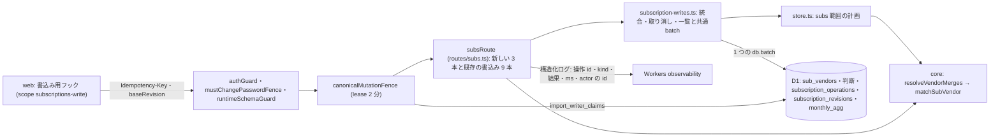

# Architecture overview

サブスク統合 — 名寄せを 1 つの照合一覧に寄せ、書込みと subs 範囲の置き換えを 1 つの `db.batch` で適用する。本書は backend の制約を持つ。エンドポイントごとの契約 (Request・Response・Error contract) の正本は `specs/spec-subscriptions-merge.md` (以下 spec) の API 契約で、`system-spec/backend.md` は承認時の入力である。行番号は 2026-09-30 に現物で確かめた値。

完成度評価は C06 (過去の問文の中立性) で FAIL のまま、利用者が 2026-09-30T14:07:45Z に例外として承認した。記録は `docs/evidence/subscriptions-merge/spec-evaluation-waiver.json` にある。

前サイクルの `architecture/subscriptions-backend.md` は、画面の値を core の subscriptionsScreen 1 か所で導き、既存の API を延長する形を定めた。本書はこの形を引き継ぐ。新しく決めるのは次の 5 点。

1. 統合を解いた照合一覧を core の `resolveVendorMerges` 1 か所で作る。`matchSubVendor` はこの一覧だけを受ける。
2. サブスクの全ての書込みを、操作の記録・revision・掃除と同じ 1 つの `db.batch` で適用する。
3. 統合・取り消し・名寄せに効く書込みは `recomputeFromDeals` を呼ばない。subs 範囲だけを計画し、同じ batch で置き換える。
4. 新しい 3 本を subsRoute に登録する。handler と batch の組み立ては補助の module に分ける。
5. サブスク等の書込みの lease の TTL を 2 分にし、取込の 15 分と分ける。

## Context and drivers

以下の既存実装の観測は開発着手前 (2026-09-30) の記録。現在の構造・契約は各設計節と spec を参照する。

- Business/technical context〔観測 qa-subsmerge-backend-web-evidence-001・qa-subsmerge-database-web-evidence-001、現物 2026-09-30〕:
  - 名寄せの `matchSubVendor` (`packages/core/src/subs.ts:59-76`) には呼び手が 3 つある。
    - 他画面の subs 集計: applyFreeeDeals (`packages/core/src/dataset.ts:86`、照合は :112-117)。
    - サブスク画面: buildContext (`packages/core/src/subs-screen.ts:239`) → registeredVendorOf (`packages/core/src/expense-projection.ts:261-271`)。
    - 事業分の現金明細の射影: projectCashContribution (`packages/api/src/store.ts:731`、照合は :760-766)。
  - 照合の順序が 2 通りある。dataset.ts:112 は科目を渡し、eligibleForAccount (subs.ts:41-51) で対象科目に合うベンダーへ先に絞る。registeredVendorOf は科目を渡さずに照合し (:265)、一致したベンダーの accounts で後から弾く (:270)。
  - 統合の関係を表す列は無い。現行の「名称を統合」は別名の追加 (`packages/api/src/routes/subs.ts:208`) で、未登録の行にしか出ない。
  - 別名の追加は、書込みの batch (:221-227) と再集計 (:228 の recomputeFromDeals) が別の要求になる。再集計が失敗した後の再試行は :220 の早期 return で終わり、集計が古いまま残る〔観測 qa-subsmerge-database-web-evidence-001〕。
  - サブスクの書込み 9 本は canonicalMutationFence (`packages/api/src/canonical-mutation-fence.ts:274`) の lease で直列化される (登録は :219-249)。取れなければ 409 canonical_write_busy (:282-291)。lease は acquireImportWriter (`packages/api/src/import-lifecycle.ts:424`) が取り、TTL は :446 で `IMPORT_CLAIM_TTL_MS` (15 分、:300) に固定されている。
  - 同時の操作で出る「サーバー側で処理に失敗しました」は、5xx を画面の describeError (`packages/web/src/components/Page.tsx:87-100`) が言い換えた文言である。
  - Workers Free の 1 invocation で発行できる D1 の問い合わせは 50 まで (`D1_FREE_QUERY_LIMIT`、import-lifecycle.ts:304)。
- Quality attribute priorities:
  1. 正しさ (O1): どの画面も、同じ取引を同じベンダーに割り当てる。
  2. 一貫性と回復性 (O2): 書込みと集計の片方だけが反映された状態を残さない。同時・連続の操作で 500 を 0 件にし、失敗を「未適用」と「適用されたか分からない」に分けて返す。
  3. 追跡性 (O4): 誰が・何を・いつ操作したかを 400 日たどれる。
  4. 性能: 統合・取り消しの 1 要求の D1 の問い合わせを 20 文未満にする。
- Constraints:
  - Cloudflare Workers・Hono ^4.13.5・drizzle-orm ^0.45.2・D1 (`packages/api/package.json`)。キュー・Durable Objects・新しい定期 job を足さない〔決定 qa-subsmerge-decision-005〕。
  - D1 の batch は 1 つのトランザクションとして実行され、途中の文が失敗すれば全体が戻る (出典 cloudflare-d1-batch)。1 文の bound parameter は 100 まで (出典 cloudflare-d1-limits)。
  - 取込と復元の lease (15 分) と、recomputeFromDeals の作りを変えない。
  - 対象は web だけ〔決定 qa-subsmerge-target-platforms-002〕。

## Goals and non-goals

- Goals:
  - G1: 統合を core の `resolveVendorMerges` 1 か所で解き、サブスク画面・他画面の subs 範囲・現金明細の射影が同じ照合一覧を通す〔-003 由来: qa-subsmerge-backend-web-003〕。
  - G1: 照合の順序を「科目で先に絞ってから照合する」1 通りにそろえる (spec FR-009)〔本書で置いた値〕。
  - G2: サブスクの全ての書込みを、操作の記録・revision の +1・書込み本体・subs 範囲の置き換え・掃除の 1 つの `db.batch` で適用する〔決定 qa-subsmerge-decision-003〕。
  - G2: 同時・連続の操作の失敗を、未適用の 409 と 503 d1_overloaded に寄せる〔決定 qa-subsmerge-decision-004〕。
  - G4: 全ての書込みを actor_user_id 付きで記録し、統合の取り消しと直近 20 件の履歴を返す〔決定 qa-subsmerge-actor-record-001・qa-subsmerge-undo-scope-001〕。
- Non-goals:
  - 取込・復元・削除の再計算 (recomputeFromDeals・planRecomputeFromDeals) の作りを変えること。
  - 金額の母集団を画面の間でそろえること。サブスク画面は照合後の実質支出、他画面は freee 仕訳と事業分の現金明細を数える〔決定 qa-subsmerge-decision-002〕。
  - キュー・Durable Objects による直列化。
  - 統合元の行を消すこと。
  - 取り消しの取り消し (unmerge の取り消し)。

## System context and boundaries

- Users/external systems:
  - 利用者 (admin・member): 画面の書込み用フックから、TanStack Query の scope で 1 件ずつ送る (`architecture/subscriptions-merge-frontend.md`)。
  - 運用者: 操作履歴の API と Workers の observability で、止まった操作を辿る (spec UC-8)。
  - D1: 唯一の保存先。
  - R2: 夜間バックアップの置き場。操作の記録と revision は写さない (`architecture/subscriptions-merge-database.md`)。
- Trust/deployment/data boundaries:
  - 全て 1 つの Worker (`packages/api`) の中で動く。ブラウザ → `/api/*` の guard → subsRoute → D1 の一方向。
  - テナントは `c.get('userId')`、操作者は `c.get('actor').id` からだけ取る (`architecture/subscriptions-merge-auth.md`)。
  - core は純関数で、D1 に触れない。api が読み、core が照合し、api が 1 つの batch で書く。
- Context diagram:

## Container and component view

| Container/Component | Responsibility | Interface | Data owner | Deployment unit |
|---|---|---|---|---|
| resolveVendorMerges (新設、core/subs.ts) | merged_into_id の連鎖を推移的にたどり、統合元の name と aliases を最終の統合先の照合対象へ展開した照合一覧を返す。統合元は単独の照合対象から外す。循環と自己統合は例外。行の無い merged_into_id は統合なしとして扱う | 純関数。戻り値は ResolvedSubVendors。照合はその vendors を使う | なし (入力は sub_vendors の行) | core (api と web に同梱) |
| matchSubVendor (既存 core/subs.ts:59) | 照合一覧から、取引名に当たるベンダー名を返す。科目を受けたら先に対象科目で絞る | SubVendor の配列を受け、呼出側が解決済みの vendors を渡す | なし | core |
| defaultMergeTarget (新設 core) | 統合先の既定を決める (推定月額が最大の登録済み行、登録済みの行が無ければ null) | 純関数 | なし | core |
| subsRoute (既存 routes/subs.ts) | 新しい 3 本の登録と既存の書込み 9 本。検証 → 状態の読み取り → 判定 → batch の依頼 → 応答 | Hono route (`index.ts:136` で /api に載る) | sub_vendors・sub_vendor_review_decisions・sub_vendor_exclusions | Worker |
| subscription-writes.ts (packages/api/src/) | 統合・取り消し・一覧のhandler、BR-009の判定、共通batch・再送の照合・操作記録の組み立て | subsRouteから呼ぶ関数。例外はindex.tsのonErrorへ渡す | subscription_operations・subscription_revisions | Worker |
| subs 範囲の計画 (新設 store.ts) | freee 仕訳・事業分の現金明細・baseline から、照合一覧で subs:* と subs_other の行を組む | 読み取り 1 文と純関数 | monthly_agg の subs 範囲 | Worker |
| canonicalMutationFence (既存) | merge と undo の 2 経路を CANONICAL_MUTATION_ROUTES に足し、lease の TTL を 2 分にする | middleware (`index.ts:115`) | import_writer_claims | Worker |
| acquireImportWriter (既存 import-lifecycle.ts:424) | TTL を受ける引数を足す。既定は IMPORT_CLAIM_TTL_MS で、取込と復元の挙動は変えない | 関数 | import_writer_claims | Worker |

## Cross-cutting contracts

規範は [spec-subscriptions-merge](../specs/spec-subscriptions-merge.md) に従う。

- 認証・所有者・操作者: spec「認証・認可」。
- 入力・応答・エラー・冪等性・revision: spec「API契約」「ビジネスルールと検証」。
- 操作状態・再試行・表示文言: spec「UI・状態遷移」「エラー・例外・回復」。
- 列・制約・保持・復元: spec「データモデル」「確定した実装契約」。
- 検証: spec「テストと受入条件」。実行結果は [docs の検証索引](../docs/subscriptions-screen.md#verification-records)。

本領域の追加参照: BR-001・BR-007、FR-007 (統合先・冪等性・対象科目)。具体値と期待値は spec を参照する。

本書は構造と採用理由を持ち、契約表を複製しない。現行の追加契約と推定月額の再計算規則は spec の「推定月額の契約確定」を参照する。

## Subtype architecture

- Frontend: N/A: 書込み用フック・scope・自動再送・操作状態は `architecture/subscriptions-merge-frontend.md` が持つ。本書は API の応答とエラーコードの意味だけを持つ。
- Backend: 下記 Backend architecture を合成する。
- Infrastructure: N/A: Worker・binding・cron を増やさない。lease の TTL と問い合わせ数の上限は `architecture/subscriptions-merge-infrastructure.md` と共有する。
- Data: N/A: 列・制約・保持・移行は `architecture/subscriptions-merge-database.md` が持つ。本書は文の順と条件だけを持つ。
- Security: N/A: 入力の上限とログの伏せ方は `architecture/subscriptions-merge-security.md`、guard と所有者の検査は `architecture/subscriptions-merge-auth.md` が持つ。

### Backend architecture

#### Runtime and architecture pattern

- Runtime/framework/version:
  - Cloudflare Workers の 1 つの Worker。Hono ^4.13.5 と `@hono/zod-validator` の zValidator、drizzle-orm ^0.45.2 の D1 driver。
  - core (`packages/core`) は純関数の TypeScript で、api と web の両方に同梱される。
- Pattern:
  - 読む → 純関数で計画する → 1 つの `db.batch` で適用する。計算は core と store の純関数に置き、D1 への書込みは subscription-writes.ts の組み立てにだけ置く。
  - 並行制御は 3 重にする。テナント単位の lease (fence)、テナントに 1 本の revision による楽観ロック、Idempotency-Key による再送の吸収。
  - 取り消しは操作の記録 (before_json) から戻す。0042 の total_cashflow_operations と同じく、元の行を消さず undone_at を埋め、取り消しの行を足す〔現物 2026-09-30: `migrations/0042_*.sql`〕。
- Selection rationale and rejected alternatives:
  - 書込みの後に recomputeFromDeals を呼ぶ現行の形は採らない。書込みと集計が別の要求になり、片方だけが反映された状態と、:220 の早期 return による古い集計が残る。
  - planRecomputeFromDeals (`store.ts:1812`) を同じ batch に入れる形は採らない。全 Dataset を読み、monthly_agg の全行を書き換えるので、読み取りと payload が統合 1 回の大きさを大きく超える。
  - Durable Objects・Queues による直列化は採らない。新しい binding と deploy の構成が要り、決定 qa-subsmerge-decision-005 の範囲を超える。
  - 統合元の行を消して別名へ移す形は採らない。取り消しで id・category・reviewed_at を戻せなくなる。
  - 同じ key の再送に 409 を返す形は採らない。5xx の後の再試行で、画面が適用済みかを判断できない。

#### Domain and module boundaries

- Bounded contexts/modules:
  - 名寄せ (core `subs.ts`): resolveVendorMerges・matchSubVendor。defaultMergeTarget は subs-screen.ts、projectSubsAggregate は dataset.ts。照合を持つのは core だけで、api と web は照合を持たない (spec 非機能要件)。
  - サブスク画面の集計 (core `subs-screen.ts`・`expense-projection.ts`): buildContext が照合一覧を受けて registeredVendorOf へ渡す。
  - 他画面の集計 (core `dataset.ts`・api `store.ts`): loadDataset (`store.ts:524`) が照合一覧を 1 回作り、Dataset の subs.vendors・aliases・accounts に照合一覧の値を入れる。baseline に残る `subs:統合元の名前` の列は、vendorSet (:584-597) と登録済みへの絞り込み (:1888-1889) の前に統合先の列へ合算する (spec BR-012)。
  - 事業分の現金明細の射影 (`store.ts:731`): 照合一覧を引数で受ける。バックアップの組み立て (`loadBackupPayload`、:1595) は書き戻しのために生の行を持つので、Dataset の値ではなく引数で渡す〔本書で置いた値〕。
  - 書込み (api `routes/subs.ts` と `subscription-writes.ts`) と操作の記録 (`subscription-writes.ts`)。
  - lease (`canonical-mutation-fence.ts`・`import-lifecycle.ts`)。
- Dependency direction:
  - routes/subs.ts → subscription-writes.ts と subscription-writes.ts → store.ts (subs 範囲の計画) → core。
  - subscription-writes.ts は subscription-writes.ts を使う。逆向きの依存は置かない。
  - core は api を知らない。store.ts は routes を知らない。
- Public/internal interfaces:
  - core が公開する: subs.ts の名寄せと照合、subs-screen.ts の既定選択、dataset.ts のsubs集計。宣言は各module、契約はspecを参照する。
  - api が公開する: spec の API 契約の 3 本と、変更した 2 種 (GET の revision、既存の書込みの baseRevision)。
  - 内部に留める: subscription-writes.ts の文の組み立てと BR-009 の判定関数。別の route として /api へ載せない。

#### API and service contracts

経路の登録は `routes/subs.ts`、統合・取り消し・一覧のhandlerは `subscription-writes.ts`。Request・Response・Error contract は spec の各API節を参照する。既存の書込みも共通の操作処理に接続し、routeは入力検証と既存の後処理を担う。

#### Data and transaction behavior

読取モデルから操作後のベンダーとsubs集計を計画し、`commitOperation` が操作記録・業務更新・revision・集計置換・snapshot無効化・掃除を一つのbatchにまとめる。各APIの文の順と件数は spec の「実行セマンティクス」を正とする。

先頭の条件付き挿入と後続の `OP_EXISTS` が、読取から書込までの競合を未適用として止める。DB制約とleaseを組み合わせる理由は SM-BE-03 を参照する。サーバーの読取キャッシュは持たず、成功後のweb再取得はfrontendが担う。問い合わせ上限は spec の非機能要件、実測の対象範囲は docs のP09を参照する。

#### Async processing

- Queue/event/scheduler:
  - N/A: キュー・イベント・新しい cron を使わない〔決定 qa-subsmerge-decision-005〕。保持の掃除は書込みの batch の (g)(h) で行う〔決定 qa-subsmerge-retention-001〕。
  - 既存の夜間の cron (`index.ts:482` の scheduled とバックアップ) は変えない。
- Delivery/order/dedup/retry/DLQ:
  - 順序: 同じ画面の中は mutation scope が 1 件ずつ送る。別タブ・別端末・別の利用者の間は、lease が直列化し、revision が古い画面の書込みを 409 で止める。
  - 重複: Idempotency-Key が同じ操作の二重の適用を除く。
  - 再試行: 画面が未適用の 409 と 503 を 1・2・4 秒の間隔で最大 3 回送る (spec FR-015・FR-016)。サーバーは再試行しない。
  - DLQ: N/A: 失敗した操作は画面の操作状態に残り、利用者が再試行か理由の確認で閉じる。

#### Security and resilience

- Authn/authz/input validation:
  - 新しい 3 本は guard の配下に置き、merge と undo を CANONICAL_MUTATION_ROUTES に明示的に登録する。consumers は sub_vendors・sub_vendor_review_decisions・subscription_operations・subscription_revisions (monthly_agg は派生表で CanonicalConsumer の型に無い)。
  - 既存のサブスクの書込み 9 本も新しい 2 表を書くようになるので、各登録の consumers に subscription_operations と subscription_revisions を足す〔本書で置いた値〕。
  - 所有者の検査は SQL の条件で行う。targetId と sourceVendorIds は 1 文で引き、1 件でも無ければ 404。
  - zod で本文を検証する: targetId は正の整数、sourceVendorIds は正の整数の 0〜50 件・重複なし、rawNames は 0〜50 件・各 1〜120 文字・制御文字なし、baseRevision は 0 以上の整数。Idempotency-Key は 8〜64 文字の `[A-Za-z0-9-]`、操作 id は 1〜64 文字の `[A-Za-z0-9_-]`、limit は 1〜20。未知のキーは捨てる。
- Timeout/retry/circuit breaker/load shedding:
  - lease の TTL は 2 分 (`CANONICAL_MUTATION_CLAIM_TTL_MS`)。解放に失敗した lease はこの時間で回復する。取込と復元は 15 分のまま。
  - 2 分を過ぎて lease を奪われても、書込みどうしは (a) の revision の条件が守る。
  - サーバー側の再試行と circuit breaker は置かない。N/A: 1 要求は数十 ms の D1 の文だけで終わり、未適用の失敗は画面が同じ key で送り直せば足りる。
  - 負荷の制限は lease が担う。テナントの書込みは常に 1 本で、あふれた要求は未適用の 409 canonical_write_busy になる。D1 の overloaded は未適用の 503 d1_overloaded で返す。

#### Operations and verification

- Logs/metrics/traces/health/readiness:
  - 書込みごとに `subscription_write` の構造化ログを Workers の observability (`packages/api/wrangler.jsonc:33`) へ出す。requestId (`index.ts:58`) と操作 id で辿れる。
  - 失敗は既存の onError のログ (`index.ts:151`、message を出さない) と、lease の解放の失敗 (`canonical_lease_release_failed`) で辿る。
  - metrics と traces は N/A: 個人利用で警報とダッシュボードを置かない (spec 可観測性)。止まった操作は UC-8 の手順で辿る。
  - readiness: runtimeSchemaGuard が、0058 の適用前は 503 schema_unavailable を返す (`schema-guard.ts:4` の EXPECTED_D1_MIGRATION を 0058 へ進める)。
- Unit/contract/integration/load/failure tests:
  - core の契約 (`packages/core/test/subs-contract.test.ts`・`subs-screen-contract.test.ts`): 連鎖・循環・自己統合・行の無い参照 (AC-003)、applyFreeeDeals とサブスク画面の照合が同じ取引を同じベンダーに割り当てる (AC-002)、defaultMergeTarget、照合の順序をそろえたことで変わる値の記録。
  - 適合テスト: subs 範囲の計画の結果が、同じ入力の planRecomputeFromDeals の subs 範囲と一致する。fixture は freee 仕訳・事業分の現金明細・`subs:統合元の名前` を持つ復元の baseline を含める。
  - api の統合テスト (`packages/api/src/subs-merge-operations.integration.test.ts` を新設): AC-001・004〜006・012〜014・017〜020。統合 1 回・取り消し 1 回・削除 1 回の D1 の文の数を数え、20 未満を検査する。
  - 失敗の注入: batch の途中の文を失敗させ、sub_vendors・操作・revision・subs 範囲がどれも変わらないこと。overloaded の例外で 503 d1_overloaded と `retryable: true` が返ること。
  - fence の分類: `packages/api/src/import-lifecycle-pure.test.ts:726` の「全mutating routeを3分類にMECEで固定する」の期待の一覧に merge と undo を足し、:855 の CANONICAL_MUTATION_ROUTES の件数を合わせる。
  - 負荷: 同じテナントで 5 件連続 (AC-004) と、2 人の同時 (AC-005) で 500 が 0 件。

## Architecture decisions

| ADR | Decision | Alternatives | Trade-on rationale | Consequences |
|---|---|---|---|---|
| SM-BE-01 | core の resolveVendorMerges が照合一覧を作り、各呼出側がその vendors を matchSubVendor に渡す | 呼び手ごとに統合を解く / 展開した別名をDBに保存する | 割当て規則を一か所に置き、展開値を保存せず取り消しを容易にする | 型宣言は subs.ts、契約は spec FR-005・008・009、呼出経路はcore契約とAPI統合テストで確認する |
| SM-BE-02 | 書込み・操作の記録・revision・subs 範囲・掃除を 1 つの db.batch で適用する〔決定 qa-subsmerge-decision-003〕 | 書込みの後に recomputeFromDeals (現行) / planRecomputeFromDeals を batch に入れる | 前者は部分適用と古い集計が残る。後者は全 Dataset を読み、monthly_agg の全行を書き換える | subs 範囲の計画を新設し、planRecomputeFromDeals と同じ結果になることを適合テストで縛る |
| SM-BE-03 | 楽観ロックはテナントに 1 本の revision・(a) の条件付き挿入・UNIQUE (user_id, base_revision) で行う〔-003 由来: qa-subsmerge-database-web-003〕 | 行ごとの version 列 / lease だけ | 統合は複数の行に触れるので、行ごとでは 1 回で競合を検出できない。lease だけでは古い画面の書込みを止められない | 全ての書込みが revision を 1 進め、古い base の書込みは未適用の 409 になる |
| SM-BE-04 | 統合元を消さず merged_into_id で統合先を指す〔-003 由来: qa-subsmerge-database-web-003〕 | 統合元を消して別名へ移す | 行を残せば、取り消しは参照と統合先の値を戻すだけで足りる | 統合元と同じ名前の新規登録は既存の 409 duplicate になる。統合先の削除の扱いが要る (SM-BE-07) |
| SM-BE-05 | spec BR-007に従い同じkey・kind・command・正規化本文の再送は、保存済みの操作から最初の結果を組み立てて 200 (replayed) で返す〔-003 由来: qa-subsmerge-backend-web-003、応答を保存しないのは本書で置いた値〕 | 409 を返す / 応答の本文を保存する | 409 では、5xx の後の再試行で適用済みかが分からない。応答は操作の行と base_revision から作り直せる | payload_json を掃除した後の再送は 422 idempotency_key_expired になる |
| SM-BE-06 | 照合は、対象科目で先に絞ってから行う〔本書で置いた値、spec FR-009〕 | 照合してから科目で弾く (registeredVendorOf の現行) | `subs.ts:56-57` のコメントの意図に合う。後から弾くと、科目の合う別のベンダーへ割り当たらない | サブスク画面で値が変わる範囲を、core の契約テストで記録する |
| SM-BE-07 | 統合先の削除は、それを指す統合元をまとめて消す。統合済みの行の削除は 409 にする〔本書で置いた値〕 | 統合元を独立の行へ戻す / 統合先の削除を拒む | 独立へ戻すと、利用者が消したつもりの名前が一覧に現れる。拒むと、削除の前に全ての統合を取り消す手間が要る | 削除の確認に、まとめて消える名前の数を出す (frontend)。削除は後続の操作なので、それより前の統合は取り消せなくなる |
| SM-BE-08 | 統合元の見直し判断を統合先へ吸収し、操作前の判断を before_json に持つ〔本書で置いた値、spec FR-006〕 | 判断を統合元に残す / 捨てる | 統合元は照合対象から外れるので、判断を残しても効かない。捨てると取り消しで戻せない | 判断の付け替えの 2 文が batch に加わる (予算の内) |
| SM-BE-09 | サブスク等の書込みの lease の TTL を 2 分に分ける〔-003 由来: qa-subsmerge-infrastructure-web-003〕 | 取込と同じ 15 分 | 解放に失敗した lease が 15 分残ると、その間の書込みが全て 409 になり、画面の 3 回の自動再送では収束しない | acquireImportWriter に TTL の引数を足す。2 分を過ぎた lease は取込にも奪われうる (Risks) |
| SM-BE-10 | `index.ts` の `isD1Overloaded` が例外messageの包含判定を行い、`app.onError` が 500 より先に 503 d1_overloaded へ写す | subsRoute と fence に判定を複製する / 500 のまま | 前置き付きの例外を取り逃がさず、利用元一か所で判定を管理する。API契約は spec を参照する | 前置き付きmessageのAPI統合テストで判定を固定する。各routeは例外を握り潰さずonErrorへ渡す |

## Delivery, migration and rollback

- Build/deploy topology:
  - 既存の Worker のまま。core は api と web のビルドに同梱される。新しい binding・secret・cron は無い。
- Migration sequence: 同じ PR の中で次の順に入れる。
  1. 0058 と `schema-guard.ts` の EXPECTED_D1_MIGRATION、`db/schema.ts` の列と表 (`architecture/subscriptions-merge-database.md`)。
  2. core: resolveVendorMerges と公開型、解決済み一覧を渡す呼出経路、照合の順序、defaultMergeTarget と契約テスト。
  3. store: loadDataset・projectCashContribution・loadSubscriptionsInput に照合一覧を通す。subs 範囲の計画と適合テスト。
  4. subscription-writes.ts と、既存の書込み 9 本の batch の組み替え (操作の記録・revision・baseRevision)。
  5. 新しい 3 本、fence の 2 経路と TTL、分類テストの更新。
  6. 統合テスト・失敗の注入・問い合わせ数の検査。
  - 本番は Migrate → Deploy の順 (spec 互換性・移行・リリース)。
- Rollback trigger/procedure:
  - 次のどれかで差し戻す: サブスクの書込みで 500 が出る、適合テストか問い合わせ数の検査が落ちる、他画面の subs 範囲がサブスク画面と合わない。
  - 手順は実装の差し戻しだけで、0058 の列と表は残す。旧実装は merged_into_id を読まないので、統合済みの行が独立した行として再び現れる。差し戻しの前に統合を取り消すか、それを受け入れるかを決める (spec 互換性・移行・リリース)。
  - 操作の記録は残り、再び進めたときに続きから使える。

## Risks and verification

- Risk/assumption:
  - 掃除の 2 文 (g)(h) は書込みと同じ batch にあるので、掃除が失敗すれば書込みも戻る。2 文は id の IN と LIMIT だけで、失敗の要因は書込み本体と共通であり、掃除だけが失敗する経路は小さいとみなす。
  - subs 範囲の計画が planRecomputeFromDeals と食い違えば、統合の後の他画面の値が、取込の後の値と違ってしまう。適合テストで縛り、取込・復元は従来どおり全体を再計算するので、次の取込で揃う。
  - 照合の順序をそろえると、対象科目を絞ったベンダーを持つテナントでは、サブスク画面の値が変わりうる (spec の実装着手時の確認事項)。
  - 問い合わせ数は設計の値で、実測ではない。統合テストで数え、超えるなら読み取りの UNION ALL をさらにまとめる。
  - 復元をまたいだ取り消しはspec BR-009のbarrierで保護する。サブスクの保存行・判断等を運ぶJSON復元にだけ適用し、一般settings restoreは妨げない。
  - 2 分を過ぎた lease を取込が奪うと、古い freee 仕訳から組んだ subs 範囲が、取込の再計算の後に書かれうる。1 要求は数十 ms で終わるので起きにくく、起きても次の書込みか取込で揃う。
  - overloaded の判定は D1 の例外の message に依る。実装の着手時に、公式の記述と実際の message を確かめる。
- Architecture fitness test:
  - matchSubVendor に、resolveVendorMerges を通さない配列を渡すと型検査で落ちる (`@ts-expect-error` のテスト)。
  - `packages/api/src` と `packages/web/src` が matchSubVendor を直接 import しない (照合は core の中だけ)。
  - routes/subs.ts の書込みの route の全てが、上の kind の表のどれかに当たり、subscription-writes.ts を通る。
  - classifyCanonicalMutation が merge と undo に canonical-mutation を、`GET /api/subscription-operations` に not-canonical-mutation を返す。
  - 統合 1 回の D1 の文の数が 20 未満。
- Load/failure/security validation:
  - 5 件連続と 2 人の同時で 500 が 0 件、最終の subs 範囲が最後に完了した操作と一致する (AC-004・AC-005)。
  - batch の途中の失敗で何も変わらない。overloaded で 503、lease の解放の失敗で応答が 500 に変わらない。
  - 他テナントの id が 404、古い base が 409 で何も変わらない、ログと履歴の応答に取引名・別名・email・金額・key が出ない (AC-012・AC-014・AC-020)。
  - `pnpm verify:full` と CI が緑 (AC-023)。

## 実装時に確定した判断

#5: 統合・取り消し・履歴は状態読取と操作判定を共有するため、handler と共通batchを subscription-writes にまとめる。内部構造を別handlerへ丸ごと公開せず、routes → subscription-writes → store → core の依存を保つ。

#6: D1 の例外には前置きが付くため、先頭一致では overloaded を取り逃がす。判定の利用元は app.onError の一か所なので index.ts に置く。

#7: 削除のまとまりを読み取り済みのベンダーから集めれば、判断を消すための vendor_key も同じ結果から導け、再帰CTEの重複を避けられる。読取後の競合は書込のrevision検査で止める。

#8: UPDATE … FROM でJSONのbindと結合を一か所にまとめ、複数列の相関サブクエリを繰り返さずに済む。既存記録では Miniflare D1 とローカル画面シナリオで動作を確認し、本番確認はP13に残す。

#9・10: subs-screen と dataset は subs に依存する。SubscriptionRow を使う既定選択を subs-screen、dataset の内部を使う集計を dataset に置き、循環importを避ける。月の集合には収入仕訳も要るため、入力を支出だけへ絞らない。宣言と配置の契約は spec を参照する。

統合元の正規名は照合専用の exactNames に保持する。保存別名と優先度を分けることで、既存の部分一致を保ちながら第三ベンダーへの誤割当てを防ぐ。科目互換は eligibleForAccount に集約し、registeredVendorOf は原本・正規化の参照を渡す。契約は spec の FR-005・FR-009、回帰は core の契約テストを参照する。

Dataset経由の再照合でも統合元の完全一致を失わないよう、coreのDataset.subsにoptionalな派生exactNames mapを持つ。API loaderから供給し、clone・期間抽出で引き継ぐ。永続化を増やさず、backupではmetadataから再構築する。型と契約の入口はcoreおよびspec FR-008。

elegant review (2026-10-01) で次の 4 点を一か所へ寄せた。revision の比較は、状態の読取り・読取りの stamp・登録の CAS が `revisionOf` の同じ式 (行の無い利用者を 0) を使う。`private, no-store` は成否を問わず `subscriptionReadSnapshot` の一か所で付け、route ごとに付けない。登録 (vendor_create) の再送は操作の行の target_vendor_id を `id` に入れて返す。循環 (統合先が統合元の子孫) は統合済みの統合先として BR-001 の 409 が先に止め、422 merge_cycle は自己統合と、確定の直前に照合一覧を組み立てる最後の守りに残す。契約は spec の BR-005・共通読取節・実行セマンティクス、回帰は api の `subs-merge-operations.integration.test.ts` と `subs-screen.integration.test.ts`。

## 読取と復元の現行構造

subscriptionReadSnapshotは読取本体の前後でstampを確認する。GET同士にleaseを取らせず、更新と重なる読取は409にして別要求で取り直す。同じ要求内のループを置かずquery予算を保つ。共通公開履歴型はcoreのsubscription-operation.ts、投影はcoreのprojectSubsAggregateとnormalizeFreeeDealsに寄せ、baseline・科目互換・別名上限をrouteごとに複製しない。契約はspecのAPI共通読取節とBR-007、保存往復はデータモデルを参照する。
