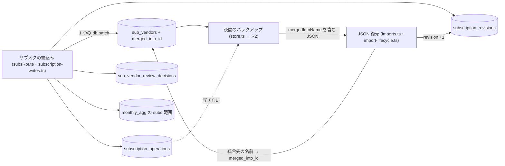

# Architecture overview

サブスク統合 — migration 0058 で、統合の参照・操作の記録・revision を追加だけで足す。本書はデータの制約を持つ。列・型・制約の正本は `specs/spec-subscriptions-merge.md` (以下 spec) のデータモデルで、`system-spec/database.md` は承認時の入力である。行番号は 2026-09-30 に現物で確かめた値。

完成度評価は C06 (過去の問文の中立性) で FAIL のまま、利用者が 2026-09-30T14:07:45Z に例外として承認した。記録は `docs/evidence/subscriptions-merge/spec-evaluation-waiver.json` にある。

前サイクルの `architecture/subscriptions-database.md` は、migration 0043 で category と見直し判断だけを足した。次の 3 点を本書も引き継ぐ。

- 追加だけで、backfill をしない。
- user_id は既存の sub_vendors (0005) と同じ TEXT。
- 利用者の判断は backup/restore で運ぶ。

本書が新しく決めるのは次の 5 点。

1. 統合元の行を残し、`sub_vendors.merged_into_id` で統合先を指す。
2. `subscription_operations` に全ての書込みを記録する。一意制約は 2 つ (再送用と revision 用)、索引は 1 つ (時刻順用)。
3. 共有テナントに 1 本だけの revision を `subscription_revisions` に持つ。
4. 保持期限の掃除を、書込みの batch の中の 2 文で行う。
5. 新しい 2 表を JSON 復元とバックアップの対象に入れず、canonical の書込みの型にだけ足す。統合の参照は、バックアップでは統合先の名前で運ぶ。

## Context and drivers

以下の既存実装の観測は開発着手前 (2026-09-30) の記録。現在の構造・契約は各設計節と spec を参照する。

- Business/technical context〔観測 qa-subsmerge-database-web-evidence-001、現物 2026-09-30〕:
  - `sub_vendors` の現状:
    - `id INTEGER PRIMARY KEY` と `UNIQUE(user_id, name)` を持つ (0005)。統合の関係を表す列は無い。
    - `sub_vendor_review_decisions` は `UNIQUE(user_id, vendor_key)` で、1 ベンダーに 1 行 (0043、`docs/data-schema.md:167-197`)。
    - 最新の migration は `0057_improvement_request_screen.sql`。`packages/api/src/schema-guard.ts:4` の EXPECTED_D1_MIGRATION がこれを指し、`packages/api/src/deletion-schema.test.ts:63` が同じ名前を直書きで検査する。
  - 取り消しの前例 (0042 の total_cashflow_operations): 元の行を消さずに undone_at を埋め、取り消しの行を足す。
  - 外部キーを付けない操作者の列の前例 (0046 の liability_audit_log): users の行が無くなっても記録を残す〔観測 qa-subsmerge-maintenance-ops-web-evidence-002〕。
  - `JSON_SNAPSHOT_MUTATION_CONSUMERS` (`packages/api/src/import-active.ts`、'sub_vendors' は :30) の二つの役割:
    - これらの表への書込みは JSON の active pointer を無効にする。
    - 同時に、この一覧は「JSON 復元で書き戻す表」の契約を兼ねる。
  - `canonical-mutation-fence.ts:19-35` の CanonicalConsumer の型は、lease で直列化するが書き戻さない表も持つ。0046 の saved_filters・tx_history がその前例。
  - 夜間のバックアップの本文は、項目を明示して組み立てる (`packages/api/src/store.ts:1627-1628`)。totalCashflowOperations (0042) と settings_change_log (0056) は、「判断だけ戻して履歴を残すと、取消が復元前の操作を指す」という理由で、履歴も一緒に運んでいる。
  - 復元の書き方:
    - sub_vendors を `(user_id, name)` で upsert する (`packages/api/src/import-lifecycle.ts:1444-1458`)。
    - 復元先だけにある行は消さない (`packages/api/src/routes/imports.ts:1037-1044`)。
    - このため既存の行の id は保たれ、新しく入る行だけが新しい id を得る。
    - サブスクの metadata のバックアップ schema は `.strict()` である (`routes/imports.ts:175-186`)。
- Quality attribute priorities:
  1. 整合性: 書込み・記録・revision・subs 範囲の片方だけが残る状態を作らない。統合の参照に循環を作らない。
  2. 追跡性: 誰が・何を・いつ操作したかを 400 日残す〔決定 qa-subsmerge-actor-record-001・qa-subsmerge-retention-001〕。
  3. 最小保持: 取り消しに要る本文は 30 日で消し、R2 の写しにも残さない。
  4. 運用費: 新しい表のための夜間 job を足さず、1 要求の D1 の問い合わせを 50 未満に保つ。
- Constraints:
  - Cloudflare D1 (SQLite)。batch は 1 つのトランザクションとして実行される (出典 cloudflare-d1-batch)。1 文の bound parameter は 100 まで (出典 cloudflare-d1-limits)。1 文の JSON は `D1_JSON_PAYLOAD_MAX_BYTES` (80KB、`import-lifecycle.ts:302`) で分ける。
  - 本番の migration は Deploy が Worker 配信の前に自動で適用する。`.github/scripts/plan-auto-migration.mjs` の destructiveFindings (DROP TABLE・DROP COLUMN・DELETE FROM・UPDATE … SET・RENAME) に当たる migration だけが `.github/migration-approvals.json` の承認を要る。
  - 新しい夜間 job・Durable Objects・Queues を足さない〔決定 qa-subsmerge-decision-005・qa-subsmerge-retention-001〕。

## Goals and non-goals

- Goals:
  - G1: 統合を行の削除ではなく参照 (merged_into_id) で表し、照合一覧をどこでも同じ参照から導けるようにする〔-003 由来: qa-subsmerge-database-web-003〕。
  - G2: 1 つの batch で、書込み・操作の記録・revision の +1・subs 範囲の置き換えをまとめて適用できる表と制約を置く。古い base の書込みを制約で弾く。
  - G4: 全ての書込みを、操作者 (actor_user_id) 付きで 400 日残す。統合の取り消しに要る変更前の値を 30 日残す〔決定 qa-subsmerge-retention-001〕。
  - バックアップと復元で、統合の参照を失わない。
- Non-goals:
  - 既存の行の書き換えと backfill (0058 は追加だけ)。
  - monthly_agg・restored_monthly_agg の形の変更。
  - 操作の記録と revision を JSON 復元で書き戻すこと。
  - 照合一覧 (resolveVendorMerges の結果) を保存すること。
  - 取引の金額・日付・口座を操作の記録に持つこと。

## System context and boundaries

- Users/external systems:
  - Worker のサブスクの書込み (subsRoute と `subscription-writes.ts`、`architecture/subscriptions-merge-backend.md`): 新しい 2 表と merged_into_id を書く唯一の経路。
  - JSON 復元 (`routes/imports.ts`・`import-lifecycle.ts`): merged_into_id を統合先の名前から書き戻し、spec の条件で revision を +1 する。操作の記録は書かない。
  - 夜間のバックアップ (`store.ts` の loadBackupPayload → R2): sub_vendors と統合先の名前を写す。新しい 2 表は写さない。
  - 運用者: `wrangler d1 execute` で読むだけ。行を直接書き換えない。
- Trust/deployment/data boundaries:
  - D1 のデータベース 1 つ (`kanjo-db`) の中に閉じる。テナントのキーは user_id (共有テナント、`packages/api/src/auth.ts:36` の TENANT_ID)、操作者は actor_user_id (users.id)。
  - R2 との境界: バックアップの JSON には、統合先の名前だけが越える。操作の本文・変更前の値・操作者は越えない。
- Context diagram:

## Container and component view

| Container/Component | Responsibility | Interface | Data owner | Deployment unit |
|---|---|---|---|---|
| `sub_vendors` (0005・0043・0058) | 登録ベンダー。0058 で merged_into_id を足す。NULL は統合されていない行 | サブスクの書込み・JSON 復元・loadDataset の snapshot (`store.ts:989`)・バックアップの snapshot (:1337-1340) | サブスクの書込み | D1 |
| `subscription_operations` (0058 新設) | サブスクの全ての書込みの記録。統合の変更前の値を持ち、取り消しの根拠にする | サブスクの書込み (batch の (a)(g)(h))・取り消し・一覧 | サブスクの書込み | D1 |
| `subscription_revisions` (0058 新設) | テナントに 1 行の版番号。成功した操作と復元で 1 進む | 書込みの状態の読み取り・batch の (c)・JSON 復元 | サブスクの書込みと JSON 復元 | D1 |
| `sub_vendor_review_decisions` (0043) | 見直し判断。統合で統合先へ吸収し、取り消しで変更前へ戻す | batch の (b) | サブスクの書込み | D1 |
| `monthly_agg` の subs 範囲 | 他画面のサブスク集計の派生キャッシュ。統合先の名前でだけ書く | batch の (d)(e)・recomputeFromDeals | 派生 (入力は freee_deals・cash_entries・restored_monthly_agg と照合一覧) | D1 |
| migration `0058_subscription_merge_operations.sql` | 列 1・表 2・一意制約 2・索引 1 を足す。既存の行を書き換えない | `pnpm db:migrate:local`・Deploy の `db:migrate:remote` | migrations/ | リポジトリ → D1 |
| `schema-guard.ts`・`db/schema.ts` | 期待する migration を 0058 へ進める。drizzle の定義に列と 2 表を足す | runtimeSchemaGuard・drizzle | api | Worker |
| バックアップ・復元 (`store.ts`・`routes/imports.ts`・`import-lifecycle.ts`) | 統合先の名前を JSON に書き、復元で merged_into_id に戻す。spec の条件で revision を +1 する | loadBackupPayload・restore の commit | api | Worker |
| `docs/data-schema.md` | 0058 の節 (表・列・保持・復元の扱い・適用と確認) を足す | 文書 | リポジトリ | リポジトリ |

## Cross-cutting contracts

規範は [spec-subscriptions-merge](../specs/spec-subscriptions-merge.md) に従う。

- 認証・所有者・操作者: spec「認証・認可」。
- 入力・応答・エラー・冪等性・revision: spec「API契約」「ビジネスルールと検証」。
- 操作状態・再試行・表示文言: spec「UI・状態遷移」「エラー・例外・回復」。
- 列・制約・保持・復元: spec「データモデル」「確定した実装契約」。
- 検証: spec「テストと受入条件」。実行結果は [docs の検証索引](../docs/subscriptions-screen.md#verification-records)。

本領域の追加参照: BR-007、FR-006・FR-007 (再送照合と復元対象)。具体値と期待値は spec を参照する。

本書は構造と採用理由を持ち、契約表を複製しない。現行の追加契約と推定月額の再計算規則は spec の「推定月額の契約確定」を参照する。

## Subtype architecture

- Frontend: N/A: 画面は API の応答 (revision・mergedIntoId) だけを読み、表に触れない。
- Backend: N/A: 文の順・条件・問い合わせ数の予算は `architecture/subscriptions-merge-backend.md` が持つ。本書は列・制約・保持と、各文が当たる索引を持つ。
- Infrastructure: N/A: migration の適用の順 (Migrate → Deploy) と Workers Free の上限は `architecture/subscriptions-merge-infrastructure.md` と共有する。本書は 0058 が承認の要らない追加だけの migration であることを持つ。
- Data: 下記 Data architecture を合成する。
- Security: N/A: バックアップへ写さない判断の根拠 (SM-SEC-07) と、ログの伏せ方は `architecture/subscriptions-merge-security.md` が持つ。本書はデータの分類だけを持つ。

### Data architecture

#### Data domains and ownership

- System of record/data owner:
  - サブスクの定義 (sub_vendors・sub_vendor_review_decisions・sub_vendor_exclusions): 正本は D1。書くのはサブスクの書込みと JSON 復元。
  - 操作の記録 (subscription_operations) と revision (subscription_revisions): 正本は D1 だけで、写しを持たない。書くのはサブスクの書込み。revision はサブスクの行を運ぶ JSON 復元も +1 する。
  - subs 範囲の集計 (monthly_agg の subs:* と subs_other): 派生値。統合・取り消し・名寄せに効く書込みは同じ batch で置き換え、取込・復元は recomputeFromDeals で全体を作り直す。
  - 照合一覧: 保存しない。読むたびに core の resolveVendorMerges が sub_vendors から作る。
- Classification/residency/tenant boundary:
  - 操作の本文 (payload_json) はcommandと正規化本文、変更前の値 (before_json) はベンダーの id・name・aliases・accounts (科目名)・merged_into_id・見直し判断と復元時のrestoreBarrierを持つ。取引の金額・日付・口座は持たない (spec データモデル)。
  - name と aliases は利用者の支払先の名前で、本人の支出の傾向を示すので、機微な個人データとして扱う〔本書で置いた値〕。
  - 保存先は D1 の 1 つのデータベースで、R2 へは写さない。region は既存の D1 のまま。
  - テナントの境界は user_id。merged_into_id・target_vendor_id・undoes_id は、同じ user_id の行だけを指すことを API が保証する。SQLite の外部キーでは user_id の一致を表せない。

#### Logical and physical model

- Entities/relations/invariants:
  - 関係:
    - sub_vendors の行 (統合元) は、merged_into_id で同じテナントの sub_vendors の行 (統合先) を指す。
    - 操作の行は target_vendor_id で sub_vendors を、取り消しの行は undoes_id で元の統合の行を指す。
  - 不変条件:
    - I1: merged_into_id は同じ user_id の別の行を指し、連鎖に循環が無い。新しい統合の統合先は、統合されていない行 (spec BR-001・BR-005)。
    - I2: revision は単調に増える。1 つの base_revision に対応する操作は、テナントに高々 1 行。
    - I3: kind='merge' の行の undone_at が埋まるのは、その行を undoes_id で指す kind='unmerge' の行を同じ batch で足したときだけ。取り消しの行は削除しない (400 日の削除は除く)。
    - I4: payload_json と before_json は created_at から 30 日を過ぎたら NULL、行は 400 日を過ぎたら削除される。ただし実行は次の書込みのとき。
    - I5: monthly_agg の subs:* には、照合一覧の統合先の名前だけが現れる (統合元の名前の列を書かない)。
    - I6: before_json を持つのは kind='merge' の行だけ。他の kind は取り消しの対象でないので NULL〔本書で置いた値〕。
- 列・型・制約・索引は spec「データモデル」と `migrations/0058_subscription_merge_operations.sql` を参照する。
- actor・target・undo元への外部キーを置かないのは、利用者や対象、古い操作が消えても監査行を保持するため。merged_into_id のテナント一致と削除のまとまりはAPIが守る。
- 既存の名前の一意制約を保ち、統合元の保存行も残す。物理配置を追加するだけで既存行のbackfillは行わない。

#### Access and consistency

- Read/write paths and query patterns:

| 問い合わせ | 経路 | 当たる索引 |
|---|---|---|
| revision の読み取り (`COALESCE((SELECT revision …), 0)`) | 書込みの状態の読み取り・batch の (a)・GET 2 本 | subscription_revisions の主キー |
| 同じ (user_id, actor_user_id, idempotency_key) の操作 | 再送の照合 | 一意制約 (再送用) の自動索引 |
| 対象の操作より base_revision の大きい未取り消しの操作 | 取り消しの判定 (spec BR-009 の 4) | 一意制約 (revision 用) の自動索引 |
| 新しい順に 20 件 (created_at の新しい順、同じなら base_revision の大きい順) | 一覧 | `INDEX (user_id, created_at)` を逆向きに読む |
| 30 日・400 日を過ぎた行を 50 件 | batch の (g)(h) | `INDEX (user_id, created_at)` |
| この操作の行が在るか (`EXISTS … id=?`) | batch の (b)〜(h) の条件 | 主キー |
| sub_vendors の全行と merged_into_id | loadDataset の snapshot (`store.ts:989` の空いている列に載せる)・書込みの状態の読み取り | 既存の user_id の索引 |

  - 書込みは全てサブスクの書込みの 1 つの batch を通す (文の並びは `architecture/subscriptions-merge-backend.md` の (a)〜(h))。例外は JSON 復元で、merged_into_id と revision を書く。
- Transaction/isolation/consistency:
  - 1 つの batch は 1 つのトランザクションで、途中の文が失敗すれば全体が戻る (出典 cloudflare-d1-batch)。
  - 古い base からの書込みは 3 段で止める。(a) の条件付きの挿入 (現在の revision = base のときだけ 1 行)、`UNIQUE (user_id, base_revision)`、(b) 以降の「この操作の行が在る」条件。
  - revision の +1 は、`INSERT … SELECT … WHERE EXISTS (…) ON CONFLICT(user_id) DO UPDATE SET revision=excluded.revision, updated_at=excluded.updated_at` の 1 文で行う。値は base + 1 を渡す。(a) が現在値 = base を保証しているので、+1 と等しい。
  - lease (import_writer_claims) が同じテナントの書込みと取込・復元を直列にする。サブスクの書込みの lease の TTL は 2 分 (`CANONICAL_MUTATION_CLAIM_TTL_MS`)。
- Cache/search/analytics derivation:
  - monthly_agg の subs 範囲は派生値。(d) で `scope LIKE 'subs:%' OR scope='subs_other'` の行を消し、(e) で照合一覧から組んだ行を `json_each(?)` の 1 文で入れ直す (`store.ts:1937` の前例)。JSON が 80KB を超えるなら文を分ける。
  - 他画面の subs 範囲は、取込・復元の recomputeFromDeals と、統合などの (d)(e) の 2 経路で書かれる。両者の一致は backend の適合テストで縛る。
  - baseline (restored_monthly_agg) に残る `subs:統合元の名前` の列は書き換えない。読むときに統合先へ合算する (spec BR-012)。
  - JSON snapshot の active pointer は、(f) で同じ batch の中で無効にする (sub_vendors が JSON_SNAPSHOT_MUTATION_CONSUMERS に在るため)。

#### Lifecycle and governance

- Creation/update/deletion/retention:
  - 作成:
    - 操作の行は、成功した書込みごとに 1 行 (batch の (a))。
    - revision の行は、テナントの最初の書込みで作る。
    - merged_into_id は統合で入り、取り消しで NULL に戻る。
  - 更新: undone_at、保持期限のNULL化に加え、サブスクJSON復元はbefore_jsonへrestoreBarrierを付ける。条件はspecのデータモデルを参照する。
  - 削除:
    - 操作の行は、取り消しでは消さない。400 日を過ぎたら掃除で消す。
    - 統合先のベンダーを消すと、それを指す統合元の行をまとめて消す (`architecture/subscriptions-merge-backend.md` SM-BE-07)。
  - 保持〔決定 qa-subsmerge-retention-001、文の形は -003 由来: qa-subsmerge-database-web-003〕:
    - (g) payload_json と before_json を NULL にする。対象は、created_at が「今から 30 日前」より前で、payload_json か before_json がまだ NULL でない行。
    - (h) 行を削除する。対象は、created_at が「今から 400 日前」より前の行。
    - どちらも `… WHERE id IN (SELECT id FROM subscription_operations WHERE user_id=? AND … LIMIT 50)` の形で 1 回 50 件まで。UPDATE・DELETE に直接 LIMIT を付ける構文は使わない。SQLite の SQLITE_ENABLE_UPDATE_DELETE_LIMIT に依るので、D1 の build で有効かを前提にしない。
    - (g) の対象を「まだ NULL でない行」に絞るのは〔本書で置いた値〕、絞らないと同じ 50 件を毎回選び、掃除が先へ進まないため。
    - 境界の時刻は Worker が ISO 8601 の文字列で作って渡す。
  - 書込みが無い期間は、期限を過ぎた行が残る。取り消せるかは created_at で判定する (spec BR-013)。
  - 400 日を過ぎて行が消えた key が再び届くと、新しい操作として扱う。その base は古いので、(a) で 409 subscription_revision_conflict になる。
- PII/encryption/masking/audit:
  - 保存時の暗号化は D1 の既定に従う。新しい鍵は持たない。
  - 伏せ方: ログと一覧の応答には、payload_json・before_json・idempotency_key を出さない。一覧は、統合先の名前・時刻・操作者の email・取り消しの状態だけを返す (spec API 契約)。
  - バックアップ: 新しい 2 表は R2 の JSON に写さない。写すと、30 日で消す約束が写し (保持 30 日のバックアップ) に及ばず、R2 に残る期間が延びるため (security の SM-SEC-07)。
  - 監査: 操作の行そのものが監査の記録。取り消しても元の行を残し、取り消しの行を足す。
- Schema ownership/catalog/lineage:
  - 持ち主: 表の形は `migrations/0058_subscription_merge_operations.sql`、drizzle の写しは `packages/api/src/db/schema.ts` (subVendors は :250)。
  - 目録: `docs/data-schema.md` に 0058 の節を足す。0043 の節 (:167-197) と同じく、表・列・意味・書く経路の表、backup/restore の扱い、確かめるテスト、適用と確認の手順を書く。
  - lineage:
    - 他画面の subs 範囲は、freee_deals・cash_entries (事業分)・restored_monthly_agg と、sub_vendors から作る照合一覧から作られる。
    - 取り消しは、操作の行の before_json から sub_vendors と見直し判断を戻す。

#### Migration and recovery

- Versioning/backfill/online migration:
  - 0058 の中身 (この順):
    1. `ALTER TABLE sub_vendors ADD COLUMN merged_into_id INTEGER`。
    2. subscription_operations の CREATE TABLE (列の CHECK と 2 つの一意制約を含む)。
    3. `CREATE INDEX` (user_id, created_at)。
    4. subscription_revisions の CREATE TABLE。
  - 既存の行の UPDATE・DELETE と backfill は入れない。destructiveFindings は 0 件で、`.github/migration-approvals.json` への追加は要らない〔現物 2026-09-30: `.github/scripts/plan-auto-migration.mjs:50-57`〕。
  - 版の更新:
    - `schema-guard.ts:4` の EXPECTED_D1_MIGRATION を `0058_subscription_merge_operations.sql` へ進める。
    - `deletion-schema.test.ts:63` の直書きを同じ名前へ直す。
    - `index.test.ts:6` は定数を import するだけなので、直す必要はない。
  - 本番は Migrate → Deploy (Deploy の `db:checkpoint` → `db:migrate:remote` → `check-d1-migrations.mjs` → `wrangler deploy`)。
    - 適用から配信までの間は旧い Worker が動く。旧い Worker の書込みは revision を進めず、操作も記録しないが、列と表が増えただけなので失敗しない。
    - 新しい Worker は、revision の行が無いテナントを 0 から始める。
- Backup/restore/integrity reconciliation:
  - バックアップ〔本書で置いた値〕:
    - バックアップの snapshot (`store.ts:1337-1340`) の json_object に mergedIntoId を足す。
    - subVendorMetadata (:1613) を作るときに、id を統合先の name へ引き直して `mergedIntoName` として書く。
    - JSON に id ではなく名前で持つ理由: 空の DB や別の環境へ復元すると、新しく入る行が新しい id を得るため。
  - 復元の検証 (`routes/imports.ts:1025-1036` に足す): 次のどれかなら InvalidRestoreSettingsError にする。
    - mergedIntoName がバックアップの名前の集合に無い。
    - mergedIntoName が自分自身を指す。
    - 統合の参照が循環する。
  - 復元のcommitは `import-lifecycle.ts` の `planRestoreImportQueries` が持つ。名前による参照更新と条件付きrevision更新は spec「データモデル」「確定した実装契約 #11」を参照する。
  - 復元先だけにある行は消えず、merged_into_id も保たれる。それらが指す先はバックアップの行か復元先だけの行で、バックアップの行は復元先だけの行を指さない。このため、復元で循環は生まれない。
  - 操作の記録と revision は書き戻さず、現在の行を残す (spec データモデル)。復元をまたいだ取り消しの扱い:
    - 統合元の参照が復元で外れた場合: spec BR-009 の 4 の後半で 409 undo_blocked_by_later_operation。
    - 統合の後に統合先に触れた操作がある場合: その行が残るので、4 の前半で 409。
    - 復元が参照を保ったまま別名を変える場合も、同じcommit batchのrestoreBarrierが古いundoを409で遮断する。
  - 整合の点検 (運用者が読むだけの SQL): merged_into_id が同じテナントの行を指していない行を数える。そのような行は resolveVendorMerges が統合なしとして扱うので、画面は壊れない。循環は API と復元の検証が作らせない。
  - D1 の Time Travel は、Deploy の `db:checkpoint` が記録する地点から戻す最後の手段で、新しい 2 表も含めて戻る。

#### Data verification

- Constraint/migration/query-plan/load/privacy tests:
  - migration (`deletion-schema.test.ts` の流儀で Miniflare に全 migration を当てる):
    - 0058 の後に、sub_vendors の既存の行の数と列の値が変わらない。
    - merged_into_id が NULL で足される。
    - 2 表・2 つの一意制約・索引が在る。
    - kind の CHECK が 8 値以外を拒む。
  - 制約:
    - 同じ (user_id, base_revision) の 2 行目が拒まれ、batch 全体が戻る。
    - 同じ (user_id, actor_user_id, idempotency_key) の 2 行目が拒まれる。
    - 別の actor の同じ key は通る。
  - 問い合わせの計画 (`EXPLAIN QUERY PLAN`):
    - 一覧・掃除の 2 文・後の操作の探索・再送の照合が、上の表の索引を使う。
    - subscription_operations を全件走査しない。
  - 保持 (時刻を固定した fixture):
    - 30 日を 1 ms 過ぎた行は NULL になり、30 日ちょうどの行は残る。
    - 400 日を過ぎた行は消える。
    - 60 件の期限切れは 2 回の書込みで片付く。
    - 掃除の文を失敗させると書込みも戻る。
  - バックアップ・復元:
    - mergedIntoName を含む JSON を空の DB へ復元すると、統合が名前どおりに戻る。
    - キーの無い旧い JSON は統合なしになる。
    - 存在しない名前・自己参照・循環は InvalidRestoreSettingsError になる。
    - 復元で revision が 1 進む。
    - 操作の記録の行の数が変わらない。
    - バックアップの JSON に payload_json・before_json・idempotency_key・actor_user_id の値が現れない。
  - 負荷: 1 テナントに 400 日ぶんの行 (1 日 20 件) を入れても、一覧と掃除の文が索引で終わる。

## Architecture decisions

| ADR | Decision | Alternatives | Trade-on rationale | Consequences |
|---|---|---|---|---|
| SM-DB-01 | 統合元の行を残し、sub_vendors.merged_into_id で統合先を指す〔-003 由来: qa-subsmerge-database-web-003〕 | 統合元を消して別名へ移す / 統合の関係を別の表に持つ | 行を残せば、取り消しは参照と統合先の値を戻すだけで足りる。id・category・reviewed_at も失わない。別の表では、照合一覧を作るたびに結合が 1 つ増え、行の削除との整合も 2 か所で保つことになる | 統合元と同じ名前の新規登録は 409 duplicate。統合先の削除で統合元もまとめて消す |
| SM-DB-02 | テナントに 1 行の subscription_revisions を持つ〔-003 由来: qa-subsmerge-database-web-003〕 | 行ごとの version 列 / 操作の表の base_revision の最大値を revision とみなす | 統合は複数の行に触れるので、行ごとでは 1 回で競合を検出できない。最大値の方式では、400 日の削除で行が無くなったときや、復元の +1 を表せない | 全ての書込みと、サブスクの行を運ぶ復元が、この 1 行を進める |
| SM-DB-03 | 一意制約を再送用 (user_id, actor_user_id, idempotency_key) と revision 用 (user_id, base_revision) の 2 つにする〔-003 由来: qa-subsmerge-database-web-003〕 | key だけで一意にする / 応答の本文を保存する | key だけでは、別の利用者の偶然の同じ key が衝突する。応答は操作の行と base_revision から作り直せるので、保存は要らない | 30 日を過ぎた key の再送は 422 idempotency_key_expired、400 日を過ぎた key は新しい操作として扱い、古い base で 409 |
| SM-DB-04 | actor_user_id・target_vendor_id・undoes_id・merged_into_id に外部キーを付けない〔actor は決定 qa-subsmerge-actor-record-001、残りは本書で置いた値〕 | 外部キーを付け、削除を cascade か restrict にする | cascade では、利用者やベンダーの削除で記録が消える。restrict では、400 日の削除の順や統合先の削除が止まる。user_id の一致は外部キーで表せない | 参照先の行の存在と同じテナントであることは API と復元の検証が保証する。参照先の無い merged_into_id は統合なし、target の無い一覧の行は名前が null |
| SM-DB-05 | 保持の掃除を書込みの batch の 2 文 (`id IN (… LIMIT 50)`) で行う〔決定 qa-subsmerge-retention-001〕 | 夜間の cron / UPDATE・DELETE の直接の LIMIT / 別の try で失敗を握りつぶす | cron は新しい job を足す。直接の LIMIT は SQLite の build の選択に依る。同じ batch にすれば、掃除だけが残る・書込みだけが残るの両方が起きない | 書込みの無い期間は期限切れの行が残る。取り消せるかは created_at で判定するので、画面の挙動には影響しない |
| SM-DB-06 | 操作履歴・revisionはbackupから書き戻さず、サブスクJSON復元だけrevisionとundoのbarrierを同じbatchに置く | 履歴をbackupで運ぶ / 復元後の古いundoを許す | 保持期限をR2へ持ち越さず、復元した保存定義を古いbefore_jsonで上書きさせない | 一般settings restoreは対象外。契約はspec BR-009・データモデルを参照する |
| SM-DB-07 | バックアップでは、統合の参照を統合先の名前 (mergedIntoName) で運ぶ〔本書で置いた値〕 | id で運ぶ / 運ばない | 復元は名前で upsert するので、空の DB や別の環境では id が変わる。名前は `UNIQUE(user_id, name)` で一意。運ばないと、復元のたびに統合が解ける | metadata の schema に任意のキーを足す。`.strict()` なので、旧い Worker は新しい JSON を拒む (Rollback) |
| SM-DB-08 | before_json を統合の行だけに持つ〔本書で置いた値〕 | 全ての kind に変更前の値を持つ | 取り消しの対象は統合だけ (決定 qa-subsmerge-undo-scope-001)。他の kind に持つと、使わない機微な値を 30 日持つことになる | 統合以外を取り消す機能を足すときは、この決定を見直す |

## Delivery, migration and rollback

- Build/deploy topology:
  - migration はリポジトリの `migrations/` にあり、ローカルは `pnpm db:migrate:local`、本番は Deploy の workflow が Worker 配信の前に `db:migrate:remote` で当てる。
  - 新しい binding・データベース・R2 の場所は無い。
- Migration sequence: 同じ PR の中で次の順に入れる。
  1. `migrations/0058_subscription_merge_operations.sql`。
  2. `schema-guard.ts:4` と `deletion-schema.test.ts:63`。
  3. `db/schema.ts` の subVendors に mergedIntoId、新しい 2 表の定義。
  4. canonical-mutation-fence.ts の CanonicalConsumer の型に 2 表を足す。
  5. loadDataset とバックアップの snapshot に merged_into_id を載せ、subVendorMetadata に mergedIntoName を足す。
  6. 復元の検証と commit の文 (upsert の NULL 化・統合の参照・revision の +1)。planRestoreImportQueries の commitStatementCount にその数を足す。
  7. migration・制約・保持・復元のテスト。
  8. `docs/data-schema.md` の 0058 の節。
  - 本番: Migrate → Deploy。適用の後に `SELECT COUNT(*) FROM sub_vendors` が変わらないこと、`pragma_table_info('sub_vendors')` に merged_into_id が在ること、2 表が在ることを確かめる (0043 の節と同じ手順)。
- Rollback trigger/procedure:
  - 次のどれかで差し戻す: migration の後に既存の画面が 503 のまま戻らない、サブスクの書込みで 500 が出る、復元が InvalidRestoreSettingsError を誤って返す。
  - 手順:
    - 実装だけを差し戻し、0058 の列と表は残す。DROP は destructiveFindings に当たり、承認が要り、記録を失う。
    - 旧い Worker は merged_into_id を読まないので、統合済みの行が独立した行として再び現れる。差し戻しの前に統合を取り消すか、それを受け入れるかを決める。
  - 差し戻した期間の注意:
    - 新しい Worker が書いた JSON (mergedIntoName を含む) は、旧い Worker の `.strict()` の schema に拒まれる。その期間の復元には 0058 より前のバックアップを使うか、再び進めるまで待つ。
    - 旧い Worker の書込みは revision を進めない。再び進めたときは、画面が一覧と revision を取り直すので、古い base は起きない。
  - 最後の手段は D1 の Time Travel で、`db:checkpoint` の地点へ戻す。

## Risks and verification

- Risk/assumption:
  - 復元をまたいだ取り消し (SM-DB-06): サブスクに触れるJSON復元は同じcommit batchでrestoreBarrierを付け、古いundoを409にする。一般設定復元は対象外。契約はspec BR-009・データモデルを参照する。
  - `.strict()` の schema による差し戻しの制約 (Rollback)。
  - 復元の文数は `planRestoreImportQueries` の計画を正とし、参照更新・条件付きrevision・barrierを含めて受理のquery予算を検査する。具体SQLを本書で複製しない。
  - 掃除の遅れ: 書込みが無い期間は、30 日を過ぎた本文が D1 に残る。1 回の書込みで 50 件までしか進まない。
  - 掃除の失敗: 掃除の 2 文は書込みと同じ batch にあるので、掃除が失敗すれば書込みも戻る。2 文は id の IN と LIMIT だけで、失敗の要因は書込み本体と共通であり、掃除だけが失敗する経路は小さいとみなす。
  - 時刻の文字列の比較: created_at の形がそろっていなければ、境界の判定が狂う。書く経路を subscription-writes.ts の 1 か所に限り、形をテストで固定する。
- Architecture fitness test:
  - `deletion-schema.test.ts` が、最新の migration = EXPECTED_D1_MIGRATION = 0058 を検査する。
  - 新しい 2 表が JSON_SNAPSHOT_MUTATION_CONSUMERS に無く、CanonicalConsumer の型に在る。
  - `loadBackupPayload` の本文に 2 表の項目が無い (backup の JSON のキーの一覧をテストで固定する)。
  - subscription_operations・subscription_revisions を書く SQL が `subscription-writes.ts` と復元の revision の 1 文にしか無い (grep で数える)。
  - 0058 に destructiveFindings が 0 件 (`plan-auto-migration.test.mjs` の流儀)。
- Load/failure/security validation:
  - 400 日ぶんの行で、一覧・掃除・後の操作の探索が索引を使い、全件走査しない。
  - batch の途中の文 ((b)〜(h) のどれか) を失敗させても、操作の行・revision・sub_vendors・monthly_agg のどれも変わらない。
  - 他テナントの行を指す merged_into_id・target_vendor_id を API も復元も書けない。
  - 30 日を過ぎた行の payload_json・before_json が NULL。バックアップの JSON に操作の記録が現れない。

## 実装時に確定した判断

#11: 復元では名前から環境ごとのidを引き直す。更新対象は1列なので統合元ごとの相関サブクエリを使う。サブスクの行を運ばない復元ではその状態が変わらず、revisionを無条件に足すと既存の最大復元予算を超えるため、restoreTouchesSubscriptionsで追加を決める。具体的な条件は spec のデータモデルと確定した実装契約を参照する。

保存aliases/accounts/sortOrderはoptional metadataで運び、表示・集計の実効aliasesと分ける。統合展開の件数を保存定義の上限で切り詰めず、復元は保存値を優先して往復を保つ。列追加やexactNamesの永続化は行わず、現行契約はspecのデータモデルへ集約する。
