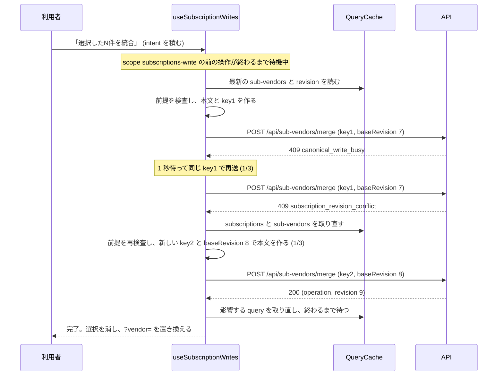

# Architecture overview

サブスク画面の書込みを 1 本の待ち行列に並べ、取り合いを自動の再送と送り直しで吸収し、各操作の状態と取り消しを画面に持つ。本書は書込みの順序・再送・状態の持ち方・API との結び方の制約を持つ。正本は `specs/spec-subscriptions-merge.md` (以下 spec) の選択の持ち方 (一覧の選択を vendorKey の集合で持つ)・FR-011・FR-012・FR-014〜FR-022 と「UI・状態遷移」で、`system-spec/frontend.md` は承認時の入力である。見た目・配置・文言は `architecture/subscriptions-merge-ui-ux.md` (以下 ui-ux 文書) が持つ。行番号は 2026-09-30 に commit a63d35c の現物で確かめた値。

新しく決めるのは次の 6 点。

1. 画面の書込み 11 種 (既存 9 本・統合・取り消し) を 1 つのフック `useSubscriptionWrites` に通し、TanStack Query v5 の `useMutation` に `scope: { id: 'subscriptions-write' }` を付けて 1 件ずつ実行する (FR-014)。
2. 自動の再送と送り直しは `mutationFn` の中のループが持ち、`retry` は 0 のままにする。
3. 操作は押した時点の本文ではなく差分 (intent) で積み、送る直前に最新のキャッシュから本文と前提の検査を作る。
4. 成功時は取り直しが終わるまで mutation を完了させず、次の操作は取り直した値を基準に送る。
5. 操作状態は `useMutationState` と `GET /api/subscription-operations` を合成して作る (FR-018)。
6. 失敗は HTTP の status ではなくエラーコードで分類する。

## Context and drivers

以下の既存実装の観測は開発着手前 (2026-09-30) の記録。現在の構造・契約は各設計節と spec を参照する。

- Business/technical context〔観測 qa-subsmerge-frontend-web-evidence-001、現物 2026-09-30〕:
  - `Subscriptions.tsx:155-160` の `useMutation` は scope を持たない。多重の送信は `busy = mutation.isPending` (:232) でボタンを無効にして防いでいるだけで、取引名チェックは処理中も押せる (FR-022)。
  - 失敗は `run` (:162-170) が上部の通知へ出し、「再試行する」は同じ closure をもう一度呼ぶ。Idempotency-Key の考えが無い。
  - 全ての書込みは `run(send, impact)` に closure を渡す形である: `DetailOverview.tsx:38`、`DetailPanel.tsx:194`・:402・:425・:444・:497・:519・:559、`ReviewDecisionActions.tsx:30`・:37・:48・:60・:66、`Subscriptions.tsx:241-245` (統合)。統合先の登録 (:247) だけは `mutation.mutateAsync` を直に呼ぶ。
  - `DetailPanel.tsx:401-407` (対象科目) と :425-426 (別名の削除) は押した時点の `related` から全置き換えの本文を作る。待ち行列に積むと、前の操作が完了した後に古い値で上書きする。
  - `DetailOverview.tsx:42` と :305 は 409 を status だけで読み、名前の重複と取り違える。取り合いの 409 (busy・revision) も「同じ名前」になる。
  - `api-client.ts:47-50` の `api` は `init.headers` を既定のヘッダに重ねるので、Idempotency-Key を `pages/subscriptions/api.ts` から渡せる。`ApiError` は `code` を持つ (:2-13)。
- Quality attribute priorities:
  1. 二重に反映しない: 同じ操作の再送は同じ key で送り、API が最初の結果を返す (FR-012)。
  2. 取り合いを失敗として見せない: busy・503 d1_overloaded・revision の衝突は自動で吸収し、「サーバー側で処理に失敗しました」を 5xx と通信の失敗だけにする (O2)〔決定 qa-subsmerge-decision-004〕。
  3. 古い値で上書きしない: 送る直前に最新の値から本文を作り、baseRevision で API に検査させる (FR-011)。
  4. 透明性: どの操作が待機中・処理中・失敗かを 1 件ずつ示す (FR-018)。
- Constraints:
  - `@tanstack/react-query` ^5.62.11 (`packages/web/package.json:32`)。依存を足さない。
  - 楽観更新をしない (spec スコープ Out)。
  - `api-client.ts` は変えない。認証の失効 (401 の AUTH_EVENT) の扱いを保つ。
  - `crypto.randomUUID()` は secure context (https と localhost) でしか使えない。画面の配信はどちらかに限られる。
  - テストは jsdom の DOM テストと vitest の単体テストで、匿名化済みの fixture だけを使う。

## Goals and non-goals

- Goals:
  - G2: 5 件続けて押しても、2 人がほぼ同時に押しても、全件が完了か理由付きの失敗になり、取り合いで「サーバー側で処理に失敗しました」が出ない (O2、UC-4・UC-5、AC-015・AC-021)〔決定 qa-subsmerge-decision-004・005〕。
  - G3: 待機中・処理中・完了・失敗を操作ごとに示し、取り消せる統合に「元に戻す」を付ける (FR-018・FR-019)〔-003 由来: qa-subsmerge-frontend-web-003〕。
  - G1: 登録済みの行を統合元にして送り、完了後に一覧から消えた状態を取り直して示す (FR-004・FR-021)〔決定 qa-subsmerge-decision-001〕。
  - G3: 処理中は行チェック・全選択・取引名チェックを無効にする (FR-022)。
- Non-goals:
  - 楽観更新。
  - タブをまたいだ待ち行列 (BroadcastChannel など)。別のタブの操作は API の lease と revision で検出する。
  - 画面を閉じた後の送信の継続 (Background Sync、Service Worker)。
  - `Retry-After` ヘッダによる間隔の調整。間隔は 1・2・4 秒に固定する (SM-FE-06)。
  - 操作状態のポーリング。他の利用者の操作は、書込みの完了とウィンドウのフォーカスで取り直したときに現れる。

## System context and boundaries

- Users/external systems:
  - 利用者 (admin・member)。同じ画面で統合・取り消し・既存の編集を続けて押す。
  - 同じテナントの他の利用者と、同じ利用者の別のタブ。どちらの操作も API の lease (409 canonical_write_busy) と revision (409 subscription_revision_conflict) で検出する。
  - API: `GET /api/subscriptions` と `GET /api/sub-vendors` (revision を含む)、`POST /api/sub-vendors/merge`、`POST /api/subscription-operations/{id}/undo`、`GET /api/subscription-operations?limit=20`、既存の書込み 9 本 (応答に revision が加わる)。
  - TanStack Query のキャッシュ: QueryCache (読み取り) と MutationCache (書込み)。
- Trust/deployment/data boundaries:
  - テナントと操作者はセッションからだけ決まり、本文とヘッダに入れない (spec NFR Security)。
  - Idempotency-Key は操作の識別子で、資格情報ではない。ブラウザのメモリにだけ置き、保存しない。
  - 統合できるか・取り消せるかの最終の判断は API が行う。画面の前提の検査は、送っても失敗が分かっている要求を省くためのもので、API の検査の代わりにしない。
- Context diagram: 統合 1 件が busy を 1 回、revision の衝突を 1 回受けてから完了する流れ。

## Container and component view

| Container/Component | Responsibility | Interface | Data owner | Deployment unit |
|---|---|---|---|---|
| `pages/subscriptions/useSubscriptionWrites.ts` (新設) | 書込みの唯一の入口。scope 付きの useMutation、再送のループ、成功時の取り直し | `run(intent, impact)`・`retry(clientOpId)`・`undo(operationId)`・処理中かどうか | MutationCache | web の lazy chunk (`AuthenticatedApp.tsx:24`) |
| `pages/subscriptions/writeRequests.ts` (新設、純関数) | intent と最新の値から、送る要求 (path・method・本文) と前提の検査の結果を作る | 関数 | なし | 同上 |
| `pages/subscriptions/operationProgress.ts` (新設) | 実行中の操作の途中経過 (自動再試行の回数と種類) を clientOpId ごとに持つ小さなストア | `useSyncExternalStore` 用の subscribe と読み取り | 画面のメモリ | 同上 |
| `pages/subscriptions/operationRows.ts` (新設、純関数) | 画面の mutation と操作履歴を合わせて表示の行を作る | 関数 | なし | 同上 |
| `pages/subscriptions/operationText.ts` (新設、純関数) | エラーの分類と文言 (ui-ux 文書の表) | 関数 | なし | 同上 |
| `pages/subscriptions/OperationList.tsx` (新設) | 操作の欄の表示 (ui-ux 文書) | props | なし | 同上 |
| `pages/subscriptions/api.ts` (既存に足す) | `postMerge`・`postUndo`・`getOperations` を足し、既存の書込みに Idempotency-Key と baseRevision を渡せるようにする | fetch の関数 | なし | 同上 |
| `Subscriptions.tsx` (既存) | 選択の状態、AFFECTED_QUERY_ROOTS、フックの呼び出し。既存の `useMutation` と `run` (:155-170) と上部の書込み失敗の通知を置き換える | コンポーネント | 選択 | 同上 |
| DetailPanel・DetailOverview・ReviewDecisionActions (既存) | closure ではなく intent を `run` に渡す | 既存の props の `run` の型を変える | なし | 同上 |
| `api-client.ts` (既存、変えない) | fetch・ApiError・401 の通知 | `api`・`ApiError` | なし | 同上 |

## Cross-cutting contracts

規範は [spec-subscriptions-merge](../specs/spec-subscriptions-merge.md) に従う。

- 認証・所有者・操作者: spec「認証・認可」。
- 入力・応答・エラー・冪等性・revision: spec「API契約」「ビジネスルールと検証」。
- 操作状態・再試行・表示文言: spec「UI・状態遷移」「エラー・例外・回復」。
- 列・制約・保持・復元: spec「データモデル」「確定した実装契約」。
- 検証: spec「テストと受入条件」。実行結果は [docs の検証索引](../docs/subscriptions-screen.md#verification-records)。

本書は構造と採用理由を持ち、契約表を複製しない。現行の追加契約と推定月額の再計算規則は spec の「推定月額の契約確定」を参照する。

## Subtype architecture

- Frontend: 下記 Frontend architecture を合成する。
- Backend: N/A: 再送を受ける側の lease・revision・Idempotency-Key の処理は `architecture/subscriptions-merge-backend.md` が持つ。本書はその応答の使い方だけを持つ。
- Infrastructure: N/A: 配信・chunk の構成と Worker の設定を変えない。
- Data: N/A: 画面は保存するデータを持たない。待ち行列と途中経過はメモリだけに置く。
- Security: N/A: 認証と cookie は既存のまま。本文に信頼境界を越える値 (テナント・操作者) を入れない制約は `architecture/subscriptions-merge-security.md` が持つ。

### Frontend architecture

#### Rendering and application pattern

- Pattern: 既存の SPA の 1 画面。読み取りは useQuery、書込みは scope 付きの useMutation 1 つ。書込みの状態は MutationCache を正とし、React の state に写さない。
- Framework/runtime and selection rationale: TanStack Query v5 の mutation scope は、同じ scope id の mutation を直列に実行し、後から来たものを isPaused の待機中として持つ。待ち行列を自前で書かずに済み、`useMutationState` で画面のどこからでも読める (SM-FE-01)。
- Browser/device support: 既存どおり。`crypto.randomUUID` が使える secure context の最近のブラウザ。

#### Routes, screens and navigation

- Route/screen map: `/subscriptions` だけ。統合の完了で `?vendor=` が統合元を指していれば統合先の vendorKey へ置き換える (FR-021)。取り消しの完了では動かさない。
- Authentication guard/deep link/history:
  - 既存の認証後のシェルの配下。URL の置き換えは既存の setVendor と同じく replace。
  - 置き換えで setVendor が選択を消すのは、統合の完了で選択を消す動きと一致する。行の選択を別の行を開いても保つため、行の選択を消すのは統合の完了と「選択を解除」だけにする。
  - 画面を離れても、積んだ mutation は同じ QueryClient の中で最後まで実行する。戻ると操作の欄に結果が出る (SM-FE-09)。

#### Component and design-system boundaries

- Component hierarchy:
  - `Subscriptions.tsx` がフックを 1 回だけ呼び、`run`・`retry`・`undo`・処理中かどうかを子へ渡す。子は api.ts を直に呼ばない。
  - intent の種類 (本文は送る直前に作る):
    - merge: 統合先の id、統合元の vendor id の配列、生の取引名の配列。未登録の行は normalizedName を生の取引名に入れる。
    - unmerge: 取り消す操作の id。
    - vendor_create: 名前。
    - vendor_update: 変える項目の差分。名前・カテゴリは値、対象科目と別名は「足す・外す 1 件」で持つ。
    - vendor_aliases_add: 足す別名。
    - vendor_delete、review: vendor id。
    - review_decision: vendorKey と判断 (または削除)、期間。
    - exclusion: 取引先の名前 (または除外の id)。
  - intent の粒度は、ui-ux 文書の操作の説明 (kind ごとの文言) に写せる単位にする。
- Design tokens/reusable primitives: 本書は見た目を持たない。状態の文字と色は ui-ux 文書に従う。
- Accessibility standard: 状態の変化の知らせ (aria-live) とフォーカスの移し方は ui-ux 文書に従う。本書は、処理中の判定を `useMutationState` の未完了の件数で与える。

#### State and data flow

- Local/server/global state ownership:
  - サーバーの値: QueryCache。subscriptions (期間ごと)・review queue・sub-vendors・sub-candidates・summary・subscription-operations。
  - 書込み: MutationCache の scope `subscriptions-write`。variables は `{ clientOpId, intent, impact, pinned }` で、pinned は「再試行」で同じ key と本文を送るときだけ持つ。
  - 途中経過: operationProgress のストア (clientOpId ごとに、再送の種類・回数)。mutation の state は mutationFn の途中で書き換えられないため、ここに分ける。
  - 選択: Subscriptions.tsx (ui-ux 文書)。
  - revision: 別の state に持たない。送る直前に、キャッシュの subscriptions の全期間の応答・sub-vendors の応答・直前の書込みの応答 (ref に持つ) の revision の最大を base とする。
- Fetch/cache/invalidation/optimistic update:
  - `useMutation` の設定: `scope: { id: 'subscriptions-write' }`、`mutationKey: ['subscriptions-write']`、`retry: 0`、`gcTime: Infinity`。
  - mutationFn のループ:
    1. 前提を検査する。崩れていれば送らずに失敗 (理由のみ)。
    2. base を決める。
    3. 本文と key を作る。
    4. 送る。
    5. busy なら待って 4 へ (同じ key)。
    6. revision なら subscriptions と sub-vendors の取り直しを待って 1 へ (新しい key)。
    7. それ以外の失敗はループを抜けて失敗にする。
  - mutationFn は mutate を呼んだ時点の closure で動くため、最新の値は `queryClient.getQueryData` と ref から読む。sub-vendors は query が無効でも前提の検査に要るので `fetchQuery` で取り直す。
  - onSuccess は invalidate の Promise を返す。取り直しが終わるまで mutation は未完了で、scope の次の操作は取り直した値を base にする。
  - AFFECTED_QUERY_ROOTS (`useSubscriptionWrites.ts`) の全ての種類に `['subscription-operations']` を足す。統合と取り消しは vendorDefinition と同じ取り直しをする。
  - 他画面のサブスク集計を変える種類 (`AFFECTS_TOTALS` が true の vendorDefinition・merge・undo) は、成功後に既存の `invalidateAnalysisDerived` で他画面の派生分析へ古い印を付ける。この Promise は onSuccess に返さず待たない。この画面に無い取得の完了で scope の次の操作を遅らせないため (spec 入力・再取得・タブの追加契約)。
  - 楽観更新をしない。
- Form/validation/error presentation:
  - 前提の検査 (writeRequests.ts)〔本書で置いた値〕:
    - merge: 統合先と全ての統合元が最新の sub-vendors に在り、統合済みでない。崩れた統合元 (または統合先) の名前を読点でつないで文言に入れる。
    - unmerge: 最新の操作履歴でその操作の `undoable` が true。false なら `undoBlockedReason` の文言で失敗にする。
    - vendor_update・vendor_aliases_add・review・vendor_delete: 対象が最新の sub-vendors に在り、統合済みでない。
    - vendor_create・review_decision・exclusion: 画面では検査せず、API の応答に任せる。
  - 統合済みかどうかは、sub-vendors の各行の `mergedIntoId` で判定する。spec の API 契約が `GET /api/sub-vendors` の応答に revision と各ベンダーの `mergedIntoId` (統合済みなら統合先の id、未統合なら null) を加法的に足す。同じ値で、統合済みのベンダーを選択バーの統合先の選択欄から外す (ui-ux 文書)。
  - `run` は mutateAsync の結果を真偽で返し、名前の編集欄を閉じるなどの既存の後処理 (`DetailPanel.tsx:194` など) を保つ。
  - 名前の重複の判定は `error.code === 'duplicate'` にする (`DetailOverview.tsx:42`・:305 の status だけの判定を直す)。

#### Backend integration

- API client/generated types/versioning:
  - 型は手書きで、spec の API 契約に合わせる。生成の仕組みは入れない。
  - api.ts に足す関数: `postMerge(body, key)`、`postUndo(operationId, body, key)`、`getOperations(limit)`。既存の 9 本は `{ baseRevision, idempotencyKey }` の省略できる引数を受け、ヘッダと本文に載せる。
  - 応答の型に revision (整数) を足す。統合と取り消しの応答は `{ operation, revision, replayed }`、操作履歴は `{ operations, revision }`。
- Auth/session/CSRF/CORS: 既存のセッション cookie (SameSite=Strict) と同一オリジンのまま。Idempotency-Key は同一オリジンの独自ヘッダで、CORS の設定は変えない。
- Offline/retry/timeout:
  - key は操作 (と revision の送り直し) ごとに `crypto.randomUUID()` で作る。36 文字の `[0-9a-f-]` で、spec BR-007 の 8〜64 文字の `[A-Za-z0-9-]` に入る。
  - 自動の再送は busy 類と revision 類だけ。5xx と通信の失敗は、適用されたか分からないので自動では送らない (FR-017)。
  - 要求のタイムアウトは足さない。fetch の既定のまま待ち、切れたら通信の失敗として「再試行」を出す。

#### Performance and observability

- Bundle/render/Core Web Vitals budgets:
  - 追加は lazy chunk の中。初期 JS の予算 110KiB gzip (`packages/web/scripts/check-initial-js-budget.mjs:8`) に影響しない。
  - `useMutationState` の select で表示に要る値だけを取り出し、途中経過のストアは購読した行だけを描き直す。
  - 成功ごとの取り直しは影響する query だけにする。5 件続けても、取り直しは 1 件ずつ終わってから次を送る。
- Client logs/metrics/traces and privacy: 画面から外へ計測を送らない。console への出力は無い。運用の追跡は API の操作 id と Workers のログで行う (spec UC-8)。

#### Frontend verification

- Unit/component/visual/e2e/accessibility:
  - 単体 (vitest):
    - writeRequests.ts: intent の種類ごとの本文、差分の適用 (別名と対象科目の足し外し)、前提の検査の成り立つ場合と崩れる場合。
    - operationText.ts: エラーの 5 類の分類と文言の全行。
    - operationRows.ts: 同じ clientOpId の複数の mutation を 1 行にまとめる、操作 id で履歴と重複を除く、新しい順に 5 件、待機中を isPaused で判定する。
    - ループ: 差し替えた待ち時間の関数で、busy 2 回の後に 200 (同じ key で 3 回送る)、revision 1 回の後に 200 (key が替わる)、busy が 4 回続くと上限の失敗、500 で自動の再送が 0 回。
  - DOM (`subscriptions-screen.dom.test.tsx`):
    - AC-009・AC-015・AC-016・AC-021・AC-022 (ui-ux 文書の対応表)。
    - 5 件続けて押すと fetch が 1 件ずつ呼ばれ、同時に 2 件が送られない (UC-4)。
    - 待機中の対象科目の外しが、前の操作の完了後の値に対して適用される。
    - 名前の変更に busy の 409 が返っても「同じ名前」の案内が出ない。
  - 旧実装で落ちることの確認: 各テストを a63d35c の実装に当てて落ちることを確かめる。0 件の違反と 0 件しか調べていないことを区別する。
  - e2e: N/A: spec のテスト方針のとおり、DOM と api 統合で足りるとする。

## Architecture decisions

| ADR | Decision | Alternatives | Trade-on rationale | Consequences |
|---|---|---|---|---|
| SM-FE-01 | 全ての書込みを 1 つのフックと scope `subscriptions-write` で直列にする〔-003 由来: qa-subsmerge-frontend-web-003〕 | 自前の Promise の鎖 / ボタンを無効にするだけ (現行) | ライブラリの待ち行列を使い、待機中を isPaused として読める。現行は取引名チェックが処理中も押せ、別の経路の書込みを防げない | 別のタブや他の利用者との取り合いは防げず、API の lease と revision に任せる |
| SM-FE-02 | 再送のループを mutationFn の中に置き、`retry` は 0 のままにする〔本書で置いた値〕 | `retry` と `retryDelay` を使う | busy は同じ key、revision は取り直しと新しい key という別の動きを、ライブラリの retry は表せない。scope を保ったまま再送できる | 途中経過は mutation の state に出ないため、operationProgress のストアを足す |
| SM-FE-03 | onSuccess で取り直しの Promise を返し、終わるまで完了にしない〔本書で置いた値〕 | 取り直しを待たずに次を送る | 次の操作の base と前提の検査を取り直した値で行え、revision の衝突を減らす | 5 件続けたときの合計の時間が取り直しの分だけ延びる |
| SM-FE-04 | 操作を差分 (intent) で積み、送る直前に最新の値から本文を作る〔本書で置いた値〕 | 押した時点の本文をそのまま送る | 現行の対象科目と別名は全置き換えで、待ち行列では前の操作の結果を消す | 書込みの種類ごとに本文を作る関数が要る。純関数にしてテストする |
| SM-FE-05 | key は操作ごとに 1 つ。busy と「再試行」は同じ key、revision の送り直しは新しい key〔-003 由来: qa-subsmerge-frontend-web-003、spec BR-007〕 | 常に新しい key / 常に同じ key | 同じ key は二重の適用を防ぐ。本文が変わる送り直しで同じ key を使うと 422 になる | 画面は key を最後に送った要求ごとに覚える |
| SM-FE-06 | 自動の間隔は 1・2・4 秒に固定し、`Retry-After` を読まない〔-003 由来: qa-subsmerge-frontend-web-003〕 | `Retry-After` を優先する | 確定した値で、テストが決定的になる。lease は 2 分で、3 回の合計 7 秒で空かなければ利用者に任せる | 長い lease の間は「再試行」を押してもらう |
| SM-FE-07 | 操作状態を `useMutationState` と `GET /api/subscription-operations` の合成で作る〔-003 由来: qa-subsmerge-frontend-web-003〕 | 履歴の API だけ / 画面の mutation だけ | 待機中と失敗は画面にしか無く、他の利用者の完了は API にしか無い | 同じ操作が両方に現れるので、操作 id で重複を除く |
| SM-FE-08 | 失敗を status ではなくエラーコードで分類する〔本書で置いた値〕 | status だけで分ける (現行の describeError と DetailOverview) | 409 に busy・revision・duplicate・already_undone など意味の違うものが並ぶ | コードの一覧を operationText.ts に集め、未知のコードは status で既定の類に落とす |
| SM-FE-09 | mutation の `gcTime` を Infinity にする〔本書で置いた値〕 | 既定の 5 分 | 失敗した操作と「再試行」の本文を、画面を開いている間は消さない | 画面の再読み込みで消える。表示は直近 5 件に絞る |

## Delivery, migration and rollback

- Build/deploy topology: 既存の web の build と deploy のまま。API の変更と同じ PR で入れ、spec の順 (Migrate → Deploy) に従う。
- Migration sequence:
  1. api.ts の関数と応答の型 (revision・統合・取り消し・履歴)。
  2. writeRequests.ts・operationText.ts・operationRows.ts とその単体テスト。
  3. operationProgress.ts と useSubscriptionWrites.ts。
  4. `RunAction` の型の変更と、DetailPanel・DetailOverview・ReviewDecisionActions の呼び出しの書き換え。
  5. Subscriptions.tsx の置き換え (既存の useMutation と run、上部の書込み失敗の通知)。
  6. OperationList.tsx と選択バーとの結線 (ui-ux 文書)。
  7. DOM テストの更新と追加、旧実装で落ちることの確認。
- Rollback trigger/procedure:
  - 引き金: 操作が「待機中」のまま進まない、同じ操作が二重に反映される、取り合いで「サーバー側で処理に失敗しました」が出る。
  - 手順: 実装を戻す。画面は保存するデータを持たないので、戻すのは実装だけ。API は baseRevision と key を省いた要求も受けるため、古い画面に戻しても書込みは通る。

## Risks and verification

- Risk/assumption:
  - 2 分の lease が 7 秒の自動再送の間に空かないと、busy の上限に達する。利用者の「再試行」で吸収する。
  - `GET /api/sub-vendors` の revision と `mergedIntoId` は、画面と同じ変更で API に加わる前提 (spec)。欠けると統合済みのベンダーが統合先の選択欄に残り、前提の検査も見分けられない。応答の形を api 統合テストで固定する。
  - 画面を閉じると待機中の操作は送られない。画面を開いている間に完了を待つ前提。
  - 別のタブで同じ操作を押すと、key が別なので両方が API へ届く。2 件目は前提の検査か API の 409 revision で止まる。
- Architecture fitness test:
  - 書込みの api 関数を呼ぶのが useSubscriptionWrites.ts と writeRequests.ts だけであることを、import の検査 (grep を使う単体テスト) で確かめる。
  - `useMutation` の scope が 1 つであること、`retry` が 0 であることをテストで固定する。
- Load/failure/security validation:
  - fetch のモックの列で、busy 2 回→200、revision 1 回→200、500、通信の失敗、統合元が統合済みを再現する。
  - 5 件続けて押し、fetch の呼び出しが重ならないこと、全件が完了か理由付きの失敗になることを確かめる。
  - 本文とヘッダにテナントの id と操作者が入らないことを、モックの受け取った要求で確かめる。

## 実装時に確定した判断

#3: busy は同じ要求、revision は取り直した要求という異なる再試行で、回数も独立している。単一の failureCount に任せず、mutationFn のループで扱うことで scope と要求の管理を一か所に置ける。#4: 選択は挿入順を保持し、React の state を不変更新する配列で持つ。Set は所属判定の派生値とし、選択順と重複防止を両立する。具体契約は spec を参照する。

履歴の取得障害はOperationList内で回復を案内する。履歴にoperation idが見つかった成功mutationだけを条件付きで整理し、未確認や失敗・未完了をcacheに残して再取得中の操作消失を防ぐ。公開型はcoreのsubscription-operation.tsを共有し、再取得の影響範囲も一か所に置く。具体条件はspec FR-018を参照する。

他画面の取り直しは、画面ごとの query key を並べず `ANALYSIS_DERIVED_QUERY_ROOTS` の既存の入口へ寄せる。どの操作が合計を変えるかは writeRequests.ts の impactOf が決め、useSubscriptionWrites.ts は `AFFECTS_TOTALS[impact]` を引くだけにする。回帰は web の `useSubscriptionWrites.dom.test.tsx` が同じ定数を import して確かめる。
