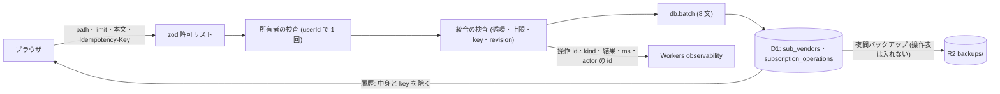

# Architecture overview

サブスク統合の統合・取り消し・操作履歴の API について、テナントの境界・入力・記録とログの中身をどう守るかの制約を持つ。上限値・エラーコード・受入の正本は `specs/spec-subscriptions-merge.md` (以下 spec) で、`system-spec/security.md` は承認時の入力である。行番号は 2026-09-30 に現物で確かめた値。

脅威は次の 5 つに分けて扱う〔-003 由来: qa-subsmerge-security-web-003〕。

1. 誰が統合・取り消しをしたか辿れない。
2. 古い画面や別の利用者の操作が、静かに上書きする。
3. 記録やログから中身が漏れる。
4. 共有テナントの外の id を使われる。
5. Idempotency-Key を別の本文で使い回される。

前サイクルの `architecture/subscriptions-security.md` は、次の 4 点を定めた。本書はこれらをそのまま引き継ぐ。

- 入力を zod の許可リストで閉じる。
- React のテキストとしてだけ描く。
- ロゴ取得や外部 AI への送信の経路を作らない。
- 依存を足さない。

名前の上限は、現物では名前・別名・除外名が `SUB_VENDOR_NAME_MAX` (120) の 1 つにそろっている (`packages/api/src/routes/subs.ts:44-52`)〔現物 2026-09-30〕。本書もこの値に合わせる。

## Context and drivers

以下の既存実装の観測は開発着手前 (2026-09-30) の記録。現在の構造・契約は各設計節と spec を参照する。

- Business/technical context〔観測 qa-subsmerge-security-web-evidence-001、現物 2026-09-30〕:
  - 書込みは zValidator で本文を検証する。名前と別名は `z.string().trim().min(1).max(SUB_VENDOR_NAME_MAX)` (subs.ts:47・:51) で、別名は 50 件まで (:50 の ALIASES_MAX)。
  - 別名の追加は :202 の aliasesBodySchema を :208 で使う。:213-215 は統合先を userId の sub_vendors から引き、無ければ 404 not_found を返す。
  - PUT (:157-200) は :190 の `b.aliases ?? target.aliases` で別名を丸ごと上書きし、画面の値が古くても検出しない。revision・冪等キー・操作の記録は無い。
  - 既存のエラーログ (`packages/api/src/index.ts:151` の onError) は、requestId・path・例外名・呼び出し位置の行だけを出し、message を出さない。requestId は :58 で 64 文字に制限する。
  - API の応答には :63-89 の secureHeaders が CSP (default-src 'self'・frame-ancestors 'none' など) を付ける。
  - 夜間バックアップは、統合 JSON を R2 の backups/ に置いて 30 日保持する (index.ts:6・:193)。本文は `loadBackupPayload` (`store.ts:1595`) が組む。本文には操作表の前例として total_cashflow_operations が入る (:1628)。
- Quality attribute priorities:
  - G4 と G2 に資する。上流の指針は OWASP ASVS 5.0.0 (出典 owasp-asvs)。
  - 入力は許可リストで検証し、オブジェクト単位で認可する。
  - 操作の記録は who・what・when を持ち (V16.2.1)、ログに機微な値を出さない (V16.2.5)。
  - 失敗した認証・認可を記録する (V16.3.2)。
- Constraints:
  - 依存を足さない。既存の `zod` ^3.24.1 と `@hono/zod-validator` ^0.4.2 で満たす (`packages/api/package.json`)。
  - 対象は web だけ〔決定 qa-subsmerge-target-platforms-002〕。
  - public リポジトリなので、実データをリポジトリに置かない (AGENTS.md、`scripts/hooks/guard-real-data.sh`)。

## Goals and non-goals

- Goals:
  - G4 (脅威 1):
    - 全ての操作の行に `actor_user_id` (認証済みセッションの `c.get('actor').id`) を書く。
    - `GET /api/subscription-operations` で操作者の email を返す〔決定 qa-subsmerge-actor-record-001〕。
  - G2 (脅威 2):
    - revision の照合と `UNIQUE (user_id, base_revision)` で 409 subscription_revision_conflict にし、未適用を保証する (spec BR-008)。
  - G4 (脅威 3):
    - payload_json と before_json は 30 日で NULL にする〔決定 qa-subsmerge-retention-001〕。
    - GET は記録の中身を返さない。
    - ログには操作 id・kind・結果・所要 ms・actor の id だけを出す (spec 非機能要件)。
  - G4 (脅威 4):
    - テナントに無い vendor id と操作 id を 404 not_found にする (spec BR-006・AC-012)。
  - G2 (脅威 5):
    - 同じ key でkind・command・正規化本文のいずれかが違えば、最初の結果を返さず 422 idempotency_key_reused にする (spec BR-007)。
- Non-goals:
  - 認証・セッションの変更 (`architecture/subscriptions-merge-auth.md`)。
  - 監査ログ基盤の新設と、列単位の暗号化。
  - レート制限 (spec 実行セマンティクス: レート制限は置かない)。
  - 他の利用者による取り消しを防ぐこと。決定で許しており、防ぐのではなく辿れるようにする〔決定 qa-subsmerge-undo-scope-001〕。

## System context and boundaries

- Users/external systems:
  - アプリの外への送信は無い。取引名・ベンダー名を外部のサービスへ出さない。
  - 構造化ログの送り先は Workers の observability (`packages/api/wrangler.jsonc:33`) だけ。
  - バックアップの置き場は R2 だけ。
- Trust/deployment/data boundaries:
  - 信頼できない入力は次の 4 つ。
    - URL パス (操作 id)。
    - クエリ (limit)。
    - JSON 本文 (targetId・sourceVendorIds・rawNames・baseRevision)。
    - Idempotency-Key ヘッダ。
  - 復元する JSON も、形の保証の無い入力として扱う (merged_into_id の循環を含みうる)。
  - 出力の境界は次の 4 つ: JSON 応答・ブラウザの DOM・Workers のログ・R2 のバックアップ。
- Context diagram:

## Container and component view

| Container/Component | Responsibility | Interface | Data owner | Deployment unit |
|---|---|---|---|---|
| zod 許可リスト (routes/subs.ts) | 本文・path の id・limit・Idempotency-Key の形と上限を検証する | zValidator | packages/api | Worker |
| 所有者の検査 (routes/subs.ts) | targetId と sourceVendorIds を userId の sub_vendors から 1 回の問い合わせで引く。操作は `(id, user_id)` で引く | Drizzle の条件式 | sub_vendors・subscription_operations | Worker |
| 統合の検査 (routes/subs.ts) | 自己統合・循環・統合済み・別名の上限・key の本文の一致・revision を確かめる | route の中の関数 | packages/api | Worker |
| canonicalMutationFence (canonical-mutation-fence.ts:46・:274) | 統合と取り消しを lease の内側で走らせる | 表への 2 行の登録 | import の lease 表 | Worker |
| subscription_operations (0058) | 記録を vendor の name・aliases・accounts・merged_into_id・見直し判断に限る。30 日で中身を NULL、400 日で行を消す | D1 | packages/api | D1 |
| 操作ログ (routes/subs.ts) | 決めた 6 項目 (requestId を含む) だけを構造化ログにする | `console.log` の JSON 1 行 | なし | Worker |
| 夜間バックアップ (store.ts:1595) | 本文に操作表を入れない | loadBackupPayload | R2 backups/ | Worker (cron) |

## Cross-cutting contracts

規範は [spec-subscriptions-merge](../specs/spec-subscriptions-merge.md) に従う。

- 認証・所有者・操作者: spec「認証・認可」。
- 入力・応答・エラー・冪等性・revision: spec「API契約」「ビジネスルールと検証」。
- 操作状態・再試行・表示文言: spec「UI・状態遷移」「エラー・例外・回復」。
- 列・制約・保持・復元: spec「データモデル」「確定した実装契約」。
- 検証: spec「テストと受入条件」。実行結果は [docs の検証索引](../docs/subscriptions-screen.md#verification-records)。

本書は構造と採用理由を持ち、契約表を複製しない。現行の追加契約と推定月額の再計算規則は spec の「推定月額の契約確定」を参照する。

## Subtype architecture

- Frontend: N/A: 画面の描き方は `architecture/subscriptions-merge-frontend.md` が持つ。本書は「テキストとしてだけ描く」の制約だけを置く。
- Backend: N/A: batch の文の並びと再試行は `architecture/subscriptions-merge-backend.md` が持つ。本書は検査の順と拒否のコードだけを持つ。
- Infrastructure: N/A: binding・secret・有料機能を増やさない。
- Data: N/A: 表・列・索引・掃除の文は `architecture/subscriptions-merge-database.md` が持つ。本書は記録に入れてよい値と保持だけを持つ。
- Security: 下記 Security architecture を合成する。

### Security architecture

#### Assets, actors and threat model

- Protected assets/data classification:
  - 機微 (業務):
    - 取引名 (rawNames)・登録名・別名・accounts (対象勘定科目)。
    - monthly_agg の subs 範囲の金額。
    - payload_json と before_json。名前と別名を含むので、機微として扱う。
  - 個人情報: users の email。履歴の応答にだけ含める。
  - 証跡: 操作の行の who・what・when (actor_user_id・kind・target_vendor_id・created_at)。
  - 非機微の識別子: 操作 id・vendor id・revision・Idempotency-Key。
- Actors/adversaries/abuse cases:
  - 脅威 1 (追跡できない): actor の無い書込み → 全ての操作の行に actor_user_id を NOT NULL で書く (spec FR-010)。
  - 脅威 2 (静かな上書き): 古い画面が別名を丸ごと上書きする → baseRevision の不一致で 409。統合済みの行への PUT・aliases・review も 409 (spec subscription-writes-base-revision)。
  - 脅威 3 (記録とログの漏れ): ログや履歴の応答から、取引名や記録の中身を読まれる → 出す項目を決め、中身を 30 日で消す。
  - 脅威 4 (テナントの外の id): 推測した id で他のテナントの行を動かす → 404。
  - 脅威 5 (key の使い回し): 同じ key で別の本文を送り、最初の結果を得る、または二重に適用させる → 422 idempotency_key_reused。掃除の後は 422 idempotency_key_expired。
  - そのほかの濫用:
    - 自己統合・循環で照合一覧を壊す → 自己統合は 422 merge_cycle。循環 (統合先が統合元の子孫) は、子孫が必ず統合済みなので BR-001 の 409 subscription_revision_conflict で先に止まる (spec BR-005)。
    - 巨大な配列や長い名前 → 400。
    - 別名を 50 件より多くする → 400 too_many_aliases (spec BR-004)。
    - 30 日を過ぎた統合を戻す → 410 undo_expired (spec BR-009)。
- Trust boundaries/data flows:
  - ブラウザ → Worker の入口で、zod・所有者・統合の検査の順に絞る。
  - 検査を通った値だけが D1 の batch に入る。
  - Worker → observability にはログの 6 項目だけが出る。
  - D1 → R2 には、操作表を除いた本文だけが出る。

#### Identity and authorization

- Authentication/session/federation: `architecture/subscriptions-merge-auth.md` に従い、変えない。
- Authorization model and deny-by-default rules:
  - 3 本は authGuard・mustChangePasswordFence の配下に置く。統合と取り消しは canonicalMutationFence の表 (canonical-mutation-fence.ts:46) にも載せる。
  - lease 保持中と一時パスワードのままの書込みを、既存と同じく止める〔-003 由来: qa-subsmerge-security-web-003〕。
  - role では分けない〔決定 qa-subsmerge-undo-scope-001〕。
- Tenant/resource ownership enforcement:
  - 統合の全ての id を、テナントの sub_vendors から 1 回の問い合わせで引く。1 件でも無ければ 404 (spec BR-006)。
  - `merged_into_id` が同じ user_id の行を指すこと、と循環しないことは API が検査する。SQLite の外部キーは user_id の一致を表せない (spec データモデル)。
  - 統合元のうち既に統合済みのものがあれば、409 subscription_revision_conflict (spec BR-006)。

#### Data and secret protection

- Encryption in transit/at rest/key ownership:
  - 通信は HTTPS だけ。
  - 保存時の暗号化と鍵は D1 と R2 の管理に委ね、列の暗号化は足さない。
    - 記録に入れる値を絞り、30 日で消すことで、暗号化しない分の露出を小さくする。
- Secret source/rotation/redaction:
  - 新しい secret は無い。
  - ログの項目は Cross-cutting contracts の 6 つに限る。
  - Idempotency-Key は画面が `crypto.randomUUID()` で作る。36 文字の `[0-9a-f-]` なので、BR-007 の形 (8〜64 文字の `[A-Za-z0-9-]`) に収まる。
- Retention/deletion/privacy requests:
  - 保持は spec BR-013 に従う〔決定 qa-subsmerge-retention-001〕。
    - created_at から 30 日を過ぎた行は、payload_json と before_json を NULL にする。
    - 400 日を過ぎた行は消す。
    - 掃除は書込みの batch に 2 文を足し、1 回 50 件ずつ行う。
  - 夜間バックアップの本文に subscription_operations と subscription_revisions を入れない〔本書で置いた値〕。
    - spec のデータモデルは、操作の記録を復元で書き戻さないとする。入れても使い道が無い。
    - 入れると、D1 で NULL にした before_json が R2 に最大 30 日残る。
  - email は操作の記録に写さず、読むときに users から引く。
  - 利用者は削除せず停止する (`routes/admin-users.ts:110`)。個人の削除の依頼は N/A: 個人利用で、利用者は運用者の身内に限られるため。

#### Application and supply-chain controls

- Input/output validation and injection defenses:
  - 統合の本文 (spec BR-002〜BR-005・BR-007):
    - targetId は正の整数。
    - sourceVendorIds は正の整数の配列で、0〜50 件・重複なし。
    - rawNames は 0〜50 件で、各要素は 1〜120 文字。C0 制御文字 (U+0000〜U+001F) と U+007F を含む要素は拒む。
    - 両方の配列が空なら 400 empty_merge。
    - 統合後の aliases が 50 件を超えれば 400 too_many_aliases。
    - 自己統合は 422 merge_cycle。循環は統合済みの統合先として 409 で先に止まる (spec BR-001・BR-005)。
    - 未知のキーは捨てる。
  - rawNames の上限を 120 にする理由 (spec BR-003): -003 は 200 文字とする。しかし取引名は統合先の別名として保存され、既存の別名の上限 120 (subs.ts:51) を超えると、後の PUT が 400 になる。
  - Idempotency-Key: 8〜64 文字の `[A-Za-z0-9-]`。無い、または形が違えば 400 idempotency_key_required。
  - 取り消しの path の id: 1〜64 文字の `[A-Za-z0-9_-]`。
  - 履歴の limit: 1〜20 の整数、既定 20 (spec 履歴の Request)。
  - SQL は Drizzle の bound parameter と `json_each(?)` で値を渡し、文字列を連結しない。
  - 画面は、取引名・ベンダー名・操作者の email・操作の文言を React のテキストとしてだけ描く。
    - `dangerouslySetInnerHTML` を使わない (`packages/web/src` に 0 件〔現物 2026-09-30〕)。
    - 利用者の入力を文言の書式に使わない。
  - 履歴の応答は、列を明示して組む。payload_json・before_json・Idempotency-Key を含めず、`Cache-Control: private, no-store` を付ける (`routes/subs.ts:405` の PRIVATE_NO_STORE)。
- Dependency/artifact provenance/signing/SBOM:
  - 依存を足さない。外部の画像ホストや CDN を CSP の許可に足さない。
  - lockfile (`pnpm-lock.yaml`) で解決版を固定する。
  - 署名と SBOM は N/A: 配布物を第三者へ渡さない個人利用の Worker で、本変更は依存を増やさないため。
- CI/CD branch/review/environment protections:
  - ci.yml の `pnpm audit --prod --audit-level high` (:52、警告として実行) と、`pnpm lint` に含まれる `security:content` (`guard-real-data.sh --scan-public-docs`) を通す。
  - テストのデータは匿名化した fixture と架空のサービス名 (aquavoice・Spotify のような一般的な名前) だけで作る。samples/*.csv は seed の生成物なので直接編集しない。
  - migration 0058 は追加型 (ADD COLUMN・CREATE TABLE・CREATE INDEX) で、`.github/scripts/plan-auto-migration.mjs:49` の DESTRUCTIVE_PATTERNS に当たらない。そのため承認は要らず、main への merge で既存の deploy が適用する〔-003 由来: qa-subsmerge-infrastructure-web-003〕。

#### Detection and response

- Audit events/security telemetry/alerts:
  - 監査は次の 3 つ。
    - subscription_operations の行 (V16.2.1)。
    - 操作ログ `subscription_operation`。
    - 拒否ログ `auth_rejected` (`architecture/subscriptions-merge-auth.md`)。
  - 警報は N/A: 個人利用のため置かない (spec 可観測性)。
- Incident response/revocation/recovery:
  - 止まった操作や不審な操作は、UC-8 の 3 段で辿る (spec 可観測性、手順は `docs/subscriptions-screen.md`)。
    1. 画面の操作状態。
    2. `GET /api/subscription-operations`。
    3. Workers の observability を操作 id で検索する。
  - 不審な利用者は停止して session を失効させる (`architecture/subscriptions-merge-auth.md`)。
  - 不正な統合の回復:
    - 30 日以内なら取り消す。
    - それより古ければ、夜間バックアップから復元する。
  - 復元の後に古い「元に戻す」が押されても、二重には戻らない。統合元の merged_into_id が統合先を指していなければ、BR-009 の 4 段目で 409 undo_blocked_by_later_operation になる。
- Vulnerability handling and SLA:
  - 依存の既知の脆弱性は、CI の `pnpm audit` の警告で見つけ、次の変更で上げる。
  - SLA は N/A: 個人利用で、対応の期限を約束する相手がいないため。

#### Security verification

- SAST/SCA/secret scan/authz/abuse/penetration tests:
  - SAST: `pnpm typecheck` と biome (`pnpm lint`)。
  - SCA: `pnpm audit --prod --audit-level high`。
  - 公開文書と実データの検査: `security:content`。
  - authz と abuse は、api の統合テスト (`packages/api/src/subs-screen.integration.test.ts`・新しい `subs-merge-operations.integration.test.ts`・`subs-vendor-scope.test.ts`) で確かめる。
    - 境界で 400: sourceVendorIds 51 件、rawNames 51 件、121 文字の要素、制御文字、両方が空の本文、7 文字と 65 文字の key、key の欠落、limit 0 と 21。受理側の 50 件・120 文字・8 文字と 64 文字の key・limit 1 と 20 は通る。
    - 自己統合が 422 merge_cycle。統合元の子を統合先に選ぶ循環が 409 で、sub_vendors・操作・revision が変わらない (spec BR-005)。
    - 同じ key で別の本文が 422 idempotency_key_reused。payload_json を NULL にした key の再送が 422 idempotency_key_expired。
    - baseRevision 7 の統合と PUT が 409 で、sub_vendors・操作・revision が変わらない (spec AC-014)。
    - user_id を付け替えた行への統合と取り消しが 404 (spec AC-012)。
    - 本文の user_id と actor が無視される。
    - 履歴の応答に before_json・payload_json・key が無い。console を spy したログの出力に、取引名・別名・email が出ない (spec AC-020)。
    - 夜間バックアップの本文に subscription_operations のキーが無い。
  - 期待値は `expect` の値の比較で固定し、旧実装で落ちることを確かめる (spec テストと受入条件)。
  - ペネトレーションテストは N/A: 個人利用で外部の診断を入れる予定が無い。上の abuse のテストで代える。

## Architecture decisions

| ADR | Decision | Alternatives | Trade-on rationale | Consequences |
|---|---|---|---|---|
| SM-SEC-01 | 本文を zod の許可リストで閉じ、上限を spec BR-002〜BR-004・BR-007 の値にする。rawNames の各要素は 120 文字〔spec BR-003、現物 2026-09-30〕 | -003 のとおり 200 文字にする / 上限を置かない | 取引名は統合先の別名として保存されるので、既存の別名の上限と同じにして後の PUT を壊さない | 121〜200 文字の取引名は統合できず、400 になる |
| SM-SEC-02 | テナントに無い id を、1 回の問い合わせで引いて 404 にする〔-003 由来: qa-subsmerge-security-web-003〕 | 1 件ずつ引く / 403 と 404 を分ける | 存在を漏らさず、問い合わせの数も増やさない | 画面は 404 で一覧を取り直す |
| SM-SEC-03 | 古い画面の書込みを、revision の照合と `UNIQUE (user_id, base_revision)` で 409 の未適用にする〔-003 由来: qa-subsmerge-backend-web-003〕 | 後勝ちで上書きする / fence の lease だけで守る | lease は同時の書込みしか止めず、古い画面からの後の書込みは止めない | 既存の書込み 9 本にも baseRevision を任意で足す |
| SM-SEC-04 | 再送のkind・method/path command・本文を照合する | 本文だけ比較する / 別の操作へ最初の結果を返す | 同じkindでも別commandの誤再送を防ぐ | 422と期限切れの契約はspec BR-007、kindをまたぐ再利用はAPI統合テストを参照する |
| SM-SEC-05 | 記録を vendor の name・aliases・accounts・merged_into_id・見直し判断に限り、30 日で中身を NULL、400 日で行を消す〔決定 qa-subsmerge-retention-001〕 | 集計値や取引の明細も記録する / 無期限に持つ | 取り消しに要る値だけを持ち、取り消せる期間を過ぎたら消す | 30 日を過ぎた統合は戻せない (410) |
| SM-SEC-06 | ログを 6 項目 (requestId・操作 id・kind・結果・所要 ms・actor の id) に限る〔spec 非機能要件、V16.2.5〕 | 取引名や集計値も出す | 名前と金額をリポジトリの外のログにも残さない | 障害の調査は、操作 id から記録を引いて行う |
| SM-SEC-07 | 夜間バックアップの本文に操作表を入れない〔本書で置いた値〕 | total_cashflow_operations の前例 (store.ts:1628) どおり入れる | 操作の記録は復元で書き戻さない (spec データモデル) ので、入れても使い道が無い。入れると NULL にした中身が R2 に残る | D1 を失ったとき、操作の証跡はバックアップから戻らない |
| SM-SEC-08 | merged_into_id を辿る回数を登録件数で打ち切り、打ち切ったら例外にする。復元では参照先の存在と循環を検査する〔本書で置いた値〕 | 辿る回数に上限を置かない | 正しい操作では循環はできないが、復元した壊れたデータで辿りが止まらなくなるのを防ぐ | 壊れたデータは復元の時点で拒まれる |

## Delivery, migration and rollback

- Build/deploy topology: 既存の Worker と web のビルドのまま。依存は増えない。
- Migration sequence: 0058 と同じ PR で、次の順に入れる。
  1. zod の許可リスト。
  2. 所有者の検査。
  3. 統合の検査 (自己統合・循環・統合済み・別名の上限・key・revision)。
  4. fence の表への登録。
  5. 操作ログの項目の固定。
  6. バックアップの本文からの除外。
  7. 上の Security verification のテスト。
  - 本番は Migrate → Deploy の順。
- Rollback trigger/procedure:
  - セキュリティのテストが落ちたら、実装を差し戻す。検証の追加が中心なので、データの巻き戻しは要らない。
  - 列と表は残る。統合済みの行は、旧実装では独立した行として再び現れる (spec 互換性・移行・リリース)。

## Risks and verification

- Risk/assumption:
  - 本文の大きさの上限は、既存のサブスクの書込みと同じく置かない (bodyLimit は `/api/auth/*` だけ、index.ts:94-101)。zod は件数と長さで拒むが、巨大な本文の JSON の解析は拒む前に走る。Workers の CPU 時間の上限で打ち切られることを受け入れる。
  - payload_json は、本文の比較のために取引名を 30 日持つ。30 日の NULL 化は書込みのついでに行うので、書込みの無い期間は期限を過ぎた中身が残る。取り消せるかは created_at で判定する (spec BR-013)。
  - 履歴の応答は、登録名 (targetVendorName) と操作者の email を含む。どちらも認証済みの同じテナントの利用者にだけ返し、`private, no-store` を付ける。
  - sub_vendors の accounts (対象勘定科目) は、-003 の言う「口座」とは別のもの。取り消しで統合先の accounts を操作前へ戻すため、before_json に入れる (spec BR-010)。
- Architecture fitness test:
  - 新しい route の zValidator に、spec の上限値 (50・120・8〜64・1〜20) が入っている。
  - ログを出す箇所に、取引名・別名・email・key の変数が渡らない (console の spy で確かめる)。
  - 履歴の SELECT が payload_json・before_json・idempotency_key を読まない。
  - `packages/web/src` に `dangerouslySetInnerHTML` が 0 件。
  - 夜間バックアップの本文に操作表のキーが無い。
- Load/failure/security validation:
  - 上の 400・404・409・410・422 と、履歴の応答が `private, no-store` であること。
  - `pnpm verify:full` と CI が緑であること (spec AC-023)。
