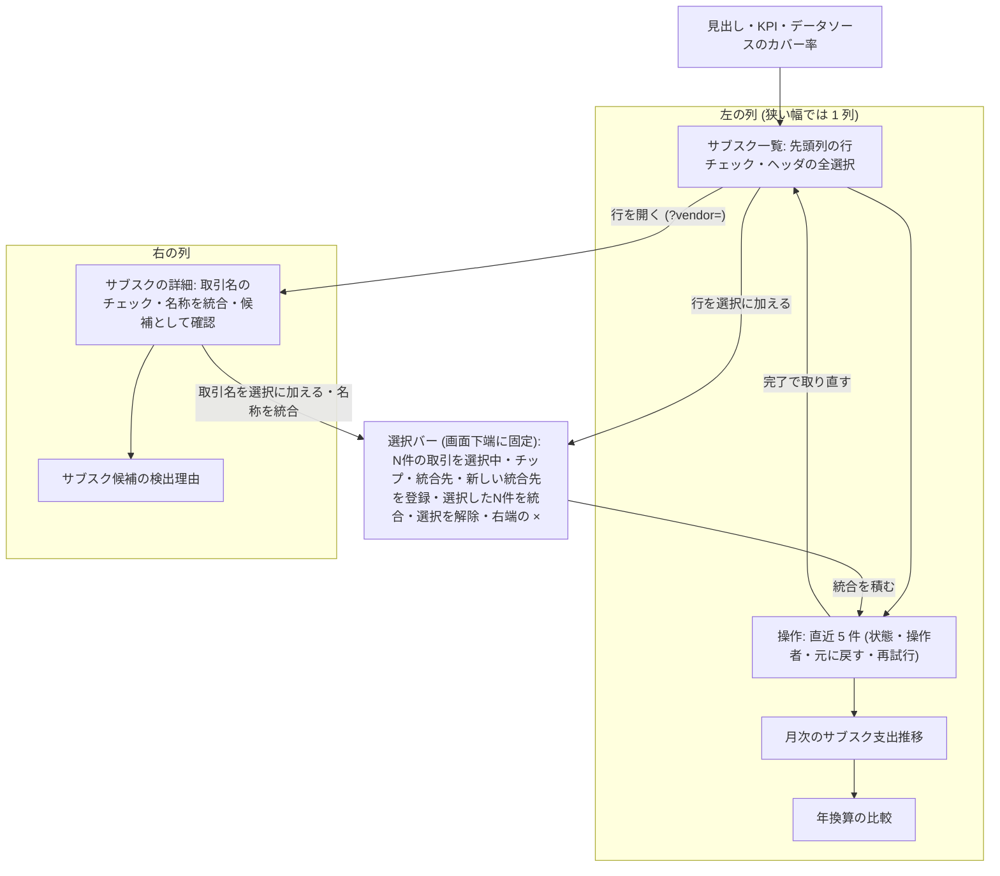

# Architecture overview

サブスク画面に、一覧の行チェック・全選択・選択バー・操作状態・取り消しを置く。本書は画面の見た目・配置・文言・操作の流れの制約を持つ。正本は `specs/spec-subscriptions-merge.md` (以下 spec) の「UI・状態遷移」と FR-001〜FR-004・FR-018・FR-019・FR-021・FR-022 で、`system-spec/ui-ux.md` は承認時の入力である。書込みの順序・再送・状態の持ち方は `architecture/subscriptions-merge-frontend.md` が持つ。行番号は 2026-09-30 に commit a63d35c の現物で確かめた値。

前サイクルの `specs/spec-subscriptions-screen.md` が定めた画面構成・文言・fixture・読み込み中と空の表示は引き継ぐ。本書で変えるのは次の 5 点。

1. 一覧の先頭列に行チェックを、ヘッダに全選択を置く。
2. 選択バーは画面下端の固定のまま (画像 09 と現行の位置)、行と取引名を 1 つの選択にまとめ、統合先 (代表) の選択欄と、右端に「選択を解除」と同じ動作の × を持たせる。統合先の選択欄は詳細パネルから選択バーへ移して 1 か所にする。
3. 一覧のカードの直下に「操作」として直近 5 件の操作状態を置き、完了した統合に「元に戻す」を付ける。
4. 詳細パネルに画像 09 の「名称を統合」を、登録済み・未登録を問わず出す。押すとその行を選択に加え、選択バーへフォーカスを移す。
5. 書込みの失敗を、画面上部の通知から操作の行へ移す。

## Context and drivers

以下の既存実装の観測は開発着手前 (2026-09-30) の記録。現在の構造・契約は各設計節と spec を参照する。

- Business/technical context〔観測 qa-subsmerge-ui-ux-web-evidence-001、現物 2026-09-30〕:
  - 画像 09 (`design/FINAL-UI/images/09-subscriptions.png`) の要素は次のとおり。
    - 一覧の先頭列のチェックとヘッダの全選択。
    - 詳細パネルの「マッチした生の取引名 (2件)」のチェック、「名称を統合」「候補として確認」。
    - 検出理由カードの「候補を採用」「候補から除外」。
    - 画面下端の選択バー: 「2件の取引を選択中」、チップ 2 つ (× 付き)、「選択した2件を統合」、「選択を解除」、右端の ×。
  - 現物では、`packages/web/src/pages/subscriptions/SubscriptionTable.tsx:89-97` の 8 列に行チェックが無い。選択は `Subscriptions.tsx:110` の取引名の配列だけである。
  - `SelectionBar.tsx` はページの末尾 (`Subscriptions.tsx:343`) に置かれ、`subscriptions.css:882-896` の `.subs-selection` が sticky で画面下端に固定する (640px 以下だけタブバーの上)。選択が無ければ何も出さない (`SelectionBar.tsx:26`)。
  - 統合先の選択欄は未登録の行のときだけ出る (`DetailOverview.tsx:168` の条件で :169-200。「新しい統合先を登録」は :201 の MergeTargetCreator)。登録済みの行 (aquavoice 型) を開いても統合の手段が無い。
  - 詳細パネルに「名称を統合」の文言は無い。`ReviewDecisionActions.tsx:62` の「候補として確認」だけがある。
  - 書込みの失敗は `Subscriptions.tsx:267-275` の上部の通知に `components/Page.tsx:87-100` の describeError で出る。5xx の文言は :92-93 の「サーバー側で処理に失敗しました。少し待ってから、もう一度読み込んでください。…」で、同時の操作の取り合いでもこれが出る (spec O2)。
- Quality attribute priorities:
  1. 可逆性と透明性 (G3): 統合を確認ダイアログで止めず、完了した統合に「元に戻す」を付ける。各操作の状態と操作者を示す。上流の指針は Apple Human Interface Guidelines (`system-spec/ui-ux.md:127` の presentation の行)。
  2. 情報の優先度 (G1): 一覧の行 > 選択バー > 操作状態 > 詳細パネル > 年換算の比較・月次推移〔-003 由来: qa-subsmerge-ui-ux-web-003〕。
  3. アクセシビリティ: 状態を色だけで示さない。状態の変化は `aria-live="polite"` で知らせる。押せる領域は 44px (`--tap-target-min`、`styles.css:100`) を保つ。全選択の mixed は WAI-ARIA APG の checkbox パターンに従う (出典 wai-aria-apg-checkbox)。
- Constraints:
  - 色・文字・余白・ボタンは `docs/design-system.md` に従う。値の正本は `packages/core/src/design-tokens.ts` で、`packages/web/src` に色の hex を直書きしない (`pnpm lint` の `scripts/check-design-tokens.mjs` が検査する)。
  - `Button` の primary は 1 つの領域に 1 つ。danger は取り消せない操作だけに使う (`docs/design-system.md:107-112`)。
  - 楽観更新をしない (spec スコープ Out)。画面の値は書込みの成功後に取り直した値だけを示す。
  - テストは匿名化済みの fixture と samples だけを使う。
  - 対象は Web だけ (spec スコープ Out の「Web 以外の専用アプリ」)。

## Goals and non-goals

- Goals:
  - G3: 一覧の行チェック・全選択 (一部だけ選ばれているとき mixed)・選択バー・統合先の選択欄を置き、AC-007・AC-008 を満たす〔-003 由来: qa-subsmerge-ui-ux-web-003〕。
  - G1: 登録済みの行を統合元にでき、統合元の行が一覧から消える。詳細パネルの「名称を統合」を登録済みの行にも出す (FR-004、UC-3)〔決定 qa-subsmerge-decision-001〕。
  - G3: 操作状態を一覧のカードの直下に直近 5 件出し (操作の記録も待機中の操作も無いときは出さない)、各行に操作者の email、状態 (文字と状態色)、取り消せる統合には「元に戻す」を付ける (FR-018・FR-019、AC-009・AC-010・AC-022)〔-003 由来: qa-subsmerge-ui-ux-web-003、決定 qa-subsmerge-undo-scope-001〕。
  - G2: 取り合いを自動再試行と送り直しの文言で示し、「サーバー側で処理に失敗しました」を 5xx と通信の失敗のときだけ出す (O2、AC-015・AC-021)〔決定 qa-subsmerge-decision-004〕。
  - G3: 処理中は行チェック・全選択・取引名チェックを無効にする (FR-022、AC-011)。
- Non-goals:
  - 他画面のデザインの作り直し (spec スコープ Out)。
  - 統合の前の確認ダイアログ。取り消しで可逆にする。
  - 楽観更新。
  - 選択バーの sticky をやめて一覧の流れの中へ移すこと。画像 09 と現行のとおり画面下端の固定を保つ (FR-003)〔決定 qa-subsmerge-decision-001「画像どおり」〕。
  - 画像 09 に合わせて選択の件数を取引名だけで数えること。spec のとおり行と取引名を合わせて数える (AC-008)。
  - 検出理由カードの「候補を採用」(画像 09)。今回は扱わない (spec のまま)。
  - 取り消しの権限を role や操作者で分けること〔決定 qa-subsmerge-undo-scope-001〕。

## System context and boundaries

- Users/external systems:
  - 利用者 (admin・member)。月次の見直しで行と取引名を選び、統合先を決めて統合する。
  - 同じテナントの他の利用者。その操作は操作状態に email 付きで現れ、自分の操作の自動送り直しの理由になる。
  - API: `GET /api/subscriptions`・`GET /api/sub-vendors` (revision を含む)、`POST /api/sub-vendors/merge`、`POST /api/subscription-operations/{id}/undo`、`GET /api/subscription-operations?limit=20`、既存の書込み 9 本。
  - 画像 09: 見た目の正本。画面下端に固定した選択バーと右端の × は画像に合わせる (SM-UX-01)。件数の数え方、統合先の選択欄と「操作」の欄を足すこと、「候補を採用」を扱わないことは spec のとおり画像と異なる。
- Trust/deployment/data boundaries:
  - 画面は表示と入力だけを持つ。統合できるか・取り消せるかの最終の判断は API が行い、画面は応答の code と `undoable` を表示に写す。
  - 選択と統合先は画面の状態で、URL に載せない。URL は開いている行 (`?vendor=`) だけを持つ。
  - 操作者の email は、完了した操作は API の `actorEmail`・`undoneByEmail` から、画面で積んだ未完了の操作はログイン中の利用者 (`['auth']` の応答) から取る。
- Context diagram: 画面の縦の並び (1024px 以上は一覧の列と詳細の列の 2 列、1023px 以下は上から順に 1 列)。選択バーは並びの外で画面下端に固定する。

## Container and component view

| Container/Component | Responsibility | Interface | Data owner | Deployment unit |
|---|---|---|---|---|
| SubscriptionTable (既存、列を足す) | 先頭列に行チェック、ヘッダに全選択。行のクリックで開く動きは保ち、チェックのセルは開く動きへ伝えない | props: 選択中の vendorKey、行と全選択の切り替え、処理中 | 選択は Subscriptions.tsx | web の lazy chunk (`AuthenticatedApp.tsx:24`) |
| SelectionBar (既存を作り直す) | 画面下端に固定したまま、件数・チップ・統合先の選択欄・「新しい統合先を登録」・「選択したN件を統合」「選択を解除」・右端の × | props: 選択の項目、統合先の候補と現在値、統合と解除 | Subscriptions.tsx | 同上 |
| OperationList (新設、`pages/subscriptions/OperationList.tsx`) | 一覧のカードの直下に、見出し「操作」と直近 5 件。状態・説明・操作者・時刻・「元に戻す」「再試行」 | props: 表示の行、取り消しと再試行 | 行は frontend 文書の書込み用フックが作る | 同上 |
| DetailOverview (既存) | 取引名のチェックと「名称を統合」。統合先の選択欄 (:169-200) と MergeTargetCreator (:201) は選択バーへ移して 1 か所にする | props: 取引名の選択、「名称を統合」 | Subscriptions.tsx | 同上 |
| ReviewDecisionActions・ReasonCard (既存) | 「候補として確認」「候補から除外」は変えない。押した操作は書込み用フックを通る | 既存の props | 変更なし | 同上 |
| 文言の対応 (新設、`pages/subscriptions/operationText.ts`) | kind・状態・エラーコードから表示の文言を返す純関数 | 関数 | なし | 同上 |
| defaultMergeTarget (新設、`packages/core/src/subs-screen.ts`) | 統合先の既定を決める純関数 | 選択中の行 → 登録済みの統合先の vendorKey または null | なし | `packages/core` |
| design tokens (既存) | 状態色と面の色 | CSS 変数 | `packages/core/src/design-tokens.ts` | 同上 |

## Cross-cutting contracts

規範は [spec-subscriptions-merge](../specs/spec-subscriptions-merge.md) に従う。

- 認証・所有者・操作者: spec「認証・認可」。
- 入力・応答・エラー・冪等性・revision: spec「API契約」「ビジネスルールと検証」。
- 操作状態・再試行・表示文言: spec「UI・状態遷移」「エラー・例外・回復」。
- 列・制約・保持・復元: spec「データモデル」「確定した実装契約」。
- 検証: spec「テストと受入条件」。実行結果は [docs の検証索引](../docs/subscriptions-screen.md#verification-records)。

本書は構造と採用理由を持ち、契約表を複製しない。現行の追加契約と推定月額の再計算規則は spec の「推定月額の契約確定」を参照する。

## Subtype architecture

- Frontend: 下記 Frontend architecture を合成する。
- Backend: N/A: 統合・取り消し・操作履歴の処理と応答は `architecture/subscriptions-merge-backend.md` と spec の API 契約が持つ。本書は応答の code と画面の文言の対応だけを持つ。
- Infrastructure: N/A: 配信と lazy chunk の構成を変えない。
- Data: N/A: 画面は D1 を読まない。操作の記録の列は `architecture/subscriptions-merge-database.md` が持つ。
- Security: N/A: 画面は既存の認証の配下にある。操作者の email を見られるのは同じテナントの利用者だけで、その制約は `architecture/subscriptions-merge-auth.md` が持つ。

### Frontend architecture

#### Rendering and application pattern

- Pattern: 既存の SPA の 1 画面。サブスク画面は `AuthenticatedApp.tsx:24` で lazy に読み込む。統合は確認ダイアログを挟まずに積み、完了後に「元に戻す」で戻せる形にする (Apple Human Interface Guidelines、`system-spec/ui-ux.md:127`)。
- Framework/runtime and selection rationale: 既存の React 18・react-router-dom 7・TanStack Query v5 のまま。見た目のための依存を足さない。
- Browser/device support: 既存どおり、PC・タブレット・スマートフォンのブラウザ。1024px 以上は一覧の列と詳細の列の 2 列 (`subscriptions.css:90-98`)、1023px 以下は 1 列に縦へ積む (:926-956)。

#### Routes, screens and navigation

- Route/screen map:
  - `/subscriptions` (既存)。`?vendor=` は開いている行の vendorKey。
  - 統合が完了し、`?vendor=` が統合元の行を指していれば、統合先の行の vendorKey へ置き換える (FR-021、AC-016)。
  - 取り消しが完了しても URL は動かさない〔本書で置いた値〕。
  - 選択と統合先は URL に載せず、再読み込みで空に戻る〔本書で置いた値〕。
- Authentication guard/deep link/history:
  - 既存の認証後のシェルの配下に置く。`/subscriptions?vendor=aquavoice` の直リンクで行を開ける (UC-3)。
  - URL の置き換えは既存の setVendor (`Subscriptions.tsx:172-186`) と同じく `replace` にし、履歴を積まない。

#### Component and design-system boundaries

- Component hierarchy:
  - 1024px 以上の配置:
    - 左の列: 一覧 → 操作 → 月次推移 → 年換算の比較。
    - 右の列: 詳細パネル → 検出理由 (既存のまま)。
    - 「操作」(`subs-operations`) は一覧のカードの直下に置く。操作の記録も待機中の操作も無いときは出さない (FR-018)。
  - 1023px 以下の並び: 見出し・KPI・カバー率 → 一覧 → 操作 → 詳細 → 検出理由 → 推移 → 比較 (情報の優先度の順、spec NFR)。「操作」は一覧のカード (`subscriptions.css:937-939` の order 3) と同じ order 3 にし、DOM で一覧のカードの後に置いて、詳細 (order 4) の前に入れる。既存の order は変えない。
  - 選択バーは既存の sticky の下端の固定 (`subscriptions.css:882-896`、640px 以下だけタブバーの上) と浮かせる影を保つ (FR-003)。どの幅でも並びの外にあり、詳細パネルで取引名を選ぶ間も見える。
  - 固定の選択バーが一覧の最後の行と「操作」を覆わないよう、選択バーが出ている間は `.subs` の実測したバーの高さを scroll-padding-bottom に反映してフォーカスを隠さない。既存の :7 は 96px で、統合先の選択欄と「新しい統合先を登録」が加わると、狭い幅で折り返したバーの高さに足りない〔本書で置いた値〕。
  - 選択バーの要素 (左から、狭い幅では折り返す):
    1. 件数「N件の取引を選択中」。
    2. チップ。行のチップは表示名、取引名のチップは取引名を示す。どちらも × で個別に外す。
    3. 統合先の選択欄。native の select 要素で、名前は「統合先」。
    4. 選択中に登録済みの行が無いときだけ「新しい統合先を登録」(既存の MergeTargetCreator を移す)。登録名の初期値は最初に選んだ行の名前。defaultMergeTarget は登録済み行の vendorKey または null を返す。
    5. 「選択したN件を統合」(primary)。
    6. 「選択を解除」(text)。
    7. 右端の ×。「選択を解除」と同じ動作で、名前は「選択を解除して閉じる」〔画像 09、spec FR-003〕。
  - 件数 N は選択中の行と取引名の合計で、統合先の行も数える (AC-008)。統合先を除いた統合元が 0 件のとき、または統合先が空のとき、「選択したN件を統合」を無効にする。処理中も押せ、押すたびにその時点の選択と統合先で操作を 1 件積む (UC-4・AC-009)。
  - 統合先の選択欄の選択肢は、選択中の登録済みの行を先に、テナントの他の登録済みベンダーを名前順に続ける。統合済みのベンダー (`GET /api/sub-vendors` の各行の `mergedIntoId` が在る) は出さない (FR-003)。未登録の行は統合先にできない (FR-003)。
  - 統合先の既定は core の `defaultMergeTarget` で決める〔-003 由来: qa-subsmerge-ui-ux-web-003・frontend-web-003〕。
    - 選択中の登録済みの行のうち、推定月額 (`estimatedMonthly`) が最大の行を選ぶ。同額なら先に選んだ行にする〔本書で置いた値〕。
    - 登録済みの行が選ばれていなければ、統合先は空 (null) にし、最初に選んだ行の名前 (表示名) を「新しい統合先を登録」の初期値にする (FR-003)。
    - 利用者が選び直した統合先は、選択肢から消えるまで保つ。
  - 詳細パネルの「名称を統合」(secondary) は、画像 09 のとおり登録済み・未登録を問わず出す (FR-004)。押すと開いている行を選択に加え、下端に固定した選択バーの統合先の選択欄へフォーカスを移す。統合の送信は選択バーの「選択したN件を統合」の 1 か所だけにする (FR-004)。詳細パネルには統合先の選択欄を置かない。
  - 操作の行の構成: 状態 (文字の badge) → 説明 → 操作者の email → 時刻 → ボタン。説明の行に自動再試行・失敗の文言と「(email) が元に戻しました」を出す。
  - 操作の説明は kind ごとに次の文言にする〔本書で置いた値〕: merge「(統合先) へ統合」、unmerge「統合の取り消し」、vendor_create「登録」、vendor_update「登録内容の変更」、vendor_delete「登録の削除」、review「見直し日の記録」、review_decision「候補の判断」、exclusion「除外」。
  - 操作の記録も待機中の操作も無いときは「操作」の領域を出さない (FR-018)。
- Design tokens/reusable primitives:
  - 行チェックと全選択は既存の `components/SelectionCheckbox.tsx` を使う。native の input 要素で `indeterminate` を持ち、無効は input の属性で渡す。行チェックの名前は「(表示名) を選択」、全選択は「表示中の行をすべて選択」で、どちらも見た目のラベルは隠す〔本書で置いた値〕。
  - 全選択の対象は、検索と状態の絞り込みの後に表示中の行とする〔本書で置いた値〕。合計の行には行チェックを置かない。
  - ボタンは `components/Button.tsx` を使う。「選択したN件を統合」は primary。「元に戻す」と「再試行」は secondary の mini にする。「元に戻す」は戻せる操作なので danger を使わない。
  - 状態色は既存の文字用トークンと淡い面の組だけを使い、必ず文字を添える〔本書で置いた値〕。
    - 待機中: 文字 `--ink-soft`。
    - 処理中: 文字 `--accent`。
    - 自動再試行中: 状態の文字は「処理中」のまま、文字 `--warn`・面 `--warn-soft`。
    - 完了: 文字 `--good`・面 `--good-soft`。
    - 失敗: 文字 `--danger`・面 `--danger-soft`。
  - 選択バーの面は既存の `--surface` と縁 `--biz-soft-line`、影 `--shadow-floating-action` を保つ。チップは既存の `--biz-soft`。
- Accessibility standard:
  - 全選択は、一部だけ選ばれているとき native の `indeterminate` で mixed を示す。ブラウザは支援技術へ mixed として伝えるため、ARIA の属性は重ねない (APG の checkbox パターン、spec NFR)。
  - 状態の変化は、「操作」の領域に 1 つだけ置く `aria-live="polite"` の要素へ、最新の変化を 1 文で入れて知らせる。例: 「Spotify へ統合: 完了」。件数の変化は既存の `SelectionBar.tsx:30` の live 要素のまま。
  - 統合が完了して選択バーが消えるとき、フォーカスが選択バーの中にあれば「操作」の見出しへ移す〔本書で置いた値〕。
  - 処理中に無効にした行チェック・全選択・取引名チェックは disabled にし、選択を変えない (AC-011)。
  - 押せる領域は mini のボタンとチェックでも 44px を保つ。

#### State and data flow

- Local/server/global state ownership:
  - 行の選択 (vendorKey)・取引名の選択・利用者が選び直した統合先は Subscriptions.tsx が持つ〔-003 由来: qa-subsmerge-frontend-web-003〕。
  - 行の選択は、別の行を開いても保つ。取引名の選択は開いている 1 行に属し、別の行を開くと外す (既存の setVendor、:182-183 のまま)。
  - 取り直した一覧に無くなった vendorKey は選択から外す〔本書で置いた値〕。
  - 操作の状態と待ち行列は frontend 文書の書込み用フックが持つ。
- Fetch/cache/invalidation/optimistic update:
  - 楽観更新をしない。統合・取り消しが完了したら、subscriptions・review queue・sub-vendors・sub-candidates・summary・subscription-operations を取り直す。取り直しが終わってから、選択を消し、URL を置き換える (FR-021)。
- Form/validation/error presentation:
  - 失敗は操作の行に出す。上部の通知 (`Subscriptions.tsx:267-275`) は読み込みの失敗だけに使う〔本書で置いた値〕。
  - 名前・別名・対象科目の入力の検証は既存のまま。

#### Backend integration

- API client/generated types/versioning: 画面は `packages/web/src/pages/subscriptions/api.ts` の関数だけを通して送る。応答の型は手書きで、spec の API 契約に合わせる。詳細は frontend 文書。
- Auth/session/CSRF/CORS: 既存のセッション cookie と同一オリジンのまま。本文にテナントと操作者を入れない。
- Offline/retry/timeout: 自動再送は 409 canonical_write_busy と 503 d1_overloaded (同じ key、1・2・4 秒後) と、409 subscription_revision_conflict の送り直し (新しい key) だけ。5xx と通信の失敗は「再試行」を押したときだけ同じ key で送る (FR-015〜FR-017)。

#### Performance and observability

- Bundle/render/Core Web Vitals budgets:
  - 初期 JS の予算 110KiB gzip (`packages/web/scripts/check-initial-js-budget.mjs:8`) に入らない lazy chunk の中で足す。
  - 行チェックの切り替えで一覧全体を並べ直さない。表示の行と選択の判定は vendorKey で行う。
- Client logs/metrics/traces and privacy: 画面から外へログを送らない。取引名・別名・email を console に出さない。

#### Frontend verification

- Unit/component/visual/e2e/accessibility:
  - DOM (`subscriptions-screen.dom.test.tsx`):
    - AC-007: 1 行だけ選ぶと全選択が indeterminate で、全行を選ぶと checked。
    - AC-008: 登録済みの 2 行と取引名 1 件で「3件の取引を選択中」、チップ 3 つ、既定の統合先、「選択した3件を統合」「選択を解除」、右端の ×。
    - 統合先の選択欄: 統合済みのベンダーが選択肢に無い。未登録の行だけを選ぶと統合先は空で、「新しい統合先を登録」の名前の初期値が最初に選んだ行の名前になる。詳細パネルに統合先の選択欄が無い。
    - AC-009: 統合を 2 件続けて押すと、操作者の email と「処理中」「待機中」が文字で出る。完了後に「完了」、5xx で「失敗」と「再試行」。
    - AC-010: 完了した統合に「元に戻す」があり、押して完了すると「(email) が元に戻しました」。
    - AC-011: 処理中は行チェック・全選択・取引名チェックが無効で、選択が変わらない。
    - AC-015・AC-021: 自動再試行と送り直しの文言と (n/3)。
    - AC-016: URL の置き換えと選択の空。
    - AC-022: 「削除された利用者」と、停止中の利用者の email。
    - 名称を統合: 押すと開いている行が選択に加わり、フォーカスが選択バーの統合先の選択欄へ移る。前サイクルの :459-460 と :910-911 の期待を置き換える。
    - aquavoice 型: 登録済みの行の「名称を統合」から選択バーで統合でき、統合元の行が一覧から消える (UC-3)。
  - 文言: operationText.ts を表の全行で単体テストする。
  - アクセシビリティ: 全選択の名前、live 要素の文、完了後のフォーカス先を DOM で確かめる。
  - 見た目: `check:mobile-layout` と `check:thead` を含む `pnpm verify:full` を通す。固定の選択バーが一覧の最後の行と「操作」を覆わないことを狭い幅で確かめる。画像 09 との差は Risks に記録する。
  - e2e: N/A: spec のテスト方針のとおり、DOM と api 統合で足りるとする。

## Architecture decisions

| ADR | Decision | Alternatives | Trade-on rationale | Consequences |
|---|---|---|---|---|
| SM-UX-01 | 選択バーは画像 09 と現行のとおり画面下端に固定し、右端に「選択を解除」と同じ動作の × を置く。「操作」は一覧のカードの直下に置く〔決定 qa-subsmerge-decision-001「画像どおり」、spec FR-003・FR-018〕 | 選択バーの sticky をやめ、操作とまとめて一覧の上に置く / 操作も固定のバーに載せる | 利用者の決定は画像どおり。固定のバーなら詳細パネルで取引名を選ぶ間も見える。操作の 5 行を固定のバーに載せると一覧を覆う | 固定のバーが一覧の最後の行と「操作」を覆わないよう、実測したバーの高さを scroll-padding-bottom に反映してフォーカスを隠さない。× は「選択を解除」と名前だけを分ける |
| SM-UX-02 | 確認ダイアログを挟まず、完了した統合に「元に戻す」を付ける〔決定 qa-subsmerge-undo-scope-001、Apple Human Interface Guidelines〕 | 統合の前に確認ダイアログを出す | 月次の見直しで続けて統合する流れを止めない。取り消しで可逆にする | 30 日を過ぎた統合は戻せない (410)。誤りに気付くのが遅れると戻せない |
| SM-UX-03 | 状態を文字と状態色の両方で示し、自動再試行は注意の色で分ける〔本書で置いた値〕 | 色だけ / アイコンだけ | WCAG 1.4.1 (色だけに頼らない)。自動で回復中であることを失敗と見分ける | 色の組は design tokens の既存の文字と淡い面の組だけにする |
| SM-UX-04 | 操作の文言をエラーコードから直接決め、describeError を通さない〔spec「UI・状態遷移」〕 | describeError に code の分岐を足す | describeError の 5xx の文言は読み込みの失敗向けで、書込みの再試行と合わない。取り合いの 409 を 5xx と同じ文言にしない | 文言を operationText.ts の 1 か所に置き、表の全行をテストする |
| SM-UX-05 | 詳細パネルの「名称を統合」は選択に加えて選択バーへフォーカスを移すだけにし、送るのは選択バーだけ。統合先の選択欄も選択バーの 1 か所にする〔画像 09、spec FR-004〕 | パネルから直接送る / 統合先の選択欄をパネルにも残す | 送る場所を 1 つにし、件数と統合先の確認を必ず選択バーで通す | パネルからの統合は 1 段増える。前サイクルの DOM テストの期待を置き換える |
| SM-UX-06 | 統合先の既定を core の defaultMergeTarget で決める (推定月額が最大、同額は先に選んだ行、登録済みの行が無ければ null)〔-003 由来: qa-subsmerge-ui-ux-web-003・frontend-web-003、spec FR-003〕 | 最初に選んだ行 / 名前順 | 月額の大きい方を残すと一覧の見え方の変化が小さい。DOM なしで試せる | 既定は選択欄で選び直せる。null のときは「新しい統合先を登録」で先に登録する |
| SM-UX-07 | 全選択の mixed を既存の SelectionCheckbox の native の indeterminate で示し、ARIA の属性は重ねない〔spec NFR〕 | ARIA の mixed の属性を持つ独自の checkbox / native に ARIA の属性を重ねる | native の input は mixed を支援技術へ伝え、キーボード操作を自前で持たずに済む。重ねると両者がずれたときに矛盾する | テストは indeterminate のプロパティで検査する |
| SM-UX-08 | 書込みの失敗を上部の通知から操作の行へ移す〔本書で置いた値〕 | 上部の通知と操作の行の両方に出す | どの操作の失敗かを行で結び、「再試行」をその行に置ける | 上部の通知は読み込みの失敗だけになる |

## Delivery, migration and rollback

- Build/deploy topology: 既存の web の build と deploy のまま。API の変更と同じ PR で入れ、spec の順 (Migrate → Deploy) に従う。
- Migration sequence:
  1. core の defaultMergeTarget とその契約テスト。
  2. operationText.ts と単体テスト。
  3. SubscriptionTable の行チェックと全選択。
  4. SelectionBar の作り直し (右端の × を含む) と、統合先の選択欄・「新しい統合先を登録」の詳細パネルからの移動。
  5. OperationList と「元に戻す」「再試行」。
  6. 詳細パネルの「名称を統合」。
  7. subscriptions.css の「操作」の配置と、選択バーの実測高さに基づく scroll padding。
  8. DOM テストの更新と追加。
  9. `docs/subscriptions-screen.md` の画面の説明。
- Rollback trigger/procedure:
  - 引き金: 統合元の行が一覧から消えない、操作が「処理中」のまま終わらない、「サーバー側で処理に失敗しました」が取り合いで出る。
  - 手順: 実装を戻す。画面は保存するデータを持たないため、戻すのは実装だけ。統合済みの行が旧画面で独立した行として再び現れる点は spec の差し戻しの判断に従う。

## Risks and verification

- Risk/assumption:
  - 固定の選択バーは、統合先の選択欄と「新しい統合先を登録」が加わって狭い幅で折り返すと高くなり、一覧の最後の行や「操作」を覆うおそれがある (SM-UX-01)。実測したバーの高さを scroll-padding-bottom に反映し、`check:mobile-layout` で確かめる。
  - 画像 09 との差のうち、件数の数え方 (行と取引名を合わせる)、統合先の選択欄と「操作」の欄を足すこと、検出理由カードの「候補を採用」を扱わないことは spec のまま据え置く。
  - 同じ選択で統合を続けて押すと、2 件目以降は送る直前の検査で統合元が統合済みと分かり、「(統合元の名前) は他の操作で変更されたため…」の失敗になる。二重には反映されない。
  - 操作の行は新しい順に 5 件なので、失敗した行も、後の操作が 5 件続くと押し出されて「再試行」が見えなくなる。そのときは操作をやり直す。
  - 「操作」の領域が出ると、月次推移と年換算の比較 (狭い幅では詳細パネル) の開始位置が下がる。
- Architecture fitness test:
  - `pnpm lint` で hex の直書きが 0 件。
  - 文言の対応の全行を単体テストで固定する。「サーバー側で処理に失敗しました」を返すのが 5xx と通信の失敗の行だけであることも確かめる。
  - 各テストが旧実装 (a63d35c) で落ちることを確かめる。例: 一覧の checkbox 0 件の現行で AC-007 が落ちる。
- Load/failure/security validation:
  - 失敗の再現は fetch のモックの列で行う: busy を 2 回返してから 200、500、通信の失敗、revision の衝突 1 回、統合元が統合済みの状態。
  - 5 件続けて押したとき、全件が待機中から順に完了か理由付きの失敗になり、「サーバー側で処理に失敗しました」が出ないことを確かめる。
  - 画面の表示にテナントの id と操作 id が出ないことを DOM で確かめる。

## 実装時に確定した判断

#1・2: sticky は末尾で自分の場所を持つため、末尾余白を増やすだけでは途中の Tab フォーカスの隠れを防げない。実測したバーの高さを scroll padding に使う。タブバーと同じ幅で持ち上げることで、641〜767px に不要な隙間を作らない。具体値は spec の確定した実装契約を参照する。
