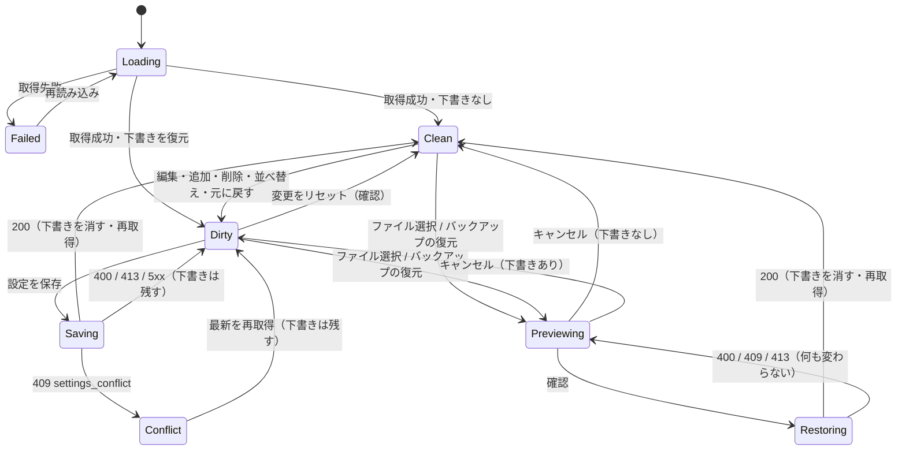

# 設定画面 再現仕様 (18-settings.png)

この文書は `/settings`（設定）を `design/FINAL-UI/images/18-settings.png` どおりに作り直すための再現仕様である。後段の exact-13 実装計画は、この 1 本を画面・設定の意味・API・migration・夜間バックアップの正本として参照する。

正本の優先順位は次のとおり。

1. `system-spec/` 配下（00-requirements-definition.md と 8 章、spec-state.json の質疑）。本書と食い違ったら system-spec に従い、本書を直す。
2. 本書。
3. 画像 18-settings.png。画像の値（集計ルールの行・日付・サイズ・最終更新など）はモックで、画面には実データを出す。画像の文言・構成と利用者決定が食い違う欄は、§UI・状態遷移 7.12「画像と決定の差分」表に置き換え先を示す。

注記の書き方: 利用者が確認していない agent の推定値には「(agent 推定・利用者未確認。根拠 qa-...)」を付ける。注記の無い値は、利用者決定か、既存コードまたは画像の観測値である。根拠の質疑 id は `system-spec/spec-state.json` にある（例: qa-settings-ui-ux-web-002）。本書が system-spec の値を具体化しただけの箇所は、§未決事項 Q-12 に一覧として残す。

## 目的と成功状態

### 目的

利用者（SH1、個人事業主）が、『集計ルールと復元設定を、安全に管理しますか？』という問いに 1 画面で答え切れるようにする（U1）。取込のたびに増える勘定科目と取引先の表記ゆれを 1 つの一覧でまとめ、右の説明パネルでそのルールが何に効き、いつ誰が変えたかを確かめ、直前の保存値へ戻せるようにする。名義の表示名・統計の最小月数・現金上書きを同じ下書きで編集し、下部の保存バーから 1 回で保存する。設定だけを JSON で書き出して復元でき、毎晩の自動バックアップを状態つきで一覧し、現在の設定と比べてから戻せるようにする（G1〜G4）。

保守者（SH2）に対しては、集計ルールの適用順・現金上書きの意味・設定 JSON の形式を core の純関数 1 か所（`packages/core/src/settings-screen.ts` ほか）に固定し、設定画面・集計・書き出し・バックアップの解釈がずれないようにする（G2・G5）。設定の変更で集計・分析・レポートの前提が黙って壊れないこと、戻せない操作が 0 件であることを本質とする（U1）。

### 成功状態（S1〜S5 を本画面の言葉で言い直したもの）

| ID | 成功状態 | 判定の場所 |
|---|---|---|
| S1 (G1) | `/settings` に画像の構成要素（§7.1 の全領域）と節ナビ 8 項目が描画される。色・余白・部品はトークンと共通部品経由で、直書き色の lint が 0 件。375px 幅で崩れず、横スクロールは表の容器の中だけ。 | DOM テスト・lint |
| S2 (G2) | 説明パネルの『このルールが影響するもの』・集計結果・書き出しが同じ core の関数から出る。取引先ルールの優先順位（手動編集 > 仕分けルール > 集計ルール(取引先) > 自動分類）と、現金上書きの空欄 / 0 / 全期間 / 月指定がテストで固定される。既存の勘定科目正規化の結果の回帰が 0 件。 | core の単体テスト |
| S3 (G3) | 全節の変更が 1 回の保存で確定し、古い `baseSavedAt` の保存は 409 で何も書かない。変更履歴は追記だけで、『このルールを元に戻す』は直前の保存値を下書きへ戻す。 | API 統合テスト・DOM テスト |
| S4 (G4) | 設定だけの JSON の書き出し → 復元で設定が一致し、取引の件数は変わらない。不正な JSON は何も変えずに拒否される。自動バックアップが JST 2:00 に状態つきで残り、比較と設定の復元ができる。 | API 統合テスト・scheduled のテスト |
| S5 (G5) | migration は追加のみで既存行の書き換え 0 件。外部送信 0 件。画像外の既存設定機能は 1 つも消えない。verify:full が緑。 | CI・migration 検査 |

## スコープ

### 対象（in）

- `/settings` の作り直し: 18-settings.png の全構成要素と、読込・空・失敗の各状態。`packages/web/src/pages/Settings.tsx`（457 行の 1 ファイル）を `packages/web/src/pages/settings/` 配下のページ本体・節ナビ・節ごとの部品・説明パネル・保存バー・`draft.ts`・`view-model.ts` に分ける（I1・qa-settings-frontend-web-001）。
- 節ナビは画像の 6 節（集計ルール・名義・統計・現金上書き・データ・バックアップ）の後ろに『アカウント』『その他の管理』を足す。画像外の既存機能は 1 つも消さない（qa-settings-decision-004）。
- 集計ルール: 種別（勘定科目 / 取引先）を持つ 1 つの一覧。並び順・有効・更新日時・更新者を持つ（qa-settings-decision-001・005）。勘定科目は従来どおり取込時に、取引先は集計時に適用する。
- 現金上書き: 支払い・受け取りの 2 行に 上書き値（空欄と 0 を区別）・適用範囲（全期間 / 月指定）・メモ。core の現金集計に実際に効かせる（qa-settings-decision-003）。
- 名義: 4 名義（事業・配偶者・家族・未設定）の表示名を設定画面から編集する。検証は既存 core の `validateOwnerLabels` を共有する（qa-settings-decision-002）。
- 統計: 最小月数の入力と説明。既定 6、範囲 3〜24（qa-settings-decision-009）。
- 全節の編集を 1 つの下書きに集める。未保存件数・localStorage への自動保存と復元・リセットと離脱の確認・`baseSavedAt` による 409（G3・I4）。
- 設定の変更履歴表（追記のみ）と、説明パネルの最終更新・更新者・『このルールを元に戻す』（qa-settings-decision-008）。
- 設定だけの版番号つき JSON の書き出しと復元。厳密な検証・サイズ上限・差分プレビュー・確認・復元直前の自動退避（qa-settings-decision-006）。
- データ出力 3 種（集計マトリクス CSV・取引 CSV・レポート HTML）を選択中の期間で出す（G4）。CSV のセル先頭の式注入を無害化する。
- 夜間バックアップを JST 2:00 にし、状態（成功 / 失敗）・メモ・設定部分の要約を残し、失敗も一覧に出す。『比較』と、バックアップからの設定だけの復元（qa-settings-decision-007・010）。
- core に設定画面の算出 `settingsScreen`（I2 の仮称をそのまま採る）と、集計ルールの照合と適用・現金上書きの解決・設定 JSON の検証と差分を新設する。
- 追加のみの migration（0052〜）と、`schema-guard.ts` の `EXPECTED_D1_MIGRATION` の更新。
- `routeMetadata.ts` の設定の `task` / `taskDetail` の文言更新（旧記述が新しい画面を説明しなくなるため）。
- 画面仕様・設計判断・証跡の文書（本書、`architecture/settings-*.md`、`docs/settings-screen/`、`docs/data-schema.md`、`docs/ui-decisions.md`）と回帰テスト。

### 対象外（out）

| 対象外 | 理由 |
|---|---|
| 取引データそのものの復元形式の変更 | U7。HTML 版からの初期移行（`POST /api/restore`）は現状のまま『その他の管理』に残す（qa-settings-decision-006）。 |
| 既存の仕分けルール・ベンダー記憶の意味の変更 | U7。集計ルール(取引先)はその下の優先順位に入るだけ。 |
| 共通シェル（サイドバー・ヘッダ・フッタ）の作り直し | U7。ヘッダの『取引ライン：正常』は既存の『防衛ライン』の表示を保つ（§7.12）。 |
| 外部 LLM・外部サービスへの送信 | U7・C4。 |
| 複数テナント化・web 以外の専用アプリ | U7・C5・qa-settings-target-platforms-001。375px 幅は web のレスポンシブで扱う。 |
| バックアップの保持期間（30 日）の変更 | U7・C5。 |
| バックアップからの全データ（取引を含む）の復元 | qa-settings-decision-010。設定だけを戻す。既存の全データ復元の経路（旧 NightlyBackups の『上書きして戻す』）は画面から外す（§7.10・Q-6）。 |
| 既存 API（`GET/PUT /api/settings`、`GET/PUT /api/settings/owner-labels`、`GET /api/backups/:date`、`POST /api/restore`、`/api/export/*`）の削除 | G5・qa-settings-backend-web-001。互換のため残す。 |
| 既存表（`account_norm_map`・`cash_overrides`）の削除・書き換え | C3。初回の写しの元として読むだけ。 |

## 用語と主体

| 用語 | 定義 |
|---|---|
| 節 | 画面の縦に並ぶ区画。集計ルール・名義・統計・現金上書き・データ（データと復元を含む）・バックアップ・アカウント・その他の管理の 8 つ。 |
| 集計ルール | 元の表記を正規化後のカテゴリへまとめる 1 行。種別・元の表記・正規化後のカテゴリ・並び順・有効・更新日時・更新者を持つ（qa-settings-decision-001・database-web-003）。 |
| 種別 kind | `account`（勘定科目）/ `vendor`（取引先）。 |
| 勘定科目ルール | 種別が勘定科目の行。freee の勘定科目の表記 → 集計用の科目名。従来の科目正規化マップ（`account_norm_map`）と同じ意味で、取込時に適用する（`normalizeAccount`、完全一致）。 |
| 取引先ルール | 種別が取引先の行。明細の内容 → 家計のカテゴリ（大項目）。集計時に適用し、保存済みの明細は書き換えない（qa-settings-decision-005）。 |
| 照合キー | 取引先ルールの照合に使う文字列。NFKC 正規化 → 大文字小文字の畳み込み → 前後空白除去（agent 推定・利用者未確認。根拠 qa-settings-backend-web-002）。 |
| 並び順 | 一覧の上から数えた順。同じ照合キーの行が重なったとき、上の行が優先する（qa-settings-decision-005）。 |
| 有効 | 行が効くかどうか。無効の行は照合にも取込時の正規化にも使わない（G2）。画面では一括の無効化でだけ切り替える（§7.4）。 |
| 現金上書き | 現金の支払い・受け取りの月の合計を置き換える値。支払い / 受け取りの 2 種、上書き値（空欄 = 上書きしない / 0 = 0 円で上書き）、適用範囲（全期間 / 月指定）、メモを持つ（qa-settings-decision-003）。 |
| 名義の表示名 | 名義の内部値（business / spouse / family / unset）ごとに利用者が付ける表示名。既存 `owner_labels`（0045）。 |
| 統計の最小月数 | AI分析の統計指標が必要とする記帳月数。既存 `analysis_settings.stat_min_months`（0019）。既定 6、範囲 3〜24。 |
| 下書き | 全節の未保存の編集。端末の localStorage に利用者単位で保存する（G3）。 |
| 未保存件数 | 保存済みの値と下書きの差分の数。フィールド単位で数え、行の追加・削除は 1 行 1 項目（agent 推定・利用者未確認。根拠 qa-settings-ui-ux-web-002）。 |
| revision | 設定の保存の版。変更履歴の最新の `changed_at`。保存時に `baseSavedAt` として送り返す（G3）。 |
| 変更履歴 | 設定の変更を 1 項目 1 行で残す追記のみの表。対象・キー・変更前・変更後・更新者・日時・由来（画面 / 復元 / 移行）を持つ（qa-settings-decision-008・database-web-004）。 |
| 更新者 | 画面からの変更は利用者名、復元と移行で入った値は『システム』（qa-settings-decision-008）。利用者名は actor のメールアドレスのローカル部（agent 推定・利用者未確認。根拠 qa-settings-auth-web-002）。 |
| 直前の保存値 | あるルールの、最後の保存より前に保存されていた値。変更履歴の最新行の『変更前』（qa-settings-decision-008）。 |
| 設定 JSON | 集計ルール・名義・統計・現金上書きだけを持つ版番号つき JSON（qa-settings-decision-006）。 |
| 自動退避 | 設定の復元の直前に、現在の設定を設定 JSON として R2 に保存すること（qa-settings-decision-006）。 |
| 夜間バックアップ | 毎日 JST 2:00 に全データを R2 `backups/YYYY-MM-DD.json` に置く既存の仕組み（qa-settings-decision-007）。 |
| 設定部分の要約 | バックアップ 1 回ごとの、集計ルール件数・名義の設定有無・統計の月数・現金上書きの件数（agent 推定・利用者未確認。根拠 qa-settings-infrastructure-web-002）。 |
| 比較 | あるバックアップの設定部分と現在の設定の差分（qa-settings-decision-007）。 |
| 主体: 利用者 | 個人事業主とその家族の家計を 1 人で管理する人（SH1）。セッションで識別し、すべての読み書きは利用者 id で区切る。 |
| 主体: 保守者 | 同一人物、および Claude Code などのコーディングエージェント（SH2）。 |
| 主体: システム | 夜間バックアップ（scheduled）・設定の復元・migration の初回の写し。変更履歴の更新者は『システム』。 |

## ユースケースとユーザーフロー

### UC-1 取引先の表記ゆれを 1 つのカテゴリへまとめる

1. 利用者はナビ『管理』の『設定』を開く。節ナビの『集計ルール』が選ばれている。
2. 『+ ルールを追加』で行を足し、種別『取引先』、元の表記『スタバ』、正規化後のカテゴリ『カフェ・外食』を入れる。
3. 行を選ぶと右の『この設定の説明』に、元の表記・正規化後のカテゴリ・このルールが影響するもの・最終更新（未保存の新規行は『未保存』）が出る。
4. 保存バーに『未保存 N項目』が出る。『設定を保存』で 1 回の PUT を送り、成功すると下書きが消え、変更履歴に 1 行ずつ追記される。
5. 以後の集計で、手動編集も仕分けルールも当たらない明細のうち、内容の照合キーが『スタバ』と一致するものが『カフェ・外食』に数えられる。保存済みの明細は書き換わらない（qa-settings-decision-005）。

### UC-2 変えたルールを直前の保存値へ戻す

1. 集計ルールの行を選ぶと、説明パネルに最終更新の日時と更新者が出る。
2. 『このルールを元に戻す』を押すと、変更履歴からそのルールの直前の保存値を取り、下書きへ戻す（qa-settings-decision-008）。
3. 保存バーの未保存件数が増える。『設定を保存』で確定する。保存しなければ何も変わらない。

### UC-3 並べ替え・一括削除・一括無効化

1. 行のチェック（SelectionCheckbox）で複数を選ぶ。見出しのチェックで全選択。
2. 選択中の行に対し『削除』『無効にする』『有効にする』を選ぶ（§7.4）。削除は確認ダイアログを経る（agent 推定・利用者未確認。根拠 qa-settings-ui-ux-web-004）。
3. 並べ替えは行の左のハンドルのドラッグ、または上下の移動ボタンで行う（qa-settings-frontend-web-001「キーボードでも行える」・agent 推定の併用方式。根拠 qa-settings-frontend-web-002）。

### UC-4 名義・統計・現金上書きを直す

1. 節ナビで『名義』へ移り、4 名義の表示名を直す。
2. 『統計』で最小月数を直す（3〜24）。
3. 『現金上書き』で、現金の支払いに 0 と適用範囲『全期間』、メモ『現金支出を0円として扱う』を入れる。受け取りは空欄のまま（上書きしない）。
4. 変更はすべて同じ下書きに入り、保存バーの 1 回の保存で確定する。

### UC-5 設定を書き出して、別の日に戻す

1. 『データ』の『設定のエクスポート（JSON）』で設定 JSON を保存する。
2. 後日、『復元』で『ファイルを選択』からその JSON を選ぶ。選ぶまで『設定を復元』は無効。
3. 『設定を復元』を押すと差分プレビュー（追加・変更・削除の件数と内訳）が確認ダイアログに出る。
4. 確認すると、サーバは現在の設定を自動退避してから、設定だけを置き換える。取引は消えない（qa-settings-decision-006）。変更履歴の更新者は『システム』、由来は『復元』。

### UC-6 自動バックアップと比べてから戻す

1. 『バックアップ』に直近 30 日の自動バックアップが 日付・サイズ・ステータス・メモ で並ぶ。失敗した回も『失敗』で出る（qa-settings-decision-007）。
2. 『比較』でその日の設定と現在の設定の差分を見る。
3. 『復元』で差分プレビュー → 確認 → 自動退避 → 設定だけの置換 の順に通る（qa-settings-decision-010）。取引は戻さない。

### UC-7 画像外の既存機能を使う

『アカウント』でパスワード変更と利用者管理（admin のみ）、『その他の管理』で名義割当・仕分けルール・科目候補・手動編集・ベンダー記憶・未記帳月・HTML 版からの初期移行を、今までと同じ部品と同じ API で使う（qa-settings-decision-004・frontend-web-001）。

### UC-8 下書きを失わない

1. 入力の 800ms 後に下書きを localStorage に保存する（agent 推定・利用者未確認。根拠 qa-settings-frontend-web-002）。
2. 別画面へ移って戻る、または再読込すると、下書きが復元され、保存バーに未保存 N 項目が出る。
3. 保存に成功すると下書きを消す。ログアウトでも消す（agent 推定・利用者未確認。根拠 qa-settings-frontend-web-004）。
4. 未保存の変更があるまま再読込・タブを閉じる・画面内のリンクで移動しようとすると確認する（G3）。

## 機能要件

| ID | 要件 | ゴール |
|---|---|---|
| FR-01 | `/settings` は画面骨格（§UI・状態遷移 7.1）の全領域を描画する。 | G1 |
| FR-02 | 期間は usePeriod（1年 / 2年 / 3年 / 任意と期間送り）で選び、データ出力 3 種（集計マトリクス CSV・取引 CSV・レポート HTML）にだけ効かせる。設定 JSON と集計ルールの一覧は期間に依存しない。 | G1, G4 |
| FR-03 | 左の節ナビに 集計ルール・名義・統計・現金上書き・データ・バックアップ・アカウント・その他の管理 の 8 項目を置き、選択中の節を強調し、クリックでその節へ移る。 | G1, G5 |
| FR-04 | 集計ルールの表は チェック・並べ替えハンドル・種別・元の表記（入力値）・正規化後のカテゴリ・操作（削除）の列と『+ ルールを追加』を持つ。上下の移動ボタンを併設する。 | G1, G2 |
| FR-05 | 行を選ぶと右の『この設定の説明』に 元の表記・正規化後のカテゴリ・このルールが影響するもの・最終更新（日時と更新者）・このルールを元に戻す・設定のヒント を出す。× で閉じられる。 | G1, G3 |
| FR-06 | 名義の節に 4 名義の表示名の欄を、画像の 2 欄の並びと部品で出す（2 列 × 2 段）。 | G1, G2 |
| FR-07 | 統計の節に 最小月数の入力（3〜24、既定 6）と画像どおりの説明を出す。 | G1, G2 |
| FR-08 | 現金上書きの節に 支払い・受け取りの 2 行（上書き値・適用範囲・メモ n/100）と 空欄 / 0 の凡例を出す。適用範囲が『月指定』のときは対象月の選択を出す。 | G1, G2 |
| FR-09 | データの節に 4 種の出力（設定のエクスポート（JSON）・集計マトリクス（CSV）・取引データ（CSV）・レポート（HTML））を出す。3 種は選択中の期間を付ける。 | G1, G4 |
| FR-10 | 復元の区画に ファイル選択・警告・『設定を復元』（ファイルを選ぶまで無効）を出す。復元は差分プレビュー → 確認 → 自動退避 → 置換 の順。 | G1, G4 |
| FR-11 | バックアップの節に 日付・サイズ・ステータス・メモ・操作（比較・復元）の表と『自動バックアップについて』を出す。失敗の回も出す。 | G1, G4 |
| FR-12 | 下部固定の保存バーに 未保存 N項目・変更をリセット・設定を保存 を出す。 | G1, G3 |
| FR-13 | 画面に出す値（影響するもの・未保存件数の基準・空欄 / 0 の表記・バックアップの要約）は core の `settingsScreen` から受け、web で計算し直さない（C1）。 | G2 |
| FR-14 | 取引先ルールは集計時に 手動編集 > 仕分けルール > 集計ルール(取引先) > 自動分類 の順で適用する。照合は照合キーの完全一致、重なりは並び順で優先、無効の行は効かない。 | G2 |
| FR-15 | 勘定科目ルールは従来どおり取込時に適用する。取込時の正規化の読み手は新表の有効な勘定科目の行を読む。既存の正規化の結果を変えない。 | G2, G5 |
| FR-16 | 現金上書きは core の現金集計 1 か所で解決する。空欄は上書きせず、0 は 0 円で上書きし、月指定の行は全期間の行より優先する。 | G2 |
| FR-17 | 全節の編集を 1 つの下書きに集め、保存は `PUT /api/settings/screen` の 1 回で `baseSavedAt` を付けて送る。現行 revision と一致しなければ 409 で何も書かない。 | G3 |
| FR-18 | 保存と同じ batch で変更履歴を 1 項目 1 行で追記する。変更履歴は更新・削除しない。 | G3 |
| FR-19 | 『このルールを元に戻す』は変更履歴からそのルールの直前の保存値を取り、下書きへ戻す。保存で確定する。 | G3 |
| FR-20 | 下書きを localStorage へ自動保存し、保存成功とログアウトで消し、次回に復元する。変更をリセットと離脱の前に確認する。 | G3 |
| FR-21 | 設定 JSON の書き出しは集計ルール・名義・統計・現金上書きだけを版番号つきで出す。 | G4 |
| FR-22 | 設定の復元は同じ形だけを受け、厳密な検証とサイズ上限を掛け、1 つでも不正なら何も変えない。復元直前に現在の設定を自動退避する。取引は消えない。 | G4, G5 |
| FR-23 | 夜間バックアップは JST 2:00 に実行し、各回に 状態・メモ・設定部分の要約 を残す。失敗した回も一覧に出す。中身は従来どおり全データで、`owner_labels` と新表も含める。 | G4 |
| FR-24 | 『比較』はその日のバックアップの設定部分と現在の設定の差分を返す。バックアップからの復元は設定だけを、設定の復元と同じ経路で戻す。 | G4 |
| FR-25 | 設定系の新しい書込み API は `CANONICAL_MUTATION_ROUTES` に登録し、`publicJsonValidator` と本文サイズ上限（超過は 413）を掛ける。読むだけの API は登録しない。 | G5 |
| FR-26 | 画像外の既存機能（パスワード変更・利用者管理・名義割当・仕分けルール・科目候補・手動編集・ベンダー記憶・未記帳月・HTML 版からの初期移行）を『アカウント』『その他の管理』に移し、1 つも消さない。 | G5 |
| FR-27 | 保存・復元に成功したら、画面の問い合わせと分析派生の問い合わせ（`invalidateAnalysisDerived`）を無効化して取り直す。 | G2, G3 |

## 非機能要件

| 区分 | 要件 |
|---|---|
| 性能 | 画面の取得は 1 要求で完結し、設定 4 種と変更履歴の最新行を D1 の batch 1 回で読む。保存は D1 の batch 1 回。勘定科目ルールが変わった保存のときだけ `recomputeFromDeals` を走らせる（agent 推定・利用者未確認。根拠 qa-settings-backend-web-002）。 |
| コスト | Cloudflare 無料枠の範囲で動かす（D1・Workers・R2）。新しいバインディング・キュー・外部サービスは足さない（agent 推定・利用者未確認。根拠 qa-settings-infrastructure-web-004）。R2 の自動退避とバックアップは既存の 30 日保持で消す。 |
| 初期 JS 予算 | 画面は既存の lazy route（`AuthenticatedApp.tsx` の `settings`）のまま置き、初期 JS に含めない。並べ替えにライブラリを足さない（HTML の drag and drop とボタン。agent 推定・利用者未確認。根拠 qa-settings-frontend-web-002）。CI の JS 予算は `build:bundle` の直後に測る。 |
| 決定論 | 照合キー・取引先ルールの適用・現金上書きの解決・設定 JSON の検証と差分・未保存件数・影響するもの・バックアップの要約は、同じ入力に対して常に同じ結果を返す。乱数と現在時刻に依存しない。例外は `exportedAt`・`changed_at`・下書きの 30 日判定。 |
| 外部送信 | 取込データと設定を外部へ送らない（C4）。下書きはサーバへ送らず、保存操作でだけ送る。 |
| アクセシビリティ | 節ナビは `nav` と `aria-current`。バックアップの状態は色だけで区別せず文字のバッジ（最新 / 成功 / 失敗）で示す（ui-ux 章の Information Design）。入力欄・チェック・ボタン・並べ替えハンドルには可視ラベルか `aria-label` を付ける。保存バーの件数と通知は `role="status"`、エラーは `role="alert"`。並べ替えはキーボード（上下の移動ボタン）で完結する。 |
| レスポンシブ | 375px 幅でも崩れない（qa-settings-target-platforms-001）。375px では節ナビを上部の横並びにし、説明パネルは表の下へ回し、横スクロールは表の容器の中だけにする（agent 推定・利用者未確認。根拠 qa-settings-ui-ux-web-004）。CI の headless Chrome は `pointer: none` なので、`@media (pointer: fine)` だけに頼る書き方をしない（否定形の 2 段で書く）。 |
| デザイン | 色は `design-tokens.ts` 由来のトークンだけを使う（C2）。共通部品は PageHeader・Button・ConfirmDialog・PeriodPicker・SelectionCheckbox・DataTable・CategoryPicker。画面専用の部品は `pages/settings/` に置く。 |
| 安全 | 画面の PUT 64KB、復元 256KB の本文上限（agent 推定・利用者未確認。根拠 qa-settings-security-web-002）。集計ルールは 500 行まで（同）。エラー応答とログに設定値を出さない。 |
| 保守性 | 算出は core に置き、api / web に重複実装しない（C1）。web の `view-model.ts` は書式（日時・サイズ・件数）と文言の組立てだけを持つ。 |

## UI・状態遷移

### 7.1 画面骨格

画像（1024x1536）を上から順に並べる。共通シェル（サイドバー・ヘッダ・フッタ）は既存の Layout のまま（`Layout.tsx` の共通ヘッダ 415〜488 行・フッタ 492〜519 行）。

```text
[共通ヘッダ]  パンくず『管理 / 設定』・防衛ライン・最終更新・検索・ダウンロード・ヘルプ・アバター（既存）
[期間]        タブ 1年 / 2年 / 3年 / 任意 ・ 期間送り ‹ 2025年9月 - 2026年8月 ›
[見出し]      設定
              集計ルールと復元設定を、安全に管理しますか？
              説明文 2 行
[本体 3 列]   ┌節ナビ┐ ┌──────── 節の本体 ─────────┐ ┌この設定の説明┐
              │集計ルール│ │集計ルール（表・+ ルールを追加）   │ │選択中の集計ルール│
              │名義    │ ├──────────────────┤ │…            │
              │統計    │ │名義（4 欄）                 │ └──────────┘
              │現金上書き│ │統計                       │
              │データ   │ │現金上書き（2 行）  │凡例│
              │バックアップ│ │データ（4 種の出力）              │
              │アカウント │ │復元                       │
              │その他の管理│ │バックアップ（表）   │自動バックアップについて│
              └──────┘ │アカウント・その他の管理（既存部品）     │
                        └──────────────────┘
[保存バー]    ⚠ 未保存 N項目  変更した設定を保存してください。  [変更をリセット] [設定を保存]（下部固定）
[共通フッタ]  既存
```

- 節ナビは sticky で幅 7〜8rem、説明パネルは 16〜18rem（agent 推定・利用者未確認。根拠 qa-settings-ui-ux-web-002）。
- 説明パネルは画像では集計ルールの節の右にだけ出る。集計ルールの節から離れても sticky で残し、選択行が無いときは閉じる（本書で具体化。Q-12）。
- 『アカウント』『その他の管理』は画像に無い。画像の 6 節の下に同じ節の見た目（見出しと説明）で足す。

ファイル構成（`packages/web/src/pages/settings/`。名前は agent 推定・利用者未確認。根拠 qa-settings-frontend-web-004 の hook 名と予算画面の先例）。

| ファイル | 役割 |
|---|---|
| `SettingsPage.tsx` | container。`GET /api/settings/screen` の取得、下書き、保存、409 の扱い、離脱確認 |
| `SettingsSectionNav.tsx` | 節ナビ。IntersectionObserver で現在の節を追う（agent 推定・利用者未確認。根拠 qa-settings-frontend-web-002） |
| `NormRulesSection.tsx` | 集計ルールの表と一括操作・並べ替え |
| `RuleExplainPanel.tsx` | この設定の説明 |
| `OwnerLabelsSection.tsx` | 名義 4 欄 |
| `StatsSection.tsx` | 統計 |
| `CashOverridesSection.tsx` | 現金上書き |
| `DataSection.tsx` | データ 4 種と復元（ファイル選択・差分プレビュー） |
| `BackupsSection.tsx` | バックアップの表・比較・復元 |
| `AccountSection.tsx` | 既存の PasswordChangeForm・UserAdmin をそのまま置く |
| `OtherAdminSection.tsx` | 既存の ClassificationSettings・VendorMemorySettings・未記帳月・初期移行（LegacyRestoreNotice）をそのまま置く |
| `SettingsSaveBar.tsx` | 保存バー（予算画面の BudgetSaveBar にならう） |
| `draft.ts` | `useSettingsDraft`（下書き。§7.11） |
| `view-model.ts` | 書式と文言の組立て |
| `settings.css` | 画面専用の配置。色はトークンだけ |

- `pages/Settings.tsx` は互換の re-export だけを残す（`SettingsPage`・`LEGACY_RESTORE_CONFIRMATION`・`LegacyRestoreNotice`・`BACKUP_RESTORE_CONFIRMATION` を既存の import 先のまま使えるようにする）。
- `routeMetadata.ts`（140〜151 行）の設定の `task` を『集計ルール・名義・統計・現金上書きと、設定の書き出し・復元・バックアップを管理します。』、`taskDetail` を『勘定科目と取引先の表記ゆれをまとめる集計ルール、名義の表示名、統計の最小月数、現金上書きを 1 回の保存で管理し、設定だけの JSON の書き出しと復元、夜間バックアップとの比較と設定の復元を行う。』に変える（文言は本書で具体化。Q-12）。`id`・`path`・`label`・`icon`・`navGroup`・`contentWidth` は変えない。

### 7.2 見出し・期間の文言（完全一致）

| 場所 | 文言 |
|---|---|
| パンくず | 管理 / 設定 |
| 期間タブ | 1年 / 2年 / 3年 / 任意 |
| 期間送り | ‹ 2025年9月 - 2026年8月 ›（値は usePeriod から出す。画像の値は例） |
| 見出し | 設定 |
| 問い | 集計ルールと復元設定を、安全に管理しますか？ |
| 説明 1 | 分類・名義・統計の設定、現金の上書き値、データの出力・復元、バックアップを管理します。 |
| 説明 2 | ここでの設定は、今後の取込・集計・分析・レポートに反映されます。 |
| 節ナビ | 集計ルール / 名義 / 統計 / 現金上書き / データ / バックアップ / アカウント / その他の管理 |

- 『アカウント』『その他の管理』は画像に無い語で、qa-settings-decision-004 の語をそのまま使う。
- 期間は PageHeader と PeriodPicker の既存の組み方に従う。

### 7.3 集計ルールの節

| 場所 | 文言 |
|---|---|
| 節の見出し | 集計ルール |
| 説明 | 取引の内容を特定のカテゴリに正規化するルールを設定します。 |
| 小見出し | カテゴリの正規化マップ |
| 列 | （全選択のチェック）/（ハンドル）/ 種別 / 元の表記（入力値）/ 正規化後のカテゴリ / 操作 |
| 追加 | + ルールを追加 |

- 画像の列見出しの括弧が全角か半角かは画像から判読不能。本書は全角『（）』に揃える（画面の他の箇所『上書き値（円）』『レポート出力（CSV・HTML）』と同じ）。
- 種別の列は画像に無い。qa-settings-decision-001 で足す（§7.12）。値は『勘定科目』『取引先』の select。
- 元の表記は text 入力（1〜60 字。BR-03）。正規化後のカテゴリは CategoryPicker（`components/CategoryPicker.tsx`、`allowAdd` 有効）。取引先の行は家計の大項目、勘定科目の行は freee の科目候補を既定のタブにする（本書で具体化。Q-12）。
- 操作の列は削除のアイコンボタン（`aria-label`『このルールを削除』）。削除は確認ダイアログを経る（agent 推定・利用者未確認。根拠 qa-settings-ui-ux-web-004）。
- ハンドル（画像の ⋮⋮）はドラッグで並べ替える。ハンドルの横に上へ / 下へ の移動ボタンを併設する（qa-settings-frontend-web-001・併用は agent 推定・利用者未確認。根拠 qa-settings-frontend-web-002）。
- 無効の行は元の表記・正規化後のカテゴリを弱い色（トークン）で出し、種別の横に『無効』の文字を添える（色だけで区別しない）。
- 初期表示の並びは保存済みの並び順。画像の 7 行（スターバックス→カフェ・外食、スタバ→カフェ・外食、Starbucks→カフェ・外食、スーパーマーケット→食料品、スーパー→食料品、Amazon.co.jp→通信販売、アマゾン→通信販売）はモックで、fixture の例として使う。
- 行が 0 件のときは表の中に『集計ルールはまだありません。』と『+ ルールを追加』を出す（文言は本書で具体化。Q-12）。
- 500 行に達したら『+ ルールを追加』を無効にし、『集計ルールは500行までです。』を出す（上限は agent 推定・利用者未確認。根拠 qa-settings-security-web-002）。

### 7.4 集計ルールの選択と一括操作

- 見出しのチェックで全選択 / 全解除。行のチェックは SelectionCheckbox。
- 1 行以上選ぶと表の上に『{n}件を選択中』と 削除 / 無効にする / 有効にする のボタンを出す（画像に無い。G1 の『一括削除』と G2 の『有効』からの具体化。Q-12）。
- 一括削除は確認ダイアログ『選択した{n}件の集計ルールを削除しますか？ 保存するまで確定しません。』を経て下書きから消す。
- 行の本体（チェック・ハンドル・入力・削除以外）を押すと、その行を選択行にして説明パネルを開く。選択行は背景色（トークン）と `aria-selected` で示す。

### 7.5 この設定の説明（右パネル）

| 場所 | 文言・値 |
|---|---|
| 見出し | この設定の説明 |
| 閉じる | ×（`aria-label`『説明を閉じる』） |
| 小見出し | 選択中の集計ルール |
| 欄 1 | 元の表記 → 選択行の元の表記（下書きの値） |
| 欄 2 | 正規化後のカテゴリ → 選択行の正規化後のカテゴリ（下書きの値） |
| 欄 3 | このルールが影響するもの → 箇条書き |
| 欄 4 | 最終更新 → `YYYY年MM月DD日 HH:MM` と改行して『（更新者）』 |
| ボタン | このルールを元に戻す |
| 小見出し | 設定のヒント |
| ヒント | 表記ゆれのある取引先名を、同じカテゴリにまとめることで、正確な集計が可能になります。 |

- 『このルールが影響するもの』は core の `settingsScreen` が種別ごとに返す。取引先の行は画像どおり『収支のカテゴリ集計』『月次サマリー』『カテゴリ別の分析グラフ』『レポート出力（CSV・HTML）』。勘定科目の行は同じ 4 項目の後ろに『取込済みの明細の科目（保存時に集計し直します）』を足す（勘定科目の行の項目は本書で具体化。Q-12）。
- 最終更新の日時は JST で出す。画像は『2026年08月20日 14:32』で月日を 2 桁にしている。ヘッダの『2026年9月10日 10:24』とは書式が違うが、画像どおり説明パネルは 2 桁にする。
- 更新者は変更履歴の最新行の更新者。利用者名、または『システム』。画像は『(システム)』で、括弧の全角・半角は画像から判読不能。本書は全角『（システム）』にする。
- 保存前の新規行は最終更新に『未保存』を出し、『このルールを元に戻す』を無効にする。
- 直前の保存値が無い（変更履歴の最新行の変更前が空、つまり作成または移行で入った値）ときは『このルールを元に戻す』を無効にし、下に『これより前の保存値はありません。』を出す（文言は本書で具体化。Q-12）。
- 『このルールを元に戻す』は確認を挟まない。下書きへ戻すだけで、保存するまで確定せず、保存バーの『変更をリセット』で取り消せるため（qa-settings-decision-008「保存で確定」）。
- 閉じると選択行を外す。次に行を押すと開く。375px では表の下に回す（§7.13）。

### 7.6 名義の節

| 場所 | 文言 |
|---|---|
| 節の見出し | 名義 |
| 説明 | 取引の名義・所有者の表示ラベルを設定します。レポートや分析画面で使用されます。 |

画像は 2 欄（左『個人の表示名』値『個人』例『例：個人、プライベート』、右『事業の表示名』値『事業』例『例：事業、ビジネス』）。qa-settings-decision-002 で 4 名義すべてを同じ並びと部品（ラベル・入力・例文）で出す。2 列 × 2 段。

| 位置 | 名義（内部値） | ラベル | 例文 |
|---|---|---|---|
| 1 段目 左 | 配偶者（spouse） | 配偶者の表示名 | 例：パートナー、配偶者 |
| 1 段目 右 | 事業（business） | 事業の表示名 | 例：事業、ビジネス |
| 2 段目 左 | 家族（family） | 家族の表示名 | 例：子ども、家族 |
| 2 段目 右 | 未設定（unset） | 未設定の表示名 | 例：その他、未設定 |

- 画像の『個人の表示名』は、既存の 4 名義に『個人』という内部値が無いため、4 名義のラベルへ置き換える。並び・ラベル・例文（事業以外）は本書で具体化した（Q-3）。
- 入力欄の初期値は `loadOwnerLabels` の値（保存が無ければ core の既定 本人 / パートナー / 子ども / その他）。
- 検証は core の `validateOwnerLabels`（長さ 1〜20 のコードポイント・制御文字・重複）を web と api で共有する。不正な欄の下に core が返す欄ごとの理由を出す。

### 7.7 統計の節

| 場所 | 文言 |
|---|---|
| 節の見出し | 統計 |
| 説明 | 統計・分析で使用する最小データ期間を設定します。 |
| ラベル | AI分析の対象月数（最小） |
| 単位 | か月 |
| 情報 | 設定した月数に満たない期間では、AIによる傾向分析が実行されません。より長い期間を設定すると、分析の精度が向上します。 |

- 入力は整数 3〜24。初期値は保存済みの値、無ければ既定 6（qa-settings-decision-009）。画像の 12 は入力例として扱う。
- 範囲外は欄の下に『3〜24の整数で入力してください。』（文言は本書で具体化。Q-12）。
- 『AI』の語は画像の文言のまま残す（qa-settings-decision-009「説明文は画像どおり」）。

### 7.8 現金上書きの節

| 場所 | 文言 |
|---|---|
| 節の見出し | 現金上書き |
| 説明 | 現金の支払い・受け取りの金額を、データ上で上書きする値を設定します。空欄と0円の違いにご注意ください。 |
| 列 | 項目 / 上書き値（円）/ 適用範囲 / メモ |
| 行 1 | 現金の支払い |
| 行 2 | 現金の受け取り |
| 適用範囲の選択肢 | 全期間 / 月指定 |
| メモの字数 | n/100 |
| 凡例 1 | 空欄：上書きを行いません（元のデータを使用） |
| 凡例 2 | 0：全額を0円として上書きします |
| 凡例 3 | ※ 設定は取込後の集計に適用されます。 |

- 画像の行 1 は 上書き値『0』・全期間・メモ『現金支出を0円として扱う』、行 2 は 上書き値 空欄・全期間・メモ『（未設定）』（placeholder）。
- 上書き値は 0 以上の整数（円）か空欄。空欄は上書きしない、0 は 0 円で上書き（qa-settings-decision-003）。入力欄は空文字と『0』を別の値として持ち、数値へ潰さない。
- 適用範囲『月指定』を選ぶと、同じ行の中に対象月（`YYYY-MM`）の選択を出す。月指定の行は 1 つの種別に複数持てるので、『月指定を追加』で行を増やす（画像は全期間だけを描く。月指定の並びは本書で具体化。Q-4）。
- 既存の月ごとの値（`cash_overrides`）は migration で『月指定』の行になる（§データモデル）。
- メモは 100 字まで。『n/100』を数えて出す（agent 推定・利用者未確認。根拠 qa-settings-ui-ux-web-002）。placeholder は『（未設定）』。
- 画像ではメモ『現金支出を0円として扱う』の行でも字数が『0/100』だが、実装は入力の字数を出す（§7.12）。

### 7.9 データの節と復元

データの節。

| 場所 | 文言 |
|---|---|
| 節の見出し | データ |
| 説明 | 現在の設定に基づいて、各種データを出力します。 |
| ボタン 1 | 設定のエクスポート（JSON）／すべての設定をJSON形式で出力 |
| ボタン 2 | 集計マトリクス（CSV）／カテゴリ別の集計結果を出力 |
| ボタン 3 | 取引データ（CSV）／集計後の取引データを出力 |
| ボタン 4 | レポート（HTML）／設定内容のレポートを出力 |

- ボタン 1 は `GET /api/settings/export`。期間を付けない。
- ボタン 2〜4 は既存の `/api/export/matrix.csv`・`/api/export/transactions.csv`・`/api/export/report.html` に、選択中の期間を ExportMenu の `withPeriod` と同じ付け方で付ける（agent 推定・利用者未確認。根拠 qa-settings-frontend-web-004）。
- 既存の全データ JSON（`/api/export/json`）は画像に無い。『その他の管理』の初期移行の区画に『全データのJSON（取引を含む）』として残す（G5。置き場所は本書で具体化。Q-12）。
- ボタン 4 の補足『設定内容のレポートを出力』は画像の文言。出力の中身は既存の会計レポート（`report.html`）で、設定内容の一覧ではない（§7.12）。

復元の区画。

| 場所 | 文言 |
|---|---|
| 見出し | 復元 |
| 説明 | エクスポートした設定ファイル（JSON）から、設定を復元します。 |
| ファイル選択 | ファイルを選択 ／ 選択されていません |
| 情報 | 復元すると、現在のすべての設定が上書きされます。／復元前に、現在の設定をバックアップすることを推奨します。 |
| ボタン | 設定を復元 |

- 『設定を復元』はファイルを選ぶまで無効（画像の無効の見た目）。
- ファイルを選ぶと、web はサイズ（256KB。agent 推定・利用者未確認。根拠 qa-settings-security-web-002）を超えないことだけを確かめ、`POST /api/settings/restore/preview` に本文を送る。
- 差分プレビューは ConfirmDialog に出す。見出し『設定を復元しますか？』、本文に 集計ルール（追加 a 件・変更 c 件・削除 d 件）・名義（変更 n 件）・統計（{前} か月 → {後} か月）・現金上書き（追加・変更・削除の件数）と『復元の直前に、現在の設定を自動で退避します。取引データは変わりません。』、ボタン『復元する』『キャンセル』（文言は本書で具体化。Q-12）。
- 差分が 0 件なら『現在の設定と同じ内容です。』を出し、『復元する』を無効にする。
- 未保存の下書きがあるときは、ConfirmDialog の本文に『未保存の変更は破棄されます。』を足す。復元に成功したら下書きを消す。
- 画像の情報文『復元すると、現在のすべての設定が上書きされます。』は画像どおり残す。復元の対象は設定 4 種だけで、取引は含まない（qa-settings-decision-006。§7.12）。
- 画像の情報文『復元前に、現在の設定をバックアップすることを推奨します。』は画像どおり残す。サーバは自動退避も行う。

### 7.10 バックアップの節

| 場所 | 文言 |
|---|---|
| 節の見出し | バックアップ |
| 説明 | 設定の自動バックアップです。過去のバックアップから設定を復元できます。 |
| 列 | 日付 / サイズ / ステータス / メモ / 操作 |
| 操作 | 比較 / 復元 |
| バッジ | 最新 / 成功 / 失敗 |
| 右の枠の見出し | 自動バックアップについて |
| 右の枠の本文 | 毎日 午前2:00に、自動で設定のバックアップを作成します。過去のバックアップから、いつでも復元できます。 |

- 日付は `YYYY/MM/DD HH:MM`（JST）。画像は `2026/09/10 02:00`。
- サイズは KB 単位の整数（画像『12KB』。丸めは切り上げ。本書で具体化。Q-12）。失敗の回は『—』。
- ステータスは、成功した回のうち最も新しい 1 件に『最新』、他の成功に『成功』、失敗に『失敗』（agent 推定・利用者未確認。根拠 qa-settings-ui-ux-web-002）。色だけでなく文字で示す。
- メモは各回の customMetadata のメモ。自動の回は『自動バックアップ』。失敗の回は理由コードに対応する短い文（例『保存に失敗しました』。本書で具体化。Q-12）。
- 失敗の回は『比較』『復元』を無効にする。
- 画像では最新の行の『復元』が他の行と違う（灰色の）見た目で、無効を意味するのかは画像から判読不能。本書は最新の行の『復元』も有効にする（同じ日の値へ戻す需要があるため。Q-7）。
- 『比較』は `GET /api/backups/:date/compare` の差分を ConfirmDialog ではなく読み取りのダイアログ（閉じるだけ）に出す。本文は復元の差分プレビューと同じ形（§7.9）。
- 『復元』は `POST /api/backups/:date/restore/preview` → ConfirmDialog（§7.9 と同じ形、見出し『{日付}のバックアップから設定を復元しますか？』）→ `POST /api/backups/:date/restore`。取引は戻さない（qa-settings-decision-010）。確認ダイアログを必ず挟む（qa-settings-ui-ux-web-001・003）。
- 旧 NightlyBackups の全データ上書き（`POST /api/restore` に本文を渡す『上書きして戻す』）は画面から外す（qa-settings-decision-010。Q-6）。`GET /api/backups/:date`（全データの本文の取り出し）は API として残す。
- 画像の説明『設定の自動バックアップです。』『自動で設定のバックアップを作成します。』は画像どおり残す。中身は従来どおり全データで、復元するのは設定だけ（qa-settings-decision-007・010。§7.12）。
- 表は DataTable を使い、375px では表の容器の中だけで横スクロールする。
- 一覧が 0 件なら『バックアップはまだありません。毎日 午前2:00に作成されます。』（本書で具体化。Q-12）。

### 7.11 アカウント・その他の管理の節

| 節 | 見出し | 置く部品（既存のまま移す） |
|---|---|---|
| アカウント | アカウント | PasswordChangeForm、UserAdmin（admin のときだけ描画。既存の判定のまま） |
| その他の管理 | その他の管理 | ClassificationSettings（名義割当・仕分けルール・科目候補・手動編集）、VendorMemorySettings（id `vendor-memory` を保つ）、未記帳月、データの初期移行（HTML版JSONから復元(初期移行)・LegacyRestoreNotice・`LEGACY_RESTORE_CONFIRMATION`・全データの JSON 書き出し） |

- 既存の部品は API・文言・確認を変えない（qa-settings-frontend-web-004）。各部品は自分の保存ボタンで既存 API に書く（設定画面の下書きと保存バーの対象外）。
- 未記帳月の保存は既存 `PUT /api/settings`（`unrecordedExpMonths`）を使い続ける。
- 旧 Settings.tsx の『科目正規化マップ』『AI分析の統計の基準月数』『現金補正』のカードは、集計ルール・統計・現金上書きの節に置き換えて消す（同じ機能が新しい節にあるので、機能は消えない）。
- 既存の深いリンク `/settings#vendor-memory` は、その他の管理の節の中の同じ id へ移るよう保つ。

### 7.12 保存バー・下書きと離脱

保存バー（下部固定）。

| 状態 | 文言 |
|---|---|
| 未保存あり | ⚠ 未保存 {N}項目　変更した設定を保存してください。　[変更をリセット] [設定を保存] |
| 未保存なし | 未保存の変更はありません。　[変更をリセット（無効）] [設定を保存（無効）]（本書で具体化。Q-12） |
| 保存中 | 『設定を保存』を無効にし、ラベルを『保存中…』にする |
| 保存成功 | 通知『設定を保存しました。』（`role="status"`） |

- 画像の『未保存 2項目』は、数字と『項目』の間に空白が無い。本書は『未保存 {N}項目』にする。
- 未保存件数は core の `countSettingsChanges(saved, draft)` で数える。フィールド単位、行の追加・削除は 1 行 1 項目、並び順の変更は動いた行ごとに 1 項目（並び順の数え方は本書で具体化。Q-12。フィールド単位は agent 推定・利用者未確認。根拠 qa-settings-ui-ux-web-002）。
- 『変更をリセット』は ConfirmDialog『未保存の変更（{N}項目）をすべて破棄しますか？』を経て、下書きを保存済みの値へ戻して消す（G3）。
- 検証エラーのある欄が 1 つでもあれば『設定を保存』を無効にし、保存バーに『入力内容を確認してください。』を出す。
- 保存が 409 `settings_conflict` のときは『他の画面で更新されました』を出して最新を再取得する（agent 推定・利用者未確認。根拠 qa-settings-frontend-web-004）。下書きは残し、最新の保存済み値に対して未保存件数を数え直す。

下書き（予算画面の `draft.ts` にならう。I4）。

- hook は `useSettingsDraft`（agent 推定・利用者未確認。根拠 qa-settings-frontend-web-004）。
- キー `kanjo:settings:draft:{userId}`、形式の版 `v: 1`、30 日で捨てる、入力から 800ms 後に保存（agent 推定・利用者未確認。根拠 qa-settings-frontend-web-002）。
- `pagehide` と unmount で debounce 前の下書きを同期的に書く（予算画面の先例）。
- ログアウトで `kanjo:settings:draft:` で始まるキーを消す（`Layout.tsx` 151〜152 行の先例。agent 推定・利用者未確認。根拠 qa-settings-frontend-web-004）。
- 下書きにある行 id が保存済みの一覧に無く、かつ新規行（下書きで作った行）でもないときは、その行の下書きを捨てる（他所で削除された行）。

離脱確認（G3）。

- 未保存が 1 項目以上のとき、`beforeunload` で確認する。
- 画面内のリンク（サイドバー・パンくず・ヘッダ）は予算画面と同じ capture の仕組み（`BudgetPage.tsx` 250〜280 行の先例）で ConfirmDialog『保存していない変更があります。移動しますか？ 下書きは端末に残ります。』を出す。
- ブラウザの戻る・進むは `BrowserRouter` では取り消せないため確認しない。下書きは 800ms 後に保存済みなので作業は失われない（予算画面と同じ扱い）。

### 7.13 画像と決定の差分

| 画像 | 決定 | 置き換え先 |
|---|---|---|
| 名義は『個人の表示名』『事業の表示名』の 2 欄 | 4 名義すべて（qa-settings-decision-002） | §7.6 の 2 列 × 2 段 |
| 統計の入力値 12 | 既定 6 のまま、12 は入力例（qa-settings-decision-009） | §7.7 |
| ヘッダのバッジ『取引ライン：正常』 | 共通シェルは変えない（U7） | 既存の『防衛ライン』を保つ |
| 集計ルールの表に種別の列が無い | 種別の列を足す（qa-settings-decision-001） | §7.3 |
| 並べ替えはハンドルだけ | 上下の移動ボタンを併設（qa-settings-frontend-web-001） | §7.3 |
| 節ナビは 6 項目 | 後ろに『アカウント』『その他の管理』（qa-settings-decision-004） | §7.2・§7.11 |
| 復元の情報文『現在のすべての設定が上書きされます』 | 対象は設定 4 種だけ、取引は消えない（qa-settings-decision-006） | 文言は画像どおり、確認ダイアログで対象を明示（§7.9） |
| バックアップの説明『設定の自動バックアップ』 | 中身は全データ、戻すのは設定だけ（qa-settings-decision-007・010） | 文言は画像どおり、比較と復元は設定部分だけ（§7.10） |
| 現金上書きの適用範囲は『全期間』だけ | 全期間 / 月指定（qa-settings-decision-003） | §7.8 |
| メモ『現金支出を0円として扱う』の字数が 0/100 | 字数を数えて出す（qa-settings-ui-ux-web-002） | 実装は入力の字数（画像の 0/100 はモックの誤り） |
| レポート（HTML）の補足『設定内容のレポートを出力』 | 出力は既存の会計レポート（G4「レポート HTML は選択中の期間で出す」） | 補足の文言は画像どおり。中身の食い違いは Q-8 |
| 最新の行の『復元』が灰色 | 画像から判読不能（無効か、見た目の違いだけか） | 有効にする（Q-7） |
| 説明パネルは集計ルールの行だけを説明 | 同じ（G1） | 他の節の説明はしない |
| 画面に一括の有効 / 無効の操作が無い | 有効フラグ（G2・database-web-003） | §7.4 の一括操作 |

### 7.14 画面の状態

| 状態 | 条件 | 表示 |
|---|---|---|
| 読込 | 画面の取得中 | 見出し・節ナビを出し、節の本体は PageState の読込表示 |
| 空 | 設定が 1 つも保存されていない（集計ルール 0 行・名義未保存・統計未保存・現金上書き 0 行） | 各節は既定値で描く（名義は core の既定、統計は 6、現金上書きは空欄）。集計ルールは §7.3 の 0 件表示。空でも保存・書き出し・復元はできる。 |
| 失敗 | 画面の取得が 5xx・ネットワークエラー | 『設定を読み込めませんでした。』と『再読み込み』（`role="alert"`）。アカウント・その他の管理の既存部品は独自に読むので出し続ける。 |
| 保存中 | PUT の応答待ち | §7.12 |
| 競合 | PUT が 409 `settings_conflict` | §7.12 |
| 復元中 | 復元の POST の応答待ち | ConfirmDialog のボタンを無効にし『復元中…』 |
| バックアップの失敗の回 | 一覧に `status: failed` | 『失敗』のバッジ、比較・復元は無効 |
| 375px | 画面幅 375px | 節ナビを上部の横並び（横スクロールする 1 行）にし、説明パネルは集計ルールの表の下へ回す。横スクロールは表の容器の中だけ（agent 推定・利用者未確認。根拠 qa-settings-ui-ux-web-004）。保存バーはボタンを 2 段にしてよい。 |

- 空・失敗の文言は本書で具体化（Q-12）。
- 情報の優先順位は 未保存件数と保存 > 集計ルール > 復元・バックアップ > 他の節（agent 推定・利用者未確認。根拠 qa-settings-ui-ux-web-004）。375px でもこの順を崩さない（保存バーは常に見える）。

### 7.15 状態遷移



### 7.16 受入テストで確かめる画面の条件

§テストと受入条件の AT-01〜AT-12 を DOM テストで確かめる。文言は本章の表と完全一致で比べる。

## ビジネスルールと検証

| ID | ルール |
|---|---|
| BR-01 | 集計ルールは種別 `account` / `vendor` を持つ 1 つの一覧で、利用者ごとに 0〜500 行（上限は agent 推定・利用者未確認。根拠 qa-settings-security-web-002）。 |
| BR-02 | 行 id（`ruleId`）は新規行を作ったときに web が `crypto.randomUUID()` で発行し、以後変えない。形式は 1〜64 字の `[A-Za-z0-9_-]`。migration で写した行は `m-` で始まる id を持つ（本書で具体化。Q-12）。 |
| BR-03 | 元の表記と正規化後のカテゴリは、前後の空白を除いて 1〜60 字（既存 `PUT /api/settings` の `normMap` の上限 60 字に揃える）。制御文字は不可。 |
| BR-04 | 勘定科目ルールの照合は従来どおり元の表記の完全一致（`normalizeAccount` と同じ意味。NFKC は掛けない）。有効な行を並び順に見て、同じ元の表記の最初の行を使う。取込時に適用し、保存時に勘定科目ルールが変わったら `recomputeFromDeals` で取込済みの明細を集計し直す（agent 推定・利用者未確認。根拠 qa-settings-backend-web-002）。 |
| BR-05 | 取引先ルールの照合キーは NFKC → 大文字小文字の畳み込み（`toLowerCase`）→ 前後空白除去（agent 推定・利用者未確認。根拠 qa-settings-backend-web-002）。明細の内容の照合キーと元の表記の照合キーの完全一致で当たる（qa-settings-decision-005）。 |
| BR-06 | 取引先ルールの適用順は 手動編集 > 仕分けルール > 集計ルール(取引先) > 自動分類。手動編集（`tx_edits`、ベンダー記憶由来を含む）か仕分けルールでカテゴリが決まった明細には効かない。自動分類（取込値のカテゴリ）より優先する（qa-settings-decision-005）。 |
| BR-07 | 同じ照合キーの取引先ルールが複数あるときは、有効な行のうち並び順の最も上の行が効く（qa-settings-decision-005）。無効の行は照合の候補に入らない（G2）。 |
| BR-08 | 取引先ルールは集計時に適用し、保存済みの明細（`mf_tx`・`tx_edits`）を書き換えない。適用された明細のカテゴリの由来は『集計ルール』とする（`catSrc`。語は本書で具体化。Q-12）。 |
| BR-09 | 取引先ルールで決まるのは家計の大項目だけで、中項目は空にする。公私の区分と名義は変えない（本書で具体化。Q-5）。 |
| BR-10 | 同じ種別で照合キーが同じ行があってもエラーにしない（並び順で優先が決まるため）。画面では下の行に『上の行が優先されます』の注記を出す（本書で具体化。Q-12）。 |
| BR-11 | 現金上書きは種別 `payment`（現金の支払い）/ `receipt`（現金の受け取り）、上書き値（0〜10,000,000,000 の整数、または null）、適用範囲 `all`（全期間）/ `month`（月指定）、対象月（`month` のとき必須の `YYYY-MM`、`all` のとき null）、メモ（0〜100 字）を持つ（qa-settings-decision-003。上限額は本書で具体化。Q-12）。 |
| BR-12 | 上書き値が null の行は上書きしない（元のデータを使う）。0 は 0 円で上書きする（qa-settings-decision-003）。 |
| BR-13 | 現金上書きの解決は core の `resolveCashOverride(overrides, month, kind)` 1 か所で行う。対象月に一致する月指定の行があればその値、無ければ全期間の行の値、どちらも無い（または null）なら上書きしない。 |
| BR-14 | 上書きする値は、その月の現金の支払い（または受け取り）の合計（現金入力の明細 `isCashTxId` の月の合計）を置き換える月額とする。全期間の行はすべての月に同じ月額を当てる（月額の読みは本書で具体化。Q-4）。 |
| BR-15 | 1 利用者あたり、種別ごとに全期間の行は 0〜1 行、月指定の行は同じ対象月に 0〜1 行。重複は 400。 |
| BR-16 | 名義の表示名は 4 名義すべて必須で、core の `validateOwnerLabels` で検証する（qa-settings-decision-002）。 |
| BR-17 | 統計の最小月数は 3〜24 の整数、既定 6（qa-settings-decision-009）。 |
| BR-18 | 保存は全節の変更を 1 回で受ける。`baseSavedAt` が現行 revision と一致しなければ 409 `settings_conflict` で何も書かない（G3）。 |
| BR-19 | 変更履歴は 1 項目 1 行で追記する。集計ルールは行単位（作成・変更・削除）、名義は名義ごと、統計は 1 行、現金上書きは行単位。更新・削除はしない（qa-settings-decision-008）。 |
| BR-20 | 変更履歴の更新者は、画面からの保存では actor のメールアドレスのローカル部（agent 推定・利用者未確認。根拠 qa-settings-auth-web-002）、設定の復元・バックアップからの復元・migration では『システム』（qa-settings-decision-008）。値は authGuard の actor から取り、本文の値は使わない（agent 推定・利用者未確認。根拠 qa-settings-auth-web-004）。 |
| BR-21 | 『元に戻す』の値は、そのルールの変更履歴の最新行の『変更前』。最新行が作成（変更前が空）なら戻す値は無い。 |
| BR-22 | revision は その利用者の変更履歴の `changed_at` の最大値（無ければ null）。既存の書込み経路（`PUT /api/settings` の `normMap`・`cashOverrides`・`statMinMonths`、`PUT /api/settings/owner-labels`、`POST /api/restore`）も新表と変更履歴へ同じ意味で書き、revision を進める（§互換性。本書で具体化。Q-2）。 |
| BR-23 | 設定 JSON は `{ format: 'kanjo-settings', version: 1, exportedAt, normRules[], ownerLabels, statMinMonths, cashOverrides[] }`（agent 推定・利用者未確認。根拠 qa-settings-backend-web-002）。各要素の形は §API契約。 |
| BR-24 | 設定の復元は `format` が `kanjo-settings` で `version` が 1 の JSON だけを受ける。未知のキーは拒否し、全フィールドの型と範囲、件数上限（BR-01・BR-15）を core の `validateSettingsJson` で検証し、1 つでも不正なら何も変えない（qa-settings-security-web-001・003。未知キーの拒否は agent 推定・利用者未確認。根拠 qa-settings-security-web-004）。 |
| BR-25 | 版を上げるときは core に移行関数を置き、古い版の復元を 1 世代まで受ける（agent 推定・利用者未確認。根拠 qa-settings-maintenance-ops-web-002）。 |
| BR-26 | 復元は設定 4 種を全件置き換える（JSON に無い集計ルール・現金上書きの行は消える）。取引・仕分けルール・手動編集・未記帳月・予算は変えない（qa-settings-decision-006）。 |
| BR-27 | 差分は core の `diffSettings(current, next)` で出す。集計ルールは `ruleId` で突き合わせ、無ければ（種別・元の表記の照合キー）で突き合わせる。名義は名義ごと、統計は値、現金上書きは（種別・適用範囲・対象月）で突き合わせる（突き合わせの鍵は本書で具体化。Q-12）。 |
| BR-28 | バックアップからの復元と比較は、バックアップ本文から設定部分（新表・`owner_labels`・`analysis_settings`。古いバックアップでは `normMap`・`cashOverride`・統計）を取り出して設定 JSON の形に直し、BR-24 と同じ検証に渡す（agent 推定・利用者未確認。根拠 qa-settings-backend-web-004）。 |
| BR-29 | 古いバックアップ（新表を持たない）の設定部分は、`normMap` を勘定科目ルールに、`cashOverride` の月ごとの値を月指定の現金上書きに、名義が無ければ core の既定に直す（migration の写しと同じ意味。本書で具体化。Q-9）。 |
| BR-30 | CSV の出力（`toCsv`）は、文字列のセルの先頭が `=` `+` `-` `@` のとき、先頭に `'` を付けて式として解釈されないようにする（ASVS V1.2.10。agent 推定・利用者未確認。根拠 qa-settings-security-web-004）。数値のセルは変えない。 既存の CSV 出力と負数の表記への影響は R-6。 |
| BR-31 | 夜間バックアップの設定部分の要約は `{ normRules: 件数, ownerLabelsSet: 真偽, statMinMonths: 月数, cashOverrides: 件数 }`（agent 推定・利用者未確認。根拠 qa-settings-infrastructure-web-002）。core の `summarizeSettings` で出す。 |

## API契約

共通の前提。

- すべて `/api/*` の配下で、次の順に通る: authGuard → mustChangePasswordFence → runtimeSchemaGuard → canonicalMutationFence（`packages/api/src/index.ts` 105〜109 行。qa-settings-auth-web-003）。
- 利用者 id は `c.get('userId')`、更新者は `c.get('actor')` から取り、本文・URL からは受け取らない。
- ルートは新しい `packages/api/src/routes/settings-screen.ts` に置き、`index.ts` で `/api` にマウントする。既存 `routes/settings.ts` の `GET /backups` は同じ path のまま応答にフィールドを足す（本書で具体化。Q-12）。
- エラーの本文は既存の `{ error: { code, message } }` の形に揃える。JSON 本文の検証は既存の `publicJsonValidator`（`public-validation.ts`、400 `invalid_request`、詳細を返さない）を使い、zod は形だけを見る。値の規則は core を正本にする（qa-settings-security-web-001）。
- 本文サイズ上限は hono の `bodyLimit` を route ごとに掛ける（既存の `/api/auth/*` と同じ形。超過は 413 `payload_too_large`）。
- パスはすべて agent 推定・利用者未確認（根拠 qa-settings-backend-web-004）。

| 区分 | method | path | 状態 | fence |
|---|---|---|---|---|
| 読取り | GET | /api/settings/screen | 新設（画面の全値と revision） | 登録しない |
| 変更 | PUT | /api/settings/screen | 新設（全節の保存） | 登録する |
| 読取り | GET | /api/settings/history?ruleId= | 新設（元に戻す用の直前値） | 登録しない |
| 読取り | GET | /api/settings/export | 新設（設定 JSON） | 登録しない |
| 読取り（副作用なし） | POST | /api/settings/restore/preview | 新設（差分プレビュー） | 登録しない |
| 変更 | POST | /api/settings/restore | 新設（設定の復元） | 登録する |
| 読取り | GET | /api/backups | 既存（状態・メモ・要約を足す） | 登録しない |
| 読取り | GET | /api/backups/:date/compare | 新設（現在の設定との差分） | 登録しない |
| 読取り（副作用なし） | POST | /api/backups/:date/restore/preview | 新設（差分プレビュー） | 登録しない |
| 変更 | POST | /api/backups/:date/restore | 新設（バックアップからの設定の復元） | 登録する |
| 読取り / 変更 | GET / PUT | /api/settings | 既存（互換のため残す。§互換性） | 既存のまま |
| 読取り / 変更 | GET / PUT | /api/settings/owner-labels | 既存（家計収支画面が使う。§互換性） | 既存のまま |
| 読取り | GET | /api/backups/:date | 既存（全データの本文） | 登録しない |
| 変更 | POST | /api/restore | 既存（HTML 版からの初期移行。self-managed-import） | 既存のまま |
| 読取り | GET | /api/export/json・matrix.csv・transactions.csv・report.html | 既存（CSV は BR-30 を足す） | 登録しない |

fence の登録（`packages/api/src/canonical-mutation-fence.ts` の `CANONICAL_MUTATION_ROUTES`。qa-settings-auth-web-003）。

- `{ method: 'PUT', path: /^\/api\/settings\/screen$/, consumers: ['settings_norm_rules', 'settings_cash_overrides', 'settings_change_log', 'owner_labels', 'analysis_settings'] }`
- `{ method: 'POST', path: /^\/api\/settings\/restore$/, consumers: [同じ 5 つ] }`
- `{ method: 'POST', path: /^\/api\/backups\/\d{4}-\d{2}-\d{2}\/restore$/, consumers: [同じ 5 つ] }`
- 正規表現の `$` で、`/restore/preview` を登録から外す（差分プレビューは POST だが読むだけなのでフェンスの対象外。agent 推定・利用者未確認。根拠 qa-settings-auth-web-004）。
- 既存の `/^\/api\/settings$/` は `$` で閉じているので `/api/settings/screen` に当たらない。
- 新表 3 つは JSON バックアップの write-set に入るので、`packages/api/src/import-active.ts` の `JSON_SNAPSHOT_MUTATION_CONSUMERS` に `'settings_norm_rules'`・`'settings_cash_overrides'`・`'settings_change_log'` を足す（qa-settings-database-web-001・database-web-004）。
- 読むだけの API（画面の取得・直前値・書き出し・差分プレビュー・比較・一覧）は登録しない（qa-settings-auth-web-003）。

### API: 設定画面の取得（GET /api/settings/screen、新設）

#### 識別と目的

- `GET /api/settings/screen`。設定画面の表示に要る値を 1 回で返す（qa-settings-backend-web-001）。
- 集計ルール・名義・統計・現金上書きの保存済みの値、行ごとの最終更新と更新者、影響するもの、revision を返す。値は core の `settingsScreen` で組み立てる。

#### 認証・認可

- セッション必須。未認証は 401。パスワード変更が必要な利用者は 403。
- 利用者 id で区切り、他の利用者の設定は返さない。
- 読取りなのでフェンスの対象外。

#### Request

query は無い。期間はこの API に効かない（FR-02）。

#### Response

200 `application/json`。

| フィールド | 型 | 説明 |
|---|---|---|
| savedAt | RFC3339 または null | revision（BR-22）。保存時に `baseSavedAt` として送り返す |
| normRules | 配列 | 並び順の集計ルール（下表） |
| ownerLabels | `{ business, spouse, family, unset }` | 名義の表示名（`loadOwnerLabels` の値） |
| ownerLabelsSaved | boolean | 名義の表示名が保存されているか（false なら core の既定） |
| statMinMonths | integer | 統計の最小月数（保存が無ければ 6） |
| statMinMonthsRange | `{ min: 3, max: 24, default: 6 }` | 既存 GET /api/settings と同じ |
| cashOverrides | 配列 | 現金上書き（下表） |
| impacts | `{ account: string[], vendor: string[] }` | 種別ごとの『このルールが影響するもの』（§7.5） |
| limits | `{ normRules: 500, text: 60, memo: 100 }` | 入力の上限（BR-01・BR-03・BR-11） |

`normRules[]` の項目。

| フィールド | 型 | 説明 |
|---|---|---|
| ruleId | string | 行 id（BR-02） |
| kind | `account` / `vendor` | 種別 |
| raw | string | 元の表記 |
| norm | string | 正規化後のカテゴリ |
| order | integer | 並び順（1 始まり） |
| enabled | boolean | 有効 |
| updatedAt | RFC3339 | 最終更新（変更履歴の最新行の `changed_at`） |
| updatedBy | string | 更新者（利用者名、または『システム』） |
| canUndo | boolean | 直前の保存値があるか（BR-21） |
| shadowedBy | string または null | 同じ照合キーの上の行の `ruleId`（BR-10）。無ければ null |

`cashOverrides[]` の項目。

| フィールド | 型 | 説明 |
|---|---|---|
| overrideId | string | 行 id |
| kind | `payment` / `receipt` | 種別 |
| amount | integer または null | 上書き値。null は上書きしない |
| scope | `all` / `month` | 適用範囲 |
| month | `YYYY-MM` または null | 対象月 |
| memo | string | メモ（空文字可） |
| updatedAt | RFC3339 | 最終更新 |
| updatedBy | string | 更新者 |

#### Validation・ビジネスルール

- query を受けない。余分な query は無視する。
- 値はすべて core の `settingsScreen` で組み立て、route で計算し直さない（C1）。
- 名義は既存の `loadOwnerLabels` で読み、家計収支画面と同じ値を返す。

#### Error contract

| HTTP | code | 条件 | クライアントの扱い |
|---|---|---|---|
| 401 | `unauthorized` | 未認証 | 既存のログイン画面へ |
| 403 | `password_change_required` | mustChangePasswordFence | 既存の変更画面へ |
| 503 | `schema_unavailable` | runtimeSchemaGuard（migration 未適用） | 失敗状態を出す |
| 500 | `internal` | その他 | 失敗状態と『再読み込み』 |

#### 実行セマンティクス

- 読取りだけで、副作用は無い。
- D1 の batch 1 回で、`settings_norm_rules`・`settings_cash_overrides`・`owner_labels`・`analysis_settings` と、行ごとの変更履歴の最新行（`settings_change_log` を対象・キーごとに `MAX(seq)`）を読む。
- 同じ保存状態には同じ出力を返す（決定論）。

#### キャッシュ・ページング

- ページングは無い（集計ルールは 500 行まで）。
- TanStack Query のキーは `['settings-screen']`（本書で具体化。Q-12）。保存・復元の成功で無効化する。
- HTTP キャッシュは使わない（既存の `/api/*` の `Cache-Control: no-store` に従う）。

#### 可観測性と監査

- 既存の要求ログに、経路・所要時間・HTTP 状態・集計ルールの行数を出す。
- 元の表記・カテゴリ・名義・メモ・金額はログに出さない（qa-settings-security-web-004）。

#### セキュリティ確認

- 全 SQL に `user_id` 条件を付ける。
- 元の表記・メモ・更新者は React の既定エスケープで描画する（`dangerouslySetInnerHTML` を使わない）。
- 応答に他の利用者の値が混ざらないことを統合テストで確かめる。

#### Contract tests

`packages/api/src/settings-screen.integration.test.ts` の取得の節で確かめる（置き場所は agent 推定・利用者未確認。根拠 qa-settings-maintenance-ops-web-004）。

- migration 適用後、既存 `account_norm_map` の行が `kind=account`・同じ `raw`/`norm`・`updatedBy='システム'`・`canUndo=false` で返る。
- 既存 `cash_overrides` の月ごとの値が `scope=month` の行で返る（BR-29 と同じ写し）。
- 保存が無い利用者で `statMinMonths=6`、`ownerLabelsSaved=false`、`savedAt=null`。
- 未認証 401。他の利用者の行が出ない。

### API: 設定の保存（PUT /api/settings/screen、新設）

#### 識別と目的

- `PUT /api/settings/screen`。全節の変更を `baseSavedAt` つきで 1 回に受け、古ければ 409、変更履歴を同じ batch で追記する（qa-settings-backend-web-001・003）。

#### 認証・認可

- セッション必須。未認証は 401。パスワード変更が必要な利用者は 403。
- `canonicalMutationFence` の内側（consumers は §API契約の冒頭）。取込の洗替え・JSON の復元・設定の復元と直列化する。
- 更新者は actor から取る（BR-20）。

#### Request

`application/json`。本文上限 64KB（agent 推定・利用者未確認。根拠 qa-settings-security-web-002）。

```json
{
  "baseSavedAt": "2026-08-20T05:32:00.000Z",
  "normRules": [
    { "ruleId": "3f1c…", "kind": "vendor", "raw": "スターバックス", "norm": "カフェ・外食", "enabled": true },
    { "ruleId": "m-6b1…", "kind": "account", "raw": "消耗品費（事務）", "norm": "消耗品費", "enabled": true }
  ],
  "ownerLabels": { "business": "事業", "spouse": "パートナー", "family": "子ども", "unset": "その他" },
  "statMinMonths": 6,
  "cashOverrides": [
    { "overrideId": "c-1", "kind": "payment", "amount": 0, "scope": "all", "month": null, "memo": "現金支出を0円として扱う" }
  ]
}
```

| フィールド | 型 | 制約 |
|---|---|---|
| baseSavedAt | RFC3339 または null | GET が返した `savedAt`。省略不可 |
| normRules | 配列 または 省略 | 送るときは全件（並び順は配列の順）。0〜500 行。`ruleId` の重複不可。BR-02・BR-03 |
| ownerLabels | object または 省略 | 4 名義すべて。BR-16 |
| statMinMonths | integer または 省略 | 3〜24 |
| cashOverrides | 配列 または 省略 | 送るときは全件。BR-11・BR-15 |

- 節ごとに、変更のある節だけを送る。送った節は全件置換、送らない節は変えない（本書で具体化。Q-12）。
- 未知のキーは拒否する（`strict`。agent 推定・利用者未確認。根拠 qa-settings-security-web-004）。

#### Response

200 `application/json`。

| フィールド | 型 | 説明 |
|---|---|---|
| ok | true | |
| savedAt | RFC3339 または null | 新しい revision |
| changes | integer | 追記した変更履歴の行数 |
| recomputed | boolean | `recomputeFromDeals` を走らせたか |

#### Validation・ビジネスルール

- 本文は `publicJsonValidator` と zod（形だけ）で検証し、値の規則は core の `validateSettingsInput`（BR-01〜BR-17、名義は `validateOwnerLabels`）で検証する。どちらかが不正なら 400 `invalid_request` で何も書かない。欄ごとの理由（`fields`）は core の検証結果の鍵だけを返し、入力値は返さない。
- 変更の無い本文（差分 0 件）は書かずに 200、`changes: 0` を返す。
- 勘定科目ルールの差分がある保存だけ `recomputeFromDeals` を走らせる（BR-04）。

#### Error contract

| HTTP | code | 条件 | クライアントの扱い |
|---|---|---|---|
| 400 | `invalid_request` | 本文・値の検証に失敗 | 『設定を保存できませんでした。入力内容を確認してください。』。下書きは残す。 |
| 401 | `unauthorized` | 未認証 | 既存のログイン画面へ。下書きは端末に残る。 |
| 403 | `password_change_required` | mustChangePasswordFence | 既存の変更画面へ |
| 409 | `canonical_write_busy` | fence の lease を取れない（取込・復元の進行中） | fence の既存文言と『再試行』。下書きは残す。 |
| 409 | `settings_conflict` | `baseSavedAt` と現行 revision が一致しない | 『他の画面で更新されました』。最新を再取得し、下書きは残す（qa-settings-frontend-web-004）。 |
| 413 | `payload_too_large` | 本文が 64KB を超える | 『保存する内容が大きすぎます。』。下書きは残す。 |
| 503 | `schema_unavailable` | migration 未適用 | 失敗の通知。下書きは残す。 |
| 500 | `internal` | その他（batch の失敗を含む） | 失敗の通知と『再試行』。batch は全体で失敗する。 |

- `settings_conflict` の code 名は本書で具体化（Q-12）。

#### 実行セマンティクス

- `canonicalMutationFence` が同一利用者の変更を直列化している内側で、現行 revision と `baseSavedAt` を照合する。不一致なら書かずに 409。
- core の `diffSettings(saved, input)` で変更を項目単位に出し、D1 の batch 1 回で次を順に行う。
  1. 送られた節の表を差分どおりに書く（集計ルールは削除行の DELETE・残る行の UPSERT、名義は 4 行の差し替え、統計は UPSERT、現金上書きは削除と UPSERT）。
  2. 変更履歴に 1 項目 1 行を `json_each` で INSERT（由来 `screen`、更新者 BR-20、`changed_at` は新 revision）。
  3. JSON snapshot を無効化（`invalidateJsonSnapshotQuery`）。
- batch は D1 の中で 1 つのトランザクションとして扱われ、途中で失敗すれば全体が戻る。
- batch の後、勘定科目ルールに差分があれば `recomputeFromDeals` を走らせる（既存 `PUT /api/settings` と同じ位置づけ）。
- `changed_at` はサーバが発行する RFC3339（UTC、ミリ秒）で、直前の revision より必ず新しくする。
- 成功後に同じ `baseSavedAt` の本文を再送すると 409 になる。

#### キャッシュ・ページング

- ページングは無い。
- 成功後、web は `['settings-screen']` を無効化し、`invalidateAnalysisDerived` を呼ぶ（集計ルール・現金上書き・統計が分析に効くため）。

#### 可観測性と監査

- 既存の要求ログに、経路・所要時間・HTTP 状態・変更件数・`recomputed` を出す。値は出さない。
- 監査の記録は変更履歴表（変更前・変更後・更新者・日時・由来）。

#### セキュリティ確認

- 利用者で区切る（全文に `user_id` をセッションから入れる）。全値をパラメタで渡す。
- 本文上限 64KB と行数の上限 500 で、1 回の書込みの大きさを抑える。
- 更新者は本文から受けない。
- fence の内側なので、取込の洗替え・復元と同時に書かれない。

#### Contract tests

- 全節を 1 回で保存し、GET の値が一致する。送らなかった節は変わらない。
- 古い `baseSavedAt` で 409 `settings_conflict`、どの表も変わらない。
- 変更履歴が変更項目の数だけ増え、既存の変更履歴の行が変わらない（更新・削除 0 件）。
- 勘定科目ルールを変えた保存でだけ `recomputed=true`。
- 不正値で 400: 501 行、元の表記 61 字、`ruleId` の重複、未知のキー、統計 25、現金上書きの負の値、`scope=month` で `month` なし、同じ対象月の重複、名義の空文字。
- 64KB を超える本文で 413。未認証 401。fence の lease を別に取った状態で 409 `canonical_write_busy`。
- 利用者 A の保存が利用者 B の行を変えない。
- 保存後に JSON snapshot が無効化されている。

### API: 元に戻す用の直前値（GET /api/settings/history、新設）

#### 識別と目的

- `GET /api/settings/history?ruleId={ruleId}`。集計ルール 1 行の直前の保存値を返す（qa-settings-decision-008）。

#### 認証・認可

- セッション必須。未認証は 401。読取りなのでフェンスの対象外。自分の変更履歴だけを読む。

#### Request

| query | 型 | 必須 | 説明 |
|---|---|---|---|
| ruleId | string（BR-02） | 必須 | 集計ルールの行 id |

#### Response

200 `application/json`。

| フィールド | 型 | 説明 |
|---|---|---|
| ruleId | string | |
| previous | `{ kind, raw, norm, enabled, order }` または null | 変更履歴の最新行の変更前（BR-21）。無ければ null |
| lastChangedAt | RFC3339 または null | 最新行の `changed_at` |
| lastChangedBy | string または null | 最新行の更新者 |

#### Validation・ビジネスルール

- `ruleId` の形式が不正なら 400 `invalid_request`。
- 行が無い（他所で削除済み）ときも 200 で、最新行（削除）の変更前を返す。web は下書きへ行として戻す。

#### Error contract

| HTTP | code | 条件 | クライアントの扱い |
|---|---|---|---|
| 400 | `invalid_request` | `ruleId` が不正 | 何もしない |
| 401 | `unauthorized` | 未認証 | 既存のログイン画面へ |
| 404 | `not_found` | そのルールの変更履歴が 1 行も無い | 『元に戻せる値がありません。』 |
| 500 | `internal` | その他 | 失敗の通知 |

#### 実行セマンティクス

- 読取りだけ。`settings_change_log` を `(user_id, target='norm_rule', target_key=ruleId)` で `seq` の降順に 1 行読む。

#### キャッシュ・ページング

- ページングは無い。キャッシュしない（押すたびに読む）。

#### 可観測性と監査

- 経路・所要時間・HTTP 状態だけを出す。値は出さない。

#### セキュリティ確認

- `user_id` 条件で他の利用者の履歴を読まない。`ruleId` はパラメタで渡す。

#### Contract tests

- 2 回保存したルールで、1 回目の値が `previous` に返る。
- 作成だけのルールで `previous=null`。migration で写したルールで `previous=null`・`lastChangedBy='システム'`。
- 他の利用者の `ruleId` を渡しても 404。

### API: 設定の書き出し（GET /api/settings/export、新設）

#### 識別と目的

- `GET /api/settings/export`。設定 JSON（BR-23）をファイルとして返す（qa-settings-decision-006）。

#### 認証・認可

- セッション必須。未認証は 401。読取りなのでフェンスの対象外。

#### Request

query は無い（期間に依存しない）。

#### Response

200 `application/json; charset=utf-8`、`Content-Disposition: attachment; filename="kanjo-settings-YYYY-MM-DD.json"`（ファイル名は本書で具体化。Q-12）。

```json
{
  "format": "kanjo-settings",
  "version": 1,
  "exportedAt": "2026-09-22T01:00:00.000Z",
  "normRules": [{ "ruleId": "…", "kind": "vendor", "raw": "スタバ", "norm": "カフェ・外食", "enabled": true }],
  "ownerLabels": { "business": "事業", "spouse": "パートナー", "family": "子ども", "unset": "その他" },
  "statMinMonths": 6,
  "cashOverrides": [{ "kind": "payment", "amount": 0, "scope": "all", "month": null, "memo": "現金支出を0円として扱う" }]
}
```

- `normRules` は並び順。更新日時・更新者・変更履歴は含めない（持ち出す値は設定だけ）。
- `cashOverrides[].overrideId` は含めない（復元時にサーバが振る）。

#### Validation・ビジネスルール

- core の `exportSettings(state)` で組み立てる。出力は必ず `validateSettingsJson` を通る（往復の保証）。

#### Error contract

| HTTP | code | 条件 | クライアントの扱い |
|---|---|---|---|
| 401 | `unauthorized` | 未認証 | 既存のログイン画面へ |
| 503 | `schema_unavailable` | migration 未適用 | 失敗の通知 |
| 500 | `internal` | その他 | 失敗の通知 |

#### 実行セマンティクス

- 読取りだけ。D1 の batch 1 回で設定 4 種を読む。

#### キャッシュ・ページング

- ページングは無い。`Cache-Control: no-store`。

#### 可観測性と監査

- 経路・所要時間・HTTP 状態・行数を出す。値は出さない。

#### セキュリティ確認

- 秘密情報（パスワード・セッション・トークン）を含めない。利用者 id・メールアドレスも含めない（qa-settings-security-web-004）。

#### Contract tests

- 書き出した JSON を `POST /api/settings/restore` に渡すと差分 0 件で、復元後の GET が書き出し前と一致する。
- 取引・仕分けルール・手動編集・予算のキーが含まれない。
- 未認証 401。

### API: 設定の差分プレビュー（POST /api/settings/restore/preview、新設）

#### 識別と目的

- `POST /api/settings/restore/preview`。設定 JSON を検証し、現在の設定との差分を返す。何も書かない（qa-settings-decision-006）。

#### 認証・認可

- セッション必須。未認証は 401。POST だが読むだけなのでフェンスの対象外（agent 推定・利用者未確認。根拠 qa-settings-auth-web-004）。

#### Request

`application/json`。本文は設定 JSON そのもの（BR-23）。本文上限 256KB（agent 推定・利用者未確認。根拠 qa-settings-security-web-002）。

#### Response

200 `application/json`。

| フィールド | 型 | 説明 |
|---|---|---|
| valid | true | |
| diff | object | `diffSettings` の結果（下表） |
| revision | RFC3339 または null | 現行 revision。復元の本文に `baseSavedAt` として付ける |

`diff` の項目。

| フィールド | 型 | 説明 |
|---|---|---|
| normRules | `{ added, changed, removed, reordered }` | 各 `{ count, items[] }`。items は `{ kind, raw, before?, after? }` の最大 50 件 |
| ownerLabels | `{ changed: [{ owner, before, after }] }` | |
| statMinMonths | `{ before, after }` または null | 変わらなければ null |
| cashOverrides | `{ added, changed, removed }` | 各 `{ count, items[] }` |
| total | integer | 変更項目の合計 |

#### Validation・ビジネスルール

- 形と値を BR-24 で検証する。不正なら 400 `invalid_settings_file`（code 名は本書で具体化。Q-12）。どの欄が不正かの詳細は返さず、『設定ファイルの形式が正しくありません。』だけを返す（qa-settings-security-web-003「詳細を外に出さず」）。
- 版が 1 より新しい、または 1 世代前より古いときは 400 `unsupported_settings_version`（BR-25）。

#### Error contract

| HTTP | code | 条件 | クライアントの扱い |
|---|---|---|---|
| 400 | `invalid_settings_file` | 形・値・件数・未知キーの検証に失敗 | 『設定ファイルの形式が正しくありません。』 |
| 400 | `unsupported_settings_version` | 対応しない版 | 『このファイルの版には対応していません。』 |
| 401 | `unauthorized` | 未認証 | 既存のログイン画面へ |
| 413 | `payload_too_large` | 256KB 超 | 『ファイルが大きすぎます。』 |
| 500 | `internal` | その他 | 失敗の通知 |

#### 実行セマンティクス

- 読取りだけ。副作用は無い。同じ本文と同じ保存状態に同じ差分を返す。

#### キャッシュ・ページング

- ページングは無い（items は各 50 件まで、件数は count で返す）。キャッシュしない。

#### 可観測性と監査

- 経路・所要時間・HTTP 状態・`total` を出す。本文と値は出さない。

#### セキュリティ確認

- 本文上限を JSON の解析より前に掛ける。未知キーを拒否する。値はパラメタとして比較するだけで、SQL に文字列連結しない。

#### Contract tests

- 書き出した JSON で `total=0`。1 行変えた JSON で `normRules.changed.count=1`。
- `format` 違い・`version: 2`・未知キー・501 行・壊れた JSON で 400、どの表も変わらない。
- 256KB 超で 413。

### API: 設定の復元（POST /api/settings/restore、新設）

#### 識別と目的

- `POST /api/settings/restore`。設定 JSON で設定 4 種を置き換える。直前に現在の設定を R2 へ自動退避する。取引は消えない（qa-settings-decision-006）。

#### 認証・認可

- セッション必須。未認証は 401。`canonicalMutationFence` の内側（qa-settings-auth-web-003）。
- 権限は既存 `/restore` と同じに留める（agent 推定・利用者未確認。根拠 qa-settings-auth-web-004）。
- 取込の洗替えと重ならないよう、import writer lease と同じ直列化を取る（agent 推定・利用者未確認。根拠 qa-settings-auth-web-002）。

#### Request

`application/json`。本文上限 256KB（agent 推定・利用者未確認。根拠 qa-settings-security-web-002）。

```json
{ "baseSavedAt": "2026-09-20T01:00:00.000Z", "settings": { "format": "kanjo-settings", "version": 1, "…": "…" } }
```

| フィールド | 型 | 制約 |
|---|---|---|
| baseSavedAt | RFC3339 または null | プレビューが返した `revision`。省略不可 |
| settings | object | 設定 JSON（BR-24） |

#### Response

200 `application/json`。

| フィールド | 型 | 説明 |
|---|---|---|
| ok | true | |
| savedAt | RFC3339 | 新しい revision |
| changes | integer | 追記した変更履歴の行数 |
| preRestoreKey | string | 自動退避の R2 キー（`backups/pre-restore/…`） |
| recomputed | boolean | `recomputeFromDeals` を走らせたか |

#### Validation・ビジネスルール

- プレビューと同じ BR-24 の検証。不正なら 400 で何も変えない（R2 にも書かない）。
- BR-26 のとおり設定 4 種を全件置き換える。
- 変更履歴の由来は `restore`、更新者は『システム』（BR-20）。
- 勘定科目ルールに差分があれば `recomputeFromDeals`。

#### Error contract

| HTTP | code | 条件 | クライアントの扱い |
|---|---|---|---|
| 400 | `invalid_settings_file` / `unsupported_settings_version` | 検証に失敗 | プレビューと同じ文言 |
| 401 | `unauthorized` | 未認証 | 既存のログイン画面へ |
| 409 | `canonical_write_busy` | fence・lease を取れない | fence の既存文言と『再試行』 |
| 409 | `settings_conflict` | プレビューの後に設定が変わった | 『他の画面で更新されました』。プレビューを取り直す |
| 413 | `payload_too_large` | 256KB 超 | 『ファイルが大きすぎます。』 |
| 500 | `pre_restore_backup_failed` | 自動退避の R2 書込みに失敗 | 『現在の設定を退避できなかったため、復元を中止しました。』。何も変わらない |
| 500 | `internal` | その他 | 失敗の通知。batch は全体で失敗する |

- code 名 `pre_restore_backup_failed` は本書で具体化（Q-12）。

#### 実行セマンティクス

- 順序: fence・lease → revision 照合 → 検証 → 現在の設定を `exportSettings` で組み R2 `backups/pre-restore/{RFC3339 UTC を - 区切りにした時刻}.json` へ put（agent 推定・利用者未確認。根拠 qa-settings-infrastructure-web-004）→ D1 の batch 1 回で置換・変更履歴の追記・snapshot の無効化 → 必要なら `recomputeFromDeals`。
- 自動退避に失敗したら D1 を書かない。D1 の batch に失敗したら退避は残る（害は無い。30 日で消える）。
- 同じ本文の再送は、revision が進んでいるので 409 になる。

#### キャッシュ・ページング

- ページングは無い。成功後、web は `['settings-screen']` と `['backups']` を無効化し、`invalidateAnalysisDerived` を呼ぶ。

#### 可観測性と監査

- 経路・所要時間・HTTP 状態・変更件数・退避キーを出す。値は出さない。
- 変更履歴に由来 `restore` の行が残る。

#### セキュリティ確認

- 本文上限を解析より前に掛ける。未知キーを拒否する。全値をパラメタで渡す。
- 退避の本文は設定 JSON だけで、秘密情報を含まない。
- fence と lease の内側なので、取込・他の復元と同時に書かれない。

#### Contract tests

- 書き出し → 設定を変える → 復元 で、設定が書き出し時と一致し、`mf_tx`・`freee_deals`・`cash_entries`・`tx_edits`・`rules` の件数が変わらない。
- 復元の前に R2 の `backups/pre-restore/` が 1 件増え、その本文が復元前の設定と一致する。
- 不正な JSON で 400、D1 と R2 のどちらも変わらない。R2 の put を失敗させると 500 `pre_restore_backup_failed` で D1 が変わらない。
- 変更履歴の追記行の更新者が『システム』、由来が `restore`。
- 未認証 401、fence で 409、256KB 超で 413。

### API: バックアップの一覧（GET /api/backups、既存に追加）

#### 識別と目的

- `GET /api/backups`。自動バックアップの一覧に 状態・メモ・設定部分の要約 を足す（qa-settings-decision-007）。

#### 認証・認可

- セッション必須。未認証は 401。読取りなのでフェンスの対象外。

#### Request

query は無い。

#### Response

200 `application/json`。`{ backups: [...] }`。既存の `date`・`size`・`uploaded` を保ち、次を足す。

| フィールド | 型 | 説明 |
|---|---|---|
| date | `YYYY-MM-DD` | 既存 |
| size | integer または null | 既存（バイト）。失敗の回は null |
| uploaded | RFC3339 または null | 既存 |
| status | `success` / `failed` | 成功は本文のオブジェクト、失敗は失敗マーカー（`backups/YYYY-MM-DD.failed.json`）から（agent 推定・利用者未確認。根拠 qa-settings-infrastructure-web-004） |
| memo | string | customMetadata のメモ。自動の回は『自動バックアップ』 |
| summary | `{ normRules, ownerLabelsSet, statMinMonths, cashOverrides }` または null | 設定部分の要約（BR-31）。旧形式の回と失敗の回は null |
| formatVersion | integer または null | customMetadata の形式の版 |
| latest | boolean | 成功の回のうち最新か（§7.10 の『最新』） |
| reason | string または null | 失敗の回の理由コード |

- 並びは日付の降順。同じ日に成功と失敗の両方があれば成功を出す（既存の一覧はキーの先頭 10 文字を日付にするので、そのままでは同じ日付が 2 行出る。R-5）。

#### Validation・ビジネスルール

- R2 の `list({ prefix: 'backups/', include: ['customMetadata'] })` を、1000 件ごとに cursor で続きを取る（agent 推定・利用者未確認。根拠 qa-settings-infrastructure-web-004）。
- `backups/pre-restore/` 配下は一覧に出さない（既存の一覧は prefix `backups/` 全体を返すので、除外の処理を足す。R-4）。
- customMetadata を持たない旧形式の回は `status=success`・`memo='自動バックアップ'`・`summary=null`。

#### Error contract

| HTTP | code | 条件 | クライアントの扱い |
|---|---|---|---|
| 401 | `unauthorized` | 未認証 | 既存のログイン画面へ |
| 500 | `internal` | R2 の list の失敗など | 節の中に『バックアップの一覧を読み込めませんでした。』と『再読み込み』 |

#### 実行セマンティクス

- 読取りだけ。本文は読まない（要約は customMetadata から）。

#### キャッシュ・ページング

- 画面へのページングは無い（保持 30 日で最大 30 件程度）。R2 の list は cursor で続きを取る。
- TanStack Query のキーは `['backups']`。

#### 可観測性と監査

- 経路・所要時間・HTTP 状態・件数を出す。

#### セキュリティ確認

- R2 は単一テナント（C5）で、キーは `backups/` 固定のプレフィックス。本文を返さない。

#### Contract tests

- customMetadata つきの成功の回で `status=success`・`summary` が返る。失敗マーカーだけの日で `status=failed`・`size=null`。
- 旧形式の回で `summary=null`。`pre-restore/` が出ない。最新の成功の回だけ `latest=true`。

### API: バックアップとの比較（GET /api/backups/:date/compare、新設）

#### 識別と目的

- `GET /api/backups/:date/compare`。その日のバックアップの設定部分と現在の設定の差分を返す（qa-settings-decision-007）。

#### 認証・認可

- セッション必須。未認証は 401。読取りなのでフェンスの対象外。

#### Request

| path | 型 | 必須 | 説明 |
|---|---|---|---|
| date | `YYYY-MM-DD` | 必須 | 既存の `backupDateSchema` で検証 |

#### Response

200 `application/json`。`{ date, diff, revision }`。`diff` は設定の差分プレビューと同じ形。

#### Validation・ビジネスルール

- 本文から設定部分を取り出し（BR-28・BR-29）、BR-24 と同じ検証を通してから差分を出す。

#### Error contract

| HTTP | code | 条件 | クライアントの扱い |
|---|---|---|---|
| 400 | `invalid_request` | date の形式が不正 | 何もしない |
| 401 | `unauthorized` | 未認証 | 既存のログイン画面へ |
| 404 | `backup_not_found` | その日の本文が無い（既存の code と文言『そのバックアップは残っていません(保持は30日)』） | 文言を出して一覧を取り直す |
| 422 | `backup_settings_unreadable` | 設定部分が検証を通らない | 『このバックアップの設定は読み取れません。』（code は本書で具体化。Q-12） |
| 500 | `internal` | その他 | 失敗の通知 |

#### 実行セマンティクス

- 読取りだけ。R2 の本文を 1 回読む。

#### キャッシュ・ページング

- ページングは無い。キャッシュしない。

#### 可観測性と監査

- 経路・所要時間・HTTP 状態・`total` を出す。値は出さない。

#### セキュリティ確認

- キーは `backups/${date}.json` だけで、date は検証済み（パスの注入を防ぐ）。

#### Contract tests

- 現在と同じ設定のバックアップで `total=0`。集計ルールを 1 行足した後で `normRules.removed.count=1`（バックアップ側に無い）。
- 旧形式（`normMap` だけ）のバックアップで勘定科目ルールとして比べられる。
- 存在しない日で 404。

### API: バックアップからの差分プレビュー（POST /api/backups/:date/restore/preview、新設）

#### 識別と目的

- `POST /api/backups/:date/restore/preview`。バックアップの設定部分で復元したときの差分を返す。何も書かない（qa-settings-decision-010）。

#### 認証・認可

- セッション必須。未認証は 401。POST だが読むだけなのでフェンスの対象外（agent 推定・利用者未確認。根拠 qa-settings-auth-web-004）。

#### Request

path の `date` だけ。本文は空（`{}`）。

#### Response

200 `application/json`。設定の差分プレビューと同じ形（`valid`・`diff`・`revision`）。

#### Validation・ビジネスルール

- 比較と同じ取り出しと検証（BR-28）。

#### Error contract

比較（`GET /api/backups/:date/compare`）と同じ。

#### 実行セマンティクス

- 読取りだけ。副作用は無い。

#### キャッシュ・ページング

- ページングは無い。キャッシュしない。

#### 可観測性と監査

- 経路・所要時間・HTTP 状態・`total` を出す。

#### セキュリティ確認

- 比較と同じ。

#### Contract tests

- 比較と同じ差分を返す。どの表も R2 も変わらない。

### API: バックアップからの設定の復元（POST /api/backups/:date/restore、新設）

#### 識別と目的

- `POST /api/backups/:date/restore`。その日のバックアップの設定部分だけを、設定の復元と同じ経路で戻す。取引は消さない（qa-settings-decision-010）。

#### 認証・認可

- 設定の復元と同じ（fence 登録・権限は既存 `/restore` と同じ・lease）。

#### Request

`application/json`。`{ "baseSavedAt": "…" }`（プレビューが返した `revision`）。本文上限は 1KB（本文は revision だけのため。本書で具体化。Q-12）。

#### Response

設定の復元と同じ形。

#### Validation・ビジネスルール

- 設定部分を取り出し（BR-28・BR-29）、設定の復元と同じ検証・自動退避・置換に渡す（agent 推定・利用者未確認。根拠 qa-settings-backend-web-004）。
- 取引・仕分けルール・手動編集などバックアップ本文の他の部分は使わない。

#### Error contract

設定の復元の表に、比較の `backup_not_found`（404）と `backup_settings_unreadable`（422）を足したもの。

#### 実行セマンティクス

- 設定の復元と同じ順序。R2 の本文の読取りは fence の内側で 1 回。

#### キャッシュ・ページング

- 設定の復元と同じ。

#### 可観測性と監査

- 設定の復元と同じ。変更履歴の由来は `restore`、更新者は『システム』。

#### セキュリティ確認

- 設定の復元と同じ。date は検証済み。

#### Contract tests

- バックアップの日の設定に戻り、取引の件数が変わらない。
- `backups/pre-restore/` が 1 件増える。
- 旧形式のバックアップからも勘定科目ルールと月指定の現金上書きとして戻る（BR-29）。
- 存在しない日で 404、fence で 409。

## データモデル

### migration `0052`〜`0054`

- 追加のみの 3 本とする: `0052_settings_norm_rules.sql`（集計ルール）・`0053_settings_cash_overrides.sql`（現金上書き）・`0054_settings_change_log.sql`（変更履歴）（番号の割り方は agent 推定・利用者未確認。根拠 qa-settings-database-web-002。1 本にまとめる案も同じ根拠にある）。
- 3 表の新設・主キーの先頭を利用者にすること・変更履歴に由来を持たせることは agent 推定・利用者未確認（根拠 qa-settings-database-web-004）。列の集合は qa-settings-database-web-001・003 に従う。
- 起案時の予定番号は 0051〜0053 だった。実装の最終段で `origin/main` を fetch し直したところ、トレードオフ画面（#68）が `0051_tradeoff_notes.sql` を使っていたため 0052〜0054 へ繰り上げ、`packages/api/src/schema-guard.ts` の `EXPECTED_D1_MIGRATION = '0054_settings_change_log.sql'` と本書の参照を揃えた（C3）。merge の直前にもう一度 fetch し、0052〜0054 がまだ空いているかを確かめる。
- 既存の行を書き換える文（UPDATE・DELETE・表の作り直し）は入れない。既存 `account_norm_map`・`cash_overrides` は残す（C3）。

```sql
-- 0052_settings_norm_rules.sql
CREATE TABLE IF NOT EXISTS settings_norm_rules (
  user_id    TEXT NOT NULL,
  rule_id    TEXT NOT NULL,
  kind       TEXT NOT NULL CHECK (kind IN ('account', 'vendor')),
  raw        TEXT NOT NULL,
  norm       TEXT NOT NULL,
  sort_order INTEGER NOT NULL,
  enabled    INTEGER NOT NULL DEFAULT 1 CHECK (enabled IN (0, 1)),
  updated_at TEXT NOT NULL,
  updated_by TEXT NOT NULL,
  PRIMARY KEY (user_id, rule_id)
);
CREATE INDEX IF NOT EXISTS settings_norm_rules_order ON settings_norm_rules (user_id, sort_order);

-- 既存の科目正規化マップを種別『勘定科目』として同じ意味で写す（初回だけ。既存表は読むだけ）
INSERT OR IGNORE INTO settings_norm_rules
  (user_id, rule_id, kind, raw, norm, sort_order, enabled, updated_at, updated_by)
SELECT user_id,
       'm-' || lower(hex(raw)),
       'account',
       raw,
       norm,
       ROW_NUMBER() OVER (PARTITION BY user_id ORDER BY raw),
       1,
       strftime('%Y-%m-%dT%H:%M:%fZ', 'now'),
       'system'
FROM account_norm_map
WHERE user_id IS NOT NULL AND raw IS NOT NULL AND norm IS NOT NULL;
```

```sql
-- 0053_settings_cash_overrides.sql
CREATE TABLE IF NOT EXISTS settings_cash_overrides (
  user_id     TEXT NOT NULL,
  override_id TEXT NOT NULL,
  kind        TEXT NOT NULL CHECK (kind IN ('payment', 'receipt')),
  amount      INTEGER CHECK (amount IS NULL OR amount >= 0),
  scope       TEXT NOT NULL CHECK (scope IN ('all', 'month')),
  month       TEXT CHECK ((scope = 'all' AND month IS NULL) OR (scope = 'month' AND month IS NOT NULL)),
  memo        TEXT NOT NULL DEFAULT '',
  updated_at  TEXT NOT NULL,
  updated_by  TEXT NOT NULL,
  PRIMARY KEY (user_id, override_id)
);
CREATE UNIQUE INDEX IF NOT EXISTS settings_cash_overrides_scope
  ON settings_cash_overrides (user_id, kind, scope, ifnull(month, ''));

-- 既存の月ごとの値を『月指定』の行として写す（支出 → 支払い、入金 → 受け取り）
INSERT OR IGNORE INTO settings_cash_overrides
  (user_id, override_id, kind, amount, scope, month, memo, updated_at, updated_by)
SELECT user_id, 'm-p-' || month, 'payment', expense, 'month', month, '',
       strftime('%Y-%m-%dT%H:%M:%fZ', 'now'), 'system'
FROM cash_overrides WHERE user_id IS NOT NULL AND month IS NOT NULL
UNION ALL
SELECT user_id, 'm-r-' || month, 'receipt', revenue, 'month', month, '',
       strftime('%Y-%m-%dT%H:%M:%fZ', 'now'), 'system'
FROM cash_overrides WHERE user_id IS NOT NULL AND month IS NOT NULL;
```

```sql
-- 0054_settings_change_log.sql
CREATE TABLE IF NOT EXISTS settings_change_log (
  user_id    TEXT NOT NULL,
  seq        INTEGER NOT NULL,
  target     TEXT NOT NULL CHECK (target IN ('norm_rule', 'owner_label', 'stat_min_months', 'cash_override')),
  target_key TEXT NOT NULL,
  before     TEXT,
  after      TEXT,
  changed_by TEXT NOT NULL,
  changed_at TEXT NOT NULL,
  origin     TEXT NOT NULL CHECK (origin IN ('screen', 'restore', 'migration')),
  PRIMARY KEY (user_id, seq)
);
CREATE INDEX IF NOT EXISTS settings_change_log_target
  ON settings_change_log (user_id, target, target_key, seq);

-- 移行で入った値を『システム』の履歴として残す（右パネルの最終更新と revision の起点）
INSERT INTO settings_change_log (user_id, seq, target, target_key, before, after, changed_by, changed_at, origin)
SELECT user_id,
       ROW_NUMBER() OVER (PARTITION BY user_id ORDER BY sort_order),
       'norm_rule', rule_id, NULL,
       json_object('kind', kind, 'raw', raw, 'norm', norm, 'enabled', enabled, 'order', sort_order),
       'system', updated_at, 'migration'
FROM settings_norm_rules;
```

補足。

- `rule_id` の `'m-' || lower(hex(raw))` は、同じ利用者で raw が主キーの既存表から写すので一意になる。移行した行を後から判別できる（本書で具体化。Q-12）。
- 既存 `account_norm_map` の列は NOT NULL を持たない（0000_init.sql 58 行）。NULL の行は既存の `Object.fromEntries` でも意味を持たないので写さない。長さの上限は DB に置かず core で検査する（既存の長い値で migration が失敗しないように）。
- 既存 `cash_overrides` の `revenue`・`expense` は列としては NULL 可だが、既存の画面と `PUT /api/settings` は空欄を 0 として書いてきたため、保存済みの 0 が『空欄』か『0 円』かを区別できない（R-1）。上の写しは値をそのまま移す形で書いてあり、0 の扱いは実装時に確かめる。既存の値は『どの集計にも効いていない』（観測）ので、写しで NULL を 0 に揃えなくても既存の集計結果は変わらない（Q-4）。
- 現金上書きの移行行と、名義・統計の既存値の変更履歴は作らない。これらは行ごとの『元に戻す』を持たないため（右パネルは集計ルールだけ）。revision の起点は集計ルールの移行行で足りる。集計ルールが 0 行の利用者は revision が null から始まる。
- `seq` は利用者ごとの連番。追記時は `(SELECT ifnull(MAX(seq), 0) FROM settings_change_log WHERE user_id = ?) + n` を同じ batch の中で使う（fence の内側で直列化されている）。
- `before`・`after` は項目の値の JSON 文字列（作成は `before` が NULL、削除は `after` が NULL）。秘密情報は入らない（設定値だけ）。
- 変更履歴の保持は無期限（agent 推定・利用者未確認。根拠 qa-settings-database-web-002）。
- `changed_by` は利用者名か `'system'`。画面では `'system'` を『システム』と表示する。

### 反映先

| 反映先 | 変更 |
|---|---|
| `packages/api/src/db/schema.ts` | 3 表の Drizzle 定義を足す |
| `packages/api/src/schema-guard.ts` | `EXPECTED_D1_MIGRATION` を最後の番号へ |
| `packages/api/src/store.ts` | `loadDataset` の正規化マップの読み手を `settings_norm_rules` の有効な `account` 行（並び順、同じ raw は最初の行）へ寄せる（agent 推定・利用者未確認。根拠 qa-settings-database-web-004）。取引先ルール・現金上書きを Dataset に載せる。`loadBackupPayload`（1382 行〜）に 3 表と `owner_labels` を足す |
| `packages/api/src/import-active.ts` | `JSON_SNAPSHOT_MUTATION_CONSUMERS` に 3 表を足す |
| `packages/api/src/import-lifecycle.ts` | JSON の書き出しと復元の write-set に 3 表を足す。古い JSON（3 表なし）の復元は `normMap`・`cashOverride` から写す（BR-29） |
| `packages/api/src/canonical-mutation-fence.ts` | §API契約の 3 本を登録 |
| `packages/api/src/index.ts` | `settings-screen.ts` のマウント、`nightlyBackup` の customMetadata・失敗マーカー（§イベント） |
| `packages/api/wrangler.jsonc` | `"crons": ["0 17 * * *"]`（1 行） |
| `packages/core/src/settings-screen.ts`（新設） | `settingsScreen`・`countSettingsChanges`・`diffSettings`・`validateSettingsInput`・`summarizeSettings`・影響するものの表 |
| `packages/core/src/settings-json.ts`（新設） | `exportSettings`・`validateSettingsJson`・版の移行関数の置き場 |
| `packages/core/src/norm-rules.ts`（新設） | `vendorMatchKey`（照合キー）・`accountNormMap`（有効な勘定科目行 → 既存 `normalizeAccount` の map）・`resolveVendorRule` |
| `packages/core/src/classify.ts` | `resolveTx` に集計ルール(取引先)の層を仕分けルールと自動分類の間に足す（BR-06） |
| `packages/core/src/cash.ts` | `resolveCashOverride` と、現金の月の合計に上書きを掛ける関数（BR-13・BR-14） |
| `packages/core/src/exports.ts` | `toCsv` に式注入の無害化（BR-30） |
| `packages/core/src/types.ts` | Dataset に `normRules`・`cashOverrideRules` を足す（既存 `cashOverride` は互換のため残す） |
| `packages/core/src/fingerprint.ts` | 指紋に `normRules`・`cashOverrideRules` を足す |

- ファイル名と関数名のうち I2 の `settingsScreen` 以外は本書で具体化（Q-12）。

### core の型（新設）

```ts
export type NormRuleKind = 'account' | 'vendor';

export interface NormRule {
  ruleId: string;
  kind: NormRuleKind;
  raw: string;
  norm: string;
  order: number; // 1 始まり
  enabled: boolean;
}

export type CashOverrideKind = 'payment' | 'receipt';

export interface CashOverrideRule {
  overrideId: string;
  kind: CashOverrideKind;
  amount: number | null; // null = 上書きしない、0 = 0 円で上書き
  scope: 'all' | 'month';
  month: string | null; // scope = 'month' のとき YYYY-MM
  memo: string;
}

export interface SettingsState {
  normRules: NormRule[];
  ownerLabels: OwnerLabels;
  statMinMonths: number;
  cashOverrides: CashOverrideRule[];
}

export interface SettingsJsonV1 {
  format: 'kanjo-settings';
  version: 1;
  exportedAt: string;
  normRules: Array<Omit<NormRule, 'order'>>; // 配列の順が並び順
  ownerLabels: OwnerLabels;
  statMinMonths: number;
  cashOverrides: Array<Omit<CashOverrideRule, 'overrideId'>>;
}

export interface SettingsDiff {
  normRules: { added: DiffBucket; changed: DiffBucket; removed: DiffBucket; reordered: DiffBucket };
  ownerLabels: { changed: Array<{ owner: OwnerKey; before: string; after: string }> };
  statMinMonths: { before: number; after: number } | null;
  cashOverrides: { added: DiffBucket; changed: DiffBucket; removed: DiffBucket };
  total: number;
}

export interface DiffBucket {
  count: number;
  items: Array<{ key: string; before?: unknown; after?: unknown }>; // 最大 50 件
}

export interface SettingsSummary {
  normRules: number;
  ownerLabelsSet: boolean;
  statMinMonths: number;
  cashOverrides: number;
}

/** 取引先ルールの照合キー。NFKC → 大文字小文字の畳み込み → 前後空白除去 */
export function vendorMatchKey(s: string): string;
/** 有効な取引先ルールを並び順に見て、最初に照合キーが一致した行を返す */
export function resolveVendorRule(content: string, rules: readonly NormRule[]): NormRule | null;
/** 月指定 > 全期間。どちらも無い・null なら null（上書きしない） */
export function resolveCashOverride(
  rules: readonly CashOverrideRule[],
  month: string,
  kind: CashOverrideKind,
): number | null;
```

- 型の形は本書で具体化（Q-12）。JSON の各キーの名前は qa-settings-backend-web-002（agent 推定・利用者未確認）に従う。

### 下書き（D1 に置かない）

localStorage に次の形で保存する（§7.12）。

- キー: `kanjo:settings:draft:{userId}`（agent 推定・利用者未確認。根拠 qa-settings-frontend-web-002）
- 値: `{ v: 1, savedAt: "{RFC3339}", baseSavedAt: "{GET の savedAt}", normRules?: [...], ownerLabels?: {...}, statMinMonths?: "入力文字列", cashOverrides?: [...] }`（変更のある節だけを持つ。値は入力文字列のまま）

サーバへは送らない。保存操作でだけ、解釈後の値を `PUT /api/settings/screen` で送る。

## 認証・認可

- 新しい認証方式は作らない。セッションは既存の `kanjo_session` Cookie と `session_generation`。テナントは既存の単一テナント（C5）。
- 設定系の新 API はすべて authGuard → mustChangePasswordFence → runtimeSchemaGuard → canonicalMutationFence の内側に置き、未認証は 401（qa-settings-auth-web-003）。
- 書込み API（全節の保存・設定の復元・バックアップからの設定の復元）は `CANONICAL_MUTATION_ROUTES` に登録する。読むだけの API（画面の取得・元に戻す用の直前値・書き出し・差分プレビュー・比較・一覧）は登録しない（qa-settings-auth-web-003）。
- 利用者 id と更新者を、本文・query・path から受け取らない。更新者は authGuard が set する actor から取る（qa-settings-auth-web-001）。
- すべての SQL に `user_id` 条件を付け、他の利用者の行を読まず、書かない。
- 設定の復元とバックアップからの復元の権限は既存 `/restore` と同じに留め、権限を広げない（qa-settings-auth-web-001）。
- アカウント節（パスワード変更・利用者管理）の権限判定は既存のまま。利用者管理は admin のときだけ描画する（qa-settings-auth-web-001・003）。
- CSRF は既存の前提（SameSite=Strict の Cookie・`Content-Type: application/json` の固定・CSP）に従う。ファイル選択の復元も、web が JSON 本文として送る（multipart を使わない）。
- 画面側の扱い。
  - 401 を受けたら、既存の認証切れ処理（ログイン画面へ）に任せる。
  - 下書きのキーに利用者 id を入れるので、同じ端末を別の利用者が使っても下書きは混ざらない。
  - ログアウトで `kanjo:settings:draft:` で始まる下書きをすべて消す（agent 推定・利用者未確認。根拠 qa-settings-frontend-web-004）。下書きにはメモと取引先名が入るため。

## エラー・例外・回復

| 事象 | 検知 | 利用者に見えるもの | 回復 |
|---|---|---|---|
| 画面の取得失敗 | GET が 5xx・ネットワークエラー | 失敗状態『設定を読み込めませんでした。』と『再読み込み』 | 再取得。下書きは端末に残る |
| 保存の検証失敗 | PUT が 400 | 『設定を保存できませんでした。入力内容を確認してください。』と欄ごとの理由 | 下書きは消さない。欄を直す |
| 保存が取込・復元と重なった | PUT が 409 `canonical_write_busy` | fence の既存文言と『再試行』 | 完了後に再試行。下書きは残る |
| 他の画面で保存された | PUT が 409 `settings_conflict` | 『他の画面で更新されました』 | 最新を再取得。下書きは残し、未保存件数を数え直す |
| 本文が大きすぎる | 413 | 『保存する内容が大きすぎます。』／『ファイルが大きすぎます。』 | 行を減らす・ファイルを確かめる |
| 復元ファイルが不正 | preview が 400 | 『設定ファイルの形式が正しくありません。』 | 何も変わらない。正しいファイルを選ぶ |
| 対応しない版 | 400 `unsupported_settings_version` | 『このファイルの版には対応していません。』 | 何も変わらない |
| 自動退避に失敗 | 500 `pre_restore_backup_failed` | 『現在の設定を退避できなかったため、復元を中止しました。』 | 何も変わらない。時間をおいて再試行 |
| プレビュー後に設定が変わった | 復元が 409 `settings_conflict` | 『他の画面で更新されました』 | プレビューを取り直す |
| バックアップが残っていない | 404 `backup_not_found` | 『そのバックアップは残っていません(保持は30日)』（既存の文言） | 一覧を取り直す |
| バックアップの設定が読めない | 422 `backup_settings_unreadable` | 『このバックアップの設定は読み取れません。』 | 別の日を選ぶ |
| 夜間バックアップの失敗 | scheduled の例外 | 一覧に『失敗』 | 翌日の実行で自動回復。続くときは運用手順（§可観測性） |
| migration 未適用 | 503 `schema_unavailable` | 失敗状態 | Migrate を適用する（既存の手順） |
| 設定の誤り（保存後に気づく） | 利用者 | — | 『このルールを元に戻す』、設定 JSON の復元、自動退避からの復元、バックアップからの復元。D1 Time Travel は障害時の最後の手段（agent 推定・利用者未確認。根拠 qa-settings-maintenance-ops-web-004） |
| localStorage が使えない | try/catch | 何も出さない | 下書き無しで動き続ける |
| 下書きが壊れている・形式が古い・30 日を過ぎた | 読込時の検証 | 何も出さない | その下書きを捨てる |
| 未保存のまま離れる | beforeunload・リンクの capture | 離脱の確認 | とどまるか、移動する（下書きは残る） |

- 文言のうち既存・画像・system-spec に無いものは本書で具体化（Q-12）。
- 回復の原則: 利用者の入力は、保存に成功するまで端末から消さない。設定の置換は、自動退避が成功してからだけ行う。保存と復元は batch 全体が成功するか全体が失敗する。

## イベント・非同期処理

夜間バックアップ（scheduled。qa-settings-decision-007）。

| 項目 | 内容 |
|---|---|
| 起動 | `packages/api/wrangler.jsonc` の `"crons": ["0 18 * * *"]` を `"crons": ["0 17 * * *"]` に変える（UTC 評価で JST 2:00。agent 推定・利用者未確認。根拠 qa-settings-infrastructure-web-004）。1 行の変更（C5） |
| 本文 | 従来どおり全データ（`loadBackupPayload`）。`owner_labels` と新 3 表を足す（qa-settings-database-web-001） |
| 置き場所 | R2 `FILES`（kanjo-files）の `backups/YYYY-MM-DD.json`（既存） |
| customMetadata | `status: 'success'`、`memo: '自動バックアップ'`、`summary: JSON 文字列（BR-31）`、`formatVersion: '1'`（agent 推定・利用者未確認。根拠 qa-settings-infrastructure-web-004） |
| 失敗 | 本文の put に失敗したら `backups/YYYY-MM-DD.failed.json` に理由コードだけの小さな本文（例 `{"reason":"put_failed"}`）と customMetadata `status: 'failed'` を置く（agent 推定・利用者未確認。根拠 qa-settings-infrastructure-web-004）。マーカーの put も失敗したら既存のログ（`index.ts` 239〜249 行）に出すだけ |
| 保持 | 30 日（既存の削除処理。`index.ts` 184〜196 行）を `.failed.json` と `backups/pre-restore/` にも同じ規則で掛ける（qa-settings-infrastructure-web-001）。既存の削除処理はキーの先頭 10 文字を日付として比べるため、そのままでは `backups/pre-restore/` が消えない（R-4） |
| 日付 | `YYYY-MM-DD` は JST の日付（本書で具体化。Q-10） |

- 新しいバインディング・キュー・Durable Objects は足さない（agent 推定・利用者未確認。根拠 qa-settings-infrastructure-web-004）。

画面の中の非同期の動き。いずれも同じタブの中で完結する。

| 動き | 契機 | 内容 |
|---|---|---|
| 下書きの自動保存 | 編集から 800ms 後・pagehide・unmount | localStorage に書く |
| 節ナビの追従 | スクロール | IntersectionObserver で現在の節を強調する |
| 差分プレビュー | ファイル選択・バックアップの『復元』 | preview API を呼び、ConfirmDialog に出す |
| 問い合わせの無効化 | 保存・復元の成功 | `['settings-screen']`・`['backups']`・分析派生（`invalidateAnalysisDerived`） |
| 通知 | 保存・復元の成功・失敗 | 成功『設定を保存しました。』『設定を復元しました。』は 5 秒で消え、失敗は閉じるまで残る（秒数は本書で具体化。Q-12） |
| 離脱確認 | 再読込・タブを閉じる・画面内のリンク | 未保存が 1 項目以上のときだけ |

## 可観測性

- 要求ログは既存の方式に従う。新しい route も、経路・所要時間・HTTP 状態を出し、件数（行数・変更件数・`total`）だけを足す。
- 元の表記・カテゴリ・名義・メモ・金額・ファイルの中身は、エラー応答にもログにも出さない（qa-settings-security-web-001）。
- 監査の記録は変更履歴表。誰がいつ何を変えたかを、画面（説明パネル）と API（`/api/settings/history`）で辿れる（qa-settings-maintenance-ops-web-001）。
- 夜間バックアップの成否は、R2 の customMetadata と失敗マーカーから一覧に出る。利用者は『失敗』のバッジで気づける（qa-settings-maintenance-ops-web-003）。scheduled の既存ログも残す。
- 外部の計測サービスは足さない。
- 保守者が値のずれを調べるときは、次を突き合わせる。いずれも core の 1 か所から出るので、ずれたら関数の外に重複実装がある。
  - 設定画面の集計ルールと、取込時の正規化（`accountNormMap`）・集計時の取引先ルール（`resolveVendorRule`）
  - 設定画面の現金上書きと、現金の月の合計（`resolveCashOverride`）
  - 書き出した設定 JSON と、差分プレビュー・比較（`exportSettings`・`diffSettings`）
  - 一覧の要約と、バックアップ本文の設定部分（`summarizeSettings`）

## 互換性・移行・リリース

- DB: 0052〜0054 は追加のみ。
  - 既存 `account_norm_map`・`cash_overrides` は残し、1 行も書き換えない。初回の写しで同じ意味の行を新表に作る（G5・C3）。
  - 行の書き換えは 0 件で、migration 検査（適用前後の既存表の行数と内容の一致）で確かめる。
- 既存の読み手の互換。
  - 取込時の正規化は新表の有効な勘定科目行を読む。写しの直後は既存 `account_norm_map` と同じ map になるので、既存の正規化の結果は変わらない（O2 の回帰 0 件）。
  - 取引先ルールは写しの直後は 0 行なので、既存の集計結果は変わらない。
  - 現金上書きは既存では『どの集計にも効いていない』（観測）。写した月指定の行は、現金集計に効き始める。既存の値が残っている利用者では、月の現金の合計が変わりうる（Q-4）。
- 既存 API の互換（qa-settings-backend-web-001「既存 API は互換のため残す」）。
  - `GET /api/settings` は同じ形で返す。`normMap` は新表の有効な勘定科目行から、`cashOverrides` は新表の月指定の行から組み直す（null は既存どおり 0 に潰す）。
  - `PUT /api/settings` の `normMap`・`cashOverrides`・`statMinMonths` は、既存表に従来どおり書くのに加えて、新表と変更履歴（由来 `screen`）へ同じ意味で書く（BR-22。本書で具体化。Q-2）。`unrecordedExpMonths` は変えない。
  - `PUT /api/settings/owner-labels`（家計収支画面）は、変更履歴（由来 `screen`）を追記して revision を進める。検証と表は変えない。
  - `POST /api/restore`（HTML 版からの初期移行）と JSON の全データ復元は、`normMap`・`cashOverride` を新表へも写し、変更履歴（由来 `migration`、更新者『システム』）を残す。
- JSON のバックアップと復元。
  - 新しい全データ JSON と夜間バックアップには 3 表と `owner_labels` が入る。古い JSON の復元は BR-29 の写しに従う。
  - 指紋（fingerprint）に新しい集合が入るので、設定を保存すると JSON snapshot の指紋が変わる。保存時に snapshot を無効化する（`invalidateJsonSnapshotQuery`）。
- 画面: `/settings` の URL は変えない。`/settings#vendor-memory` は保つ。`pages/Settings.tsx` は re-export だけを残すので、`AuthenticatedApp.tsx` の lazy import と既存テスト（`settings-restore.dom.test.tsx`・`backup-restore.dom.test.tsx`）の import は変わらない。`backup-restore.dom.test.tsx` の全データ上書きの判定は、バックアップからの設定の復元の判定へ書き換える（契約は緩めない。Q-6）。
- 設定 JSON の版を上げるときは core に移行関数を置き、古い版の復元を 1 世代まで受ける（agent 推定・利用者未確認。根拠 qa-settings-maintenance-ops-web-002）。
- リリース順: Migrate（0052〜0054）→ Deploy（cron の変更を含む）。
  - 既存の Deploy / Migrate の手順とゲートに従う。migration が途中で止まったら Deploy の再実行で収束させる（agent 推定・利用者未確認。根拠 qa-settings-maintenance-ops-web-004）。
  - 未適用のまま新しい Worker が動いても、runtimeSchemaGuard が 503 を返し、壊れた書込みは起きない。
- 巻き戻し。
  - Worker を前の版に戻すと、新表は読まれなくなり、読み手は既存 `account_norm_map` に戻る。新表で足した取引先ルール・現金上書きは効かなくなる（害は無い）。
  - 前の版に戻している間に旧 `PUT /api/settings` で書いた値は既存表だけに入り、新表とずれる。再び新しい版に上げたときは、変更履歴の最新と既存表を比べて差分を報告する運用手順を docs に残す（本書で具体化。Q-2）。
  - cron を戻すときは wrangler.jsonc の 1 行を戻す。
  - 表は消さない（追加のみの方針）。
- 文書: `docs/settings-screen/` に設計判断（集計ルールの 2 種別と適用順・現金上書きの意味・設定 JSON の形式と版・バックアップの状態）と画面の証拠を置き、`docs/data-schema.md` と `docs/ui-decisions.md` を更新する（agent 推定・利用者未確認。根拠 qa-settings-maintenance-ops-web-004）。

## テストと受入条件

### テストの置き場所（agent 推定・利用者未確認。根拠 qa-settings-maintenance-ops-web-004）

| ファイル | 固定する内容 |
|---|---|
| `packages/core/test/settings-screen.test.ts`（新設） | 照合キー（NFKC・大小文字・前後空白）、取引先ルールの適用順（手動編集 > 仕分けルール > 集計ルール(取引先) > 自動分類）、並び順の優先、無効行の不適用、保存済みの明細を変えないこと、勘定科目ルールが既存 `normalizeAccount` と同じ結果、現金上書きの 空欄 / 0 / 全期間 / 月指定（月指定が全期間より優先）、未保存件数の数え方、差分、影響するもの、要約、決定論 |
| `packages/core/test/settings-json.test.ts`（新設） | 書き出し → 検証の往復、未知キー・版違い・件数超過・型違いの拒否、古い版の移行関数の置き場 |
| `packages/core/test/exports.test.ts`（追記） | `toCsv` の式注入の無害化（= + - @）と数値セルの不変 |
| `packages/api/src/settings-screen.integration.test.ts`（新設） | 各 API の Contract tests（§API契約）、migration の写しと既存行の不変、fence、利用者の区切り、JSON の書き出しと復元への 3 表の追加 |
| `packages/api/src/nightly-backup.test.ts`（新設） | scheduled で customMetadata つきの本文が置かれる、失敗でマーカーが置かれ一覧に『失敗』で出る、30 日の削除が `.failed.json` と `pre-restore/` にも掛かる、`owner_labels` と 3 表が本文に入る |
| `packages/web/src/pages/settings/settings.dom.test.tsx`（新設） | 画像の全構成要素の描画、文言の完全一致、節ナビ 8 項目、状態（読込・空・失敗）、下書きの自動保存・復元・保存成功とログアウトでの消去、未保存件数、リセットと離脱の確認、409 の扱い、元に戻す、並べ替え（ボタン）、一括操作、差分プレビューと復元、比較、375px の配置 |
| `packages/web/src/pages/settings/view-model.test.ts`（新設） | 日時（説明パネルの 2 桁の書式）・サイズ（KB）・件数・バッジの純関数 |
| `settings-restore.dom.test.tsx`・`backup-restore.dom.test.tsx`・`owner-labels.integration.test.ts`（既存） | 緑のまま。`backup-restore.dom.test.tsx` はバックアップからの設定の復元へ書き換える（判定の数と強さは同じ以上） |

テストを確定する前に、それが旧実装で落ちることを確かめる。

- 例 1: 旧実装には種別の列が無いので、「集計ルールの表に『種別』の列があり『取引先』を選べる」が落ちる。
- 例 2: 旧実装では現金上書きがどの集計にも効かないので、「支払い 0・全期間で、現金の支払いの月の合計が 0 になる」が落ちる。
- 例 3: 旧実装の夜間バックアップには customMetadata が無いので、「一覧の `status`・`summary`」が落ちる。
- 検査の対象が 0 件で緑になるテストにしない。fixture の集計ルールの行数（勘定科目 2・取引先 7。画像の 7 行を使う）、現金入力の月数、バックアップの日数を固定し、判定の対象になった件数も確かめる。

### 受入条件

| ID | 受入条件 | 確かめ方 |
|---|---|---|
| AT-01 | `/settings` に パンくず『管理 / 設定』、期間タブ 4 つと期間送り、見出し『設定』、問い『集計ルールと復元設定を、安全に管理しますか？』、説明文 2 行が描画される。 | DOM |
| AT-02 | 節ナビに 集計ルール・名義・統計・現金上書き・データ・バックアップ・アカウント・その他の管理 の 8 項目があり、押すとその節へ移り、現在の節が `aria-current` で示される。 | DOM |
| AT-03 | 集計ルールの表に 全選択・ハンドル・種別・元の表記（入力値）・正規化後のカテゴリ・操作 の列と『+ ルールを追加』、上下の移動ボタンがあり、ボタンだけで並べ替えられる。 | DOM |
| AT-04 | 行を選ぶと『この設定の説明』に 選択中の集計ルール・元の表記・正規化後のカテゴリ・このルールが影響するもの（画像の 4 項目）・最終更新と更新者・このルールを元に戻す・設定のヒント（画像の文言）が出て、× で閉じられる。 | DOM |
| AT-05 | 『このルールを元に戻す』で直前の保存値が下書きに入り、未保存件数が増え、保存で確定する。 | DOM・API |
| AT-06 | 名義に 4 欄、統計に『AI分析の対象月数（最小）』と既定 6・画像どおりの説明、現金上書きに 2 行・凡例 3 行・メモ n/100 が出る。 | DOM |
| AT-07 | データに 4 種の出力（画像の文言と補足）があり、3 種の URL に選択中の期間が付き、設定 JSON には付かない。 | DOM |
| AT-08 | 復元はファイルを選ぶまで無効で、選ぶと差分プレビューの確認が出て、確認すると設定が置き換わり、取引の件数が変わらない。 | DOM・API |
| AT-09 | バックアップに 日付・サイズ・ステータス（最新 / 成功 / 失敗）・メモ・比較・復元 と『自動バックアップについて』（画像の文言）が出る。失敗の回が出て、比較・復元が無効。 | DOM・API |
| AT-10 | 保存バーに『未保存 N項目』『変更した設定を保存してください。』『変更をリセット』『設定を保存』が出る。全節の変更が 1 回の PUT で送られ、本文に `baseSavedAt` が入る。 | DOM |
| AT-11 | 下書きが 800ms 後に保存され、再読込で復元され、保存成功とログアウトで消える。リセットと画面内リンクの離脱で確認が出る。409 で『他の画面で更新されました』が出て再取得される。 | DOM |
| AT-12 | 読込・空・失敗の状態が出る。375px で節ナビが上部の横並びになり、説明パネルが表の下に回り、ページ全体の横スクロールが無い。 | DOM |
| AT-13 | 取引先ルールの適用順・照合キー・並び順優先・無効行、現金上書きの 空欄 / 0 / 全期間 / 月指定 が期待値どおりで、既存の勘定科目正規化の結果が変わらない。 | core |
| AT-14 | 古い `baseSavedAt` の PUT が 409 で何も書かず、保存ごとに変更履歴が追記され（更新・削除 0 件）、`/api/settings/history` が直前の保存値を返す。 | API |
| AT-15 | 書き出した設定 JSON を復元すると設定が一致し取引件数は不変。形の違う JSON・256KB 超・版違いは 4xx で何も変わらない。復元前の自動退避が 1 件増える。 | API |
| AT-16 | scheduled のテストで、JST 2:00（`0 17 * * *`）の実行が状態つきで保存され、失敗も一覧に出る。比較が差分を返し、バックアップからの復元は設定だけを戻す。 | API |
| AT-17 | migration が追加のみで既存行の書き換え 0 件、既存の正規化マップと現金の月ごとの値が初回に同じ意味で新表に入る。`EXPECTED_D1_MIGRATION` が最後の番号。 | API・migration 検査 |
| AT-18 | 設定系の書込み API 3 本が `CANONICAL_MUTATION_ROUTES` に登録され、読むだけの API は登録されない。未認証 401、本文上限超過 413、不正入力で詳細を返さない。 | API |
| AT-19 | CSV の文字列セルの先頭の = + - @ が無害化され、数値セルは変わらない。 | core |
| AT-20 | 画像外の既存機能（パスワード変更・利用者管理・名義割当・仕分けルール・科目候補・手動編集・ベンダー記憶・未記帳月・HTML 版からの初期移行）がアカウント / その他の管理の節にあり、既存の DOM テストが緑。 | DOM |
| AT-21 | 直書き色の lint が 0 件。pnpm lint・typecheck・初期 JS 予算・verify:full を CI で通す。 | CI |
| AT-22 | 外部への送信が 0 件である（fetch の宛先が同じオリジンの `/api` だけ）。 | DOM（fetch の監視） |

受入は、実行済みの最新のテスト証跡だけで判定する。未実施、一部適合、または既知の逸脱が 1 件でも残る項目は PASS にしない（S5）。verify:full は 4175 の vite を前提にするので、ローカルで回すときは先に起動する。

## 未決事項

以下は利用者が決めていない、または system-spec の値どうしの間で解釈が要った事項である。実装は「現状」の値で進められる。利用者が別の値を選んだら、system-spec を直してから本書を直す。

| ID | 事項 | 現状 | 決め手 |
|---|---|---|---|
| Q-1 | 名義の API。qa-settings-decision-002 は『家計収支画面の OwnerLabelsCard と同じ API（GET/PUT /api/settings/owner-labels）を共有する』、G3 は『全節の編集を 1 つの下書きに集め、1 回の PUT で保存』。 | 設定画面は `PUT /api/settings/screen` に名義を含めて 1 回で送り、書く表（`owner_labels`）・検証（`validateOwnerLabels`）・読み出し（`loadOwnerLabels`）を既存 API と共有する。既存 API は家計収支画面のために残す。 | 名義だけ既存 API へ別に送る案にすると、1 回の保存と 409 の判定が 2 つに割れる。利用者に確認してよい。 |
| Q-2 | 既存の書込み経路（旧 `PUT /api/settings`・`PUT /api/settings/owner-labels`・`POST /api/restore`）と新表・revision の同期（BR-22）。 | 既存経路も新表と変更履歴へ同じ意味で書き、revision を進める。既存表にも従来どおり書く。 | system-spec は『既存 API は互換のため残す』とだけ定める。旧 PUT の `normMap`・`cashOverrides` を廃止扱いにする案もある。（R-2 も参照） |
| Q-3 | 名義 4 欄の並び・ラベル・例文（§7.6）。画像の『個人の表示名』に当たる内部値が無い。 | 配偶者・事業・家族・未設定 を 2 列 × 2 段。例文は事業だけ画像どおり、他は本書の具体化。 | 利用者に並びと例文を確認してよい。 |
| Q-4 | 現金上書きの意味の細部（BR-14）。上書き値を月額と読んだ点、上書きの対象を現金入力の明細の月の合計とした点、効く画面（家計収支・総収支・概要）、既存の月ごとの値の NULL を上書きしないとして写す点。 | 本書の読みで実装する。写した既存の値は現金集計に効き始める。 | 全期間の値を期間合計と読む案もある。既存の値を持つ利用者の数字が変わりうるので、リリース前に利用者へ知らせる。 |
| Q-5 | 取引先ルールで決まる値の範囲（BR-09）。大項目だけで中項目を空にし、公私と名義は変えない点。照合する値を明細の内容そのものとした点（`payeeOf` で取引先名に絞る案もある）。 | 大項目だけ。照合は内容の照合キーの完全一致（qa-settings-decision-005「完全一致」）。 | 利用者に、店舗名つきの内容（例『スターバックス 渋谷店』）もまとめたいかを確認してよい。まとめるなら照合の決定を直す。 |
| Q-6 | 旧 NightlyBackups の全データ上書き（`POST /api/restore` に全データを渡す）を画面から外す点。 | qa-settings-decision-010『設定だけ戻す』に従い外す。全データの戻し方は D1 Time Travel と HTML 版の初期移行が残る。 | 全データの戻しを画面に残したいなら、『その他の管理』に置く決定が要る。（R-7 も参照） |
| Q-7 | 画像の最新の行の『復元』が灰色で、無効の意図か判読不能。 | 有効にする。 | 利用者に確認してよい。無効にするなら最新の回と現在の設定が同じ前提になるが、最新の回の後にも設定は変わりうる。 |
| Q-8 | レポート（HTML）の補足『設定内容のレポートを出力』と、出力の中身（既存の会計レポート）の食い違い。 | 補足は画像どおり、中身は既存の会計レポート。 | 補足を『選択中の期間の会計レポートを出力』に変えるか、設定内容を載せるかを利用者に確認してよい。 |
| Q-9 | 古いバックアップ・古い全データ JSON（新表なし）の設定部分の読み方（BR-29）。 | migration の写しと同じ意味で直す。 | 30 日の保持で古い形式は自然に消える。 |
| Q-10 | 夜間バックアップのファイル名の日付を JST とする点。既存は UTC の `today`（`index.ts` 182 行）で、cron が JST 2:00 = UTC 17:00 になると前日の UTC 日付になる。 | JST の日付にそろえる（画面の『2026/09/10 02:00』と一致させるため）。切替の日だけ同じ日付が 2 回にならないよう、既存のキーがあれば上書きする。 | 既存どおり UTC の日付のままにする案もある（画面の日付と 1 日ずれる）。（R-3 も参照） |
| Q-11 | 変更履歴の表示場所。右パネルは集計ルールだけで、名義・統計・現金上書きの変更履歴は画面に出ない。 | API（`/api/settings/history`）と表には残す。画面は集計ルールだけ。 | 他の節にも最終更新を出したいなら、画像に無い表示の決定が要る。 |
| Q-12 | 本書の agent 推定・利用者未確認の値と、本書で具体化した値の一覧。 | 値は次のとおり。 ・節ナビ 7〜8rem・説明パネル 16〜18rem・フィールド単位の未保存件数・行の追加削除は 1 行 1 項目・メモ n/100・バッジ 最新 / 成功 / 失敗・ヒント文は画像どおり（ui-ux-web-002） ・375px の配置・削除とバックアップ復元の確認ダイアログ・情報の優先順位（ui-ux-web-004） ・下書きのキー・v1・30 日・800ms・ドラッグと上下ボタンの併用・ライブラリを足さない・IntersectionObserver（frontend-web-002） ・`useSettingsDraft`・ログアウトで下書きを消す・409 の文言と再取得・`withPeriod`・既存部品をそのまま移す（frontend-web-004） ・設定 JSON の形・照合キー・`recomputeFromDeals` を勘定科目ルールの変更に限る（backend-web-002） ・API のパス 10 本・バックアップ本文から設定部分を取り出す・`settingsScreen`・customMetadata（backend-web-004） ・migration 0052〜0054 の 3 本・変更履歴の無期限保持（database-web-002） ・3 表の新設・主キーの先頭・由来・取込時の正規化の読み手・バックアップと snapshot の対象（database-web-004） ・更新者はメールのローカル部・lease の直列化（auth-web-002） ・actor から取る・権限は /restore と同じ・プレビューをフェンスから外す（auth-web-004） ・64KB / 256KB / 500 行（security-web-002） ・未知キーの拒否・core が正本・CSV の無害化・ログに値を出さない（security-web-004） ・失敗マーカー・要約の項目（infrastructure-web-002） ・`0 17 * * *`・customMetadata・`backups/pre-restore/`・バインディングを足さない・list の cursor（infrastructure-web-004） ・版の移行関数と 1 世代（maintenance-ops-web-002） ・docs の置き場所・Deploy の再実行・D1 Time Travel は最後の手段・テストの置き場所（maintenance-ops-web-004） ・本書で具体化したもの: 説明パネルの sticky と選択なしで閉じる点、routeMetadata の task / taskDetail の文言、CategoryPicker の既定のタブ、0 件・500 行・空・失敗・一括削除・リセット・離脱・比較・復元の各文言、一括の有効 / 無効の操作、元に戻すに確認を挟まない点と『これより前の保存値はありません。』、勘定科目の行の影響するものの 5 項目目、統計の範囲外の文言、月指定の追加の並び、全データ JSON の置き場所、サイズの KB 切り上げ、失敗の回のメモ、未保存なしの保存バー、並び順の変更の数え方、`ruleId` の発行と `m-` 接頭辞、`catSrc` の『集計ルール』、同じ照合キーの注記、現金上書きの上限額、差分の突き合わせの鍵、節ごとの全件置換、error code 名（`settings_conflict`・`invalid_settings_file`・`unsupported_settings_version`・`pre_restore_backup_failed`・`backup_settings_unreadable`）、バックアップからの復元の本文上限 1KB、Query key、書き出しのファイル名、ファイル構成と core の関数名・型の形、`settings-screen.ts` の route 分割、通知の秒数、巻き戻し時の差分報告の手順、画像の括弧の全角への統一 | 実装はこの値で進める。 |

### 実装時に要確認（既存コードとの食い違い）

architecture 担当が既存コードを読んで見つけた食い違いである。本書はここで答えを決めない。実装の最初の task で既存コードとテストを確かめ、決める必要があれば利用者に確認し、system-spec と本書を直してから進める。

| ID | 食い違い | 影響 | 本書で関わる箇所 |
|---|---|---|---|
| R-1 | 既存 `cash_overrides` は、画面の空欄が 0 に潰れて保存されている（`PUT /api/settings` の `cashOverrides` は非負整数か null で、空欄は 0 として送られてきた）。 | そのまま『月指定の 0 円』へ写すと、利用者が空欄のつもりだった月の現金集計を 0 円で上書きする。 | §データモデル の 0053 の写し、BR-12・BR-14、Q-4 |
| R-2 | 旧 `PUT /api/settings` が `account_norm_map` を書き続けると、新表 `settings_norm_rules` と科目正規化の正本が 2 つになる。 | 取込時の正規化の読み手と、旧経路で書いた値がずれうる。 | BR-22、§互換性・移行・リリース、Q-2 |
| R-3 | バックアップのキーの日付は UTC（`new Date().toISOString().slice(0, 10)`）なので、JST 2:00 の実行では JST の日付と 1 日ずれる（現行の JST 3:00 の実行でも同じ）。 | 一覧の日付と実行日の表示がずれる。日付の付け方を変える日に、同じ日付のキーが重なりうる。 | §イベント・非同期処理、Q-10 |
| R-4 | 夜間バックアップの削除処理は、キーの `backups/` の後ろの先頭 10 文字を日付として比べる。 | `backups/pre-restore/` の退避は先頭 10 文字が日付にならないので、30 日を過ぎても消えない。既存の一覧にも日付でない行として出る。 | §イベント・非同期処理 の保持、GET /api/backups |
| R-5 | 失敗マーカー `backups/YYYY-MM-DD.failed.json` を置くと、既存の `GET /api/backups` には同じ日付が 2 行出る。 | 一覧の重複と、失敗の行での比較・復元の誤起動。 | §イベント・非同期処理、GET /api/backups |
| R-6 | core の `toCsv` はセルの先頭の式文字（= + - @）を無害化していない。 | 無害化を足すと、既存の CSV 出力（集計マトリクス・取引）の内容と、文字列として出している負数の表記が変わりうる。既存の CSV のテストに影響する。 | BR-30、AT-19 |
| R-7 | 既存 `backup-restore.dom.test.tsx` は『バックアップからの復元は `POST /api/restore`（全データ置換）に合流する』ことを固定している。 | qa-settings-decision-010（設定だけを戻す）と衝突する。テストの書き換えが要る。 | §7.10、§互換性・移行・リリース、Q-6 |
